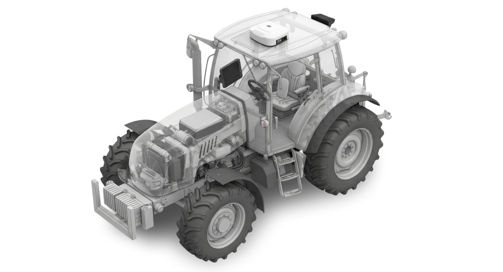

---
layout:
  width: default
  title:
    visible: true
  description:
    visible: false
  tableOfContents:
    visible: true
  outline:
    visible: true
  pagination:
    visible: true
  metadata:
    visible: true
  tags:
    visible: true
metaLinks:
  alternates:
    - https://app.gitbook.com/s/BOM0TFj6U9PhJd6dDTa9/
---

# Fukuoka Kyushu Kubota pluva ion Service Manual

<figure><figcaption></figcaption></figure>

메뉴얼 활용 방법

* 이 매뉴얼의 각 절차는 완료에 필요한 모든 단계를 포함하고 있습니다.
* 일부 단계에서 다른 절차를 참조하는 경우, 해당 절차로 이동하여 진행합니다.
* 이미 완료한 단계는 건너뛰고 다음 단계로 진행하면 됩니다.

### 영상 가이드 

메뉴얼 정보를 간략하게 볼 수 있도록 영상 가이드를 제공합니다. 아래 영상 가이드를 통해 빠르게 내용을 확인합니다.




[다른 영상 가이드도 보러가기](https://www.youtube.com/playlist?list=PLH3vv0_FUaJ1LRfcGwZ4NdQlejbQaYJfw)


### 목차

개통/설치

<table data-card-size="large" data-view="cards" data-full-width="true"><thead><tr><th></th><th data-hidden data-card-target data-type="content-ref"></th></tr></thead><tbody><tr><td>개통/설치 단계 설명</td><td><a href="order-installation/order-installation-steps.md">order-installation-steps.md</a></td></tr><tr><td>제품 개통</td><td><a href="order-installation/product-registration.md">product-registration.md</a></td></tr><tr><td>제품 설치</td><td><a href="https://fkk-pluva-servicemanual.pluva.io/ion/kr/order-installation/product-installation">https://fkk-pluva-servicemanual.pluva.io/ion/kr/order-installation/product-installation</a></td></tr><tr><td>퀵셋업</td><td><a href="https://fkk-pluva-servicemanual.pluva.io/ion/kr/order-installation/quick-setup">https://fkk-pluva-servicemanual.pluva.io/ion/kr/order-installation/quick-setup</a></td></tr><tr><td>설치 완료 확인</td><td><a href="https://fkk-pluva-servicemanual.pluva.io/ion/kr/order-installation/installation-completed">https://fkk-pluva-servicemanual.pluva.io/ion/kr/order-installation/installation-completed</a></td></tr></tbody></table>

사용법

<table data-card-size="large" data-view="cards" data-full-width="true"><thead><tr><th></th><th data-hidden data-card-target data-type="content-ref"></th></tr></thead><tbody><tr><td>초기 설정법</td><td><a href="https://fkk-pluva-servicemanual.pluva.io/ion/kr/initial-setup">https://fkk-pluva-servicemanual.pluva.io/ion/kr/initial-setup</a></td></tr><tr><td>주행모드(경로플래닝)</td><td><a href="https://fkk-pluva-servicemanual.pluva.io/ion/kr/driving">https://fkk-pluva-servicemanual.pluva.io/ion/kr/driving</a></td></tr><tr><td>턴 모드</td><td><a href="https://fkk-pluva-servicemanual.pluva.io/ion/kr/uturn-mode">https://fkk-pluva-servicemanual.pluva.io/ion/kr/uturn-mode</a></td></tr><tr><td>주행 편의 기능</td><td><a href="https://fkk-pluva-servicemanual.pluva.io/ion/kr/driving-convenience-function">https://fkk-pluva-servicemanual.pluva.io/ion/kr/driving-convenience-function</a></td></tr><tr><td>내 농장 관리 (MY Farm)</td><td><a href="https://fkk-pluva-servicemanual.pluva.io/ion/kr/my-farm">https://fkk-pluva-servicemanual.pluva.io/ion/kr/my-farm</a></td></tr><tr><td>차량 관리</td><td><a href="https://fkk-pluva-servicemanual.pluva.io/ion/kr/vehicle-settings">https://fkk-pluva-servicemanual.pluva.io/ion/kr/vehicle-settings</a></td></tr><tr><td>작업기 관리</td><td><a href="https://fkk-pluva-servicemanual.pluva.io/ion/kr/workstation-management">https://fkk-pluva-servicemanual.pluva.io/ion/kr/workstation-management</a></td></tr><tr><td>네트워크 설정</td><td><a href="https://fkk-pluva-servicemanual.pluva.io/ion/kr/network-settings">https://fkk-pluva-servicemanual.pluva.io/ion/kr/network-settings</a></td></tr><tr><td>엔터테인먼트</td><td><a href="https://fkk-pluva-servicemanual.pluva.io/ion/kr/entertainment">https://fkk-pluva-servicemanual.pluva.io/ion/kr/entertainment</a></td></tr></tbody></table>

기타

<table data-card-size="large" data-view="cards" data-full-width="true"><thead><tr><th></th><th data-hidden data-card-target data-type="content-ref"></th></tr></thead><tbody><tr><td>고객 불편사항 대응 방법</td><td><a href="https://fkk-pluva-servicemanual.pluva.io/ion/kr/others/initial-setup">https://fkk-pluva-servicemanual.pluva.io/ion/kr/others/initial-setup</a></td></tr><tr><td>어드민 로그인</td><td><a href="https://fkk-pluva-servicemanual.pluva.io/ion/kr/others/admin-login">https://fkk-pluva-servicemanual.pluva.io/ion/kr/others/admin-login</a></td></tr><tr><td>계정 관리</td><td><a href="https://fkk-pluva-servicemanual.pluva.io/ion/kr/others/account-management">https://fkk-pluva-servicemanual.pluva.io/ion/kr/others/account-management</a></td></tr><tr><td>제품 관리</td><td><a href="https://fkk-pluva-servicemanual.pluva.io/ion/kr/others/product-management">https://fkk-pluva-servicemanual.pluva.io/ion/kr/others/product-management</a></td></tr><tr><td>오퍼레이터 계정 관리</td><td><a href="https://fkk-pluva-servicemanual.pluva.io/ion/kr/others/operator-management">https://fkk-pluva-servicemanual.pluva.io/ion/kr/others/operator-management</a></td></tr><tr><td>원격 지원</td><td><a href="https://fkk-pluva-servicemanual.pluva.io/ion/kr/others/monitorning">https://fkk-pluva-servicemanual.pluva.io/ion/kr/others/monitorning</a></td></tr></tbody></table>

