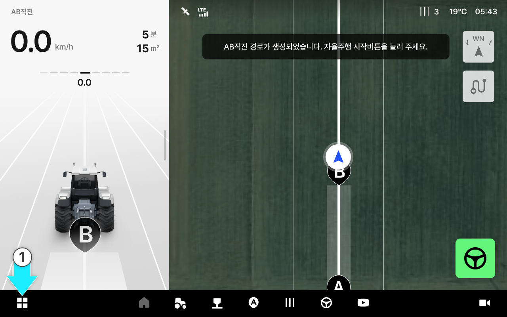
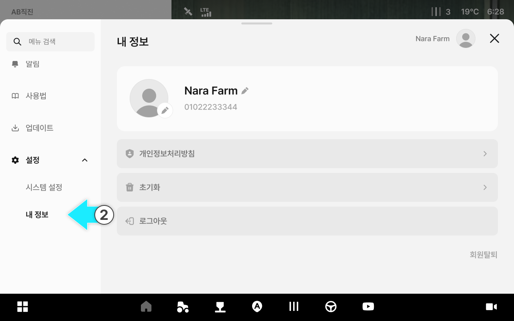
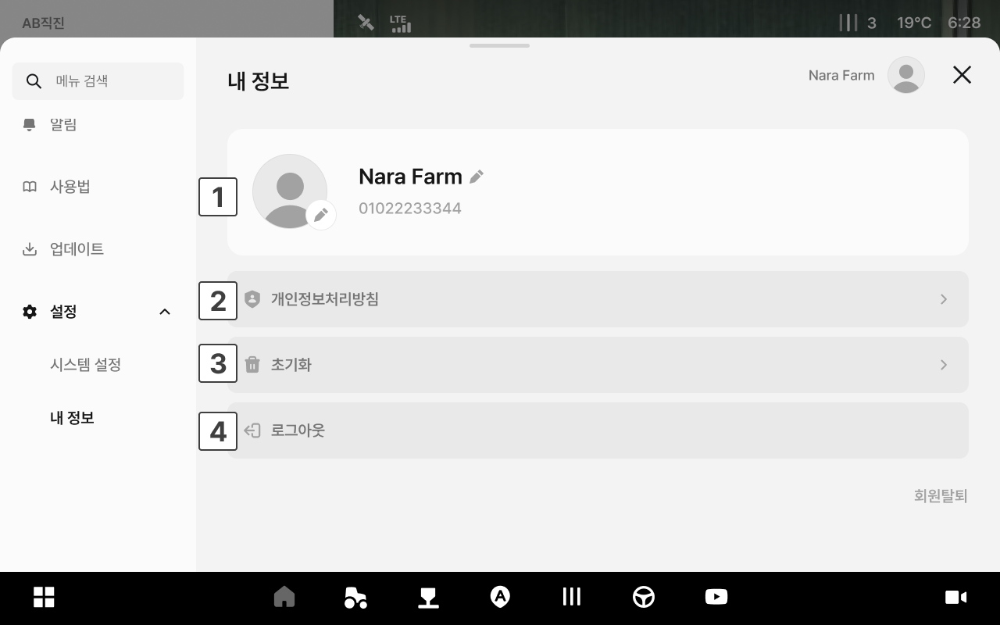

---
metaLinks:
  alternates:
    - https://app.gitbook.com/s/3srvTBakWIhqzDD4BV3T/ion/settings/my-info
---

# 내 정보

내 정보에서는 현재 로그인된 계정의 프로필 정보를 확인하고, 개인정보 처리 방침 열람 및 계정 관련 작업을 수행할 수 있습니다.

### 진입 방법



앱 하단 내비게이션에서 설정 아이콘을 누릅니다.

<figure><figcaption></figcaption></figure>



좌측 메뉴에서 내 정보를 누릅니다.

<figure><figcaption></figcaption></figure>



***

### 내 정보 화면

<figure><figcaption></figcaption></figure>

 **프로필**

* **프로필 사진**: 원형 아이콘으로 표시됩니다. 누르면 다른 이미지로 변경할 수 있습니다.
* **이름**: 등록된 이름이 표시됩니다.
* **전화번호**: 가입 시 등록한 연락처가 표시됩니다.

 **개인정보처리방침**

* 개인정보처리방침 항목을 누르면 개인정보 수집 및 이용에 관한 방침을 확인할 수 있습니다.

 **초기화**

* 앱 데이터를 초기 상태로 되돌립니다.


**주의**: 초기화 시 저장된 작업 설정 및 데이터가 삭제될 수 있습니다. 진행 전 반드시 필요한 데이터를 확인하세요.


 **로그아웃**

* 현재 계정에서 로그아웃합니다.

 **회원탈퇴**

* 서비스 계정을 영구적으로 삭제합니다.


**주의**: 회원탈퇴 시 모든 데이터가 영구 삭제되며 복구할 수 없습니다.


