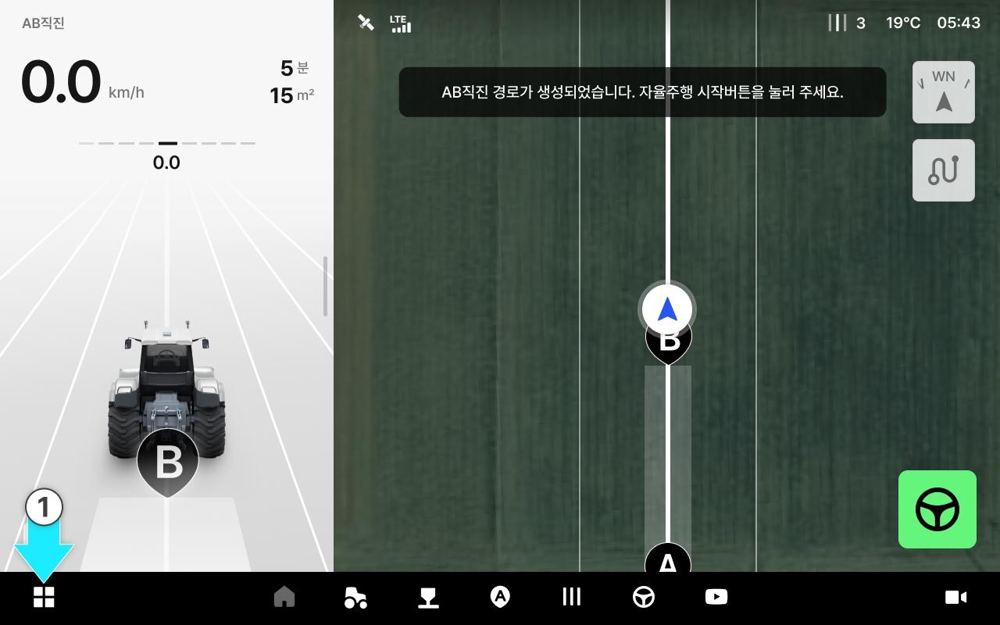
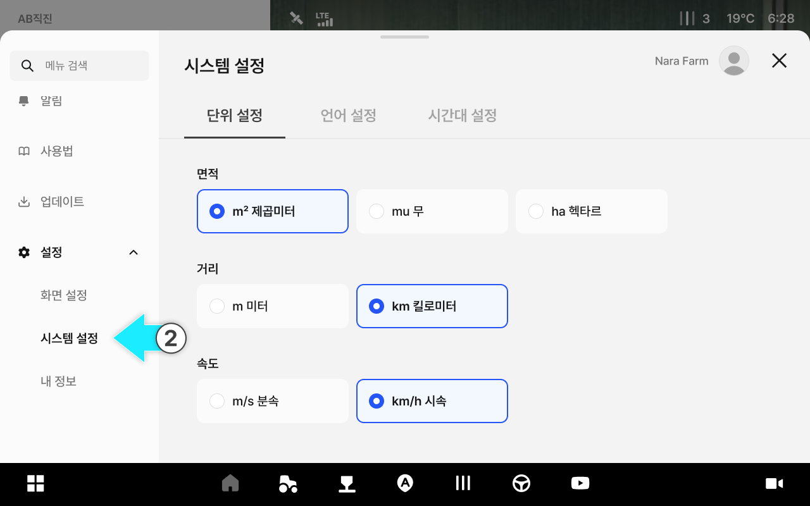
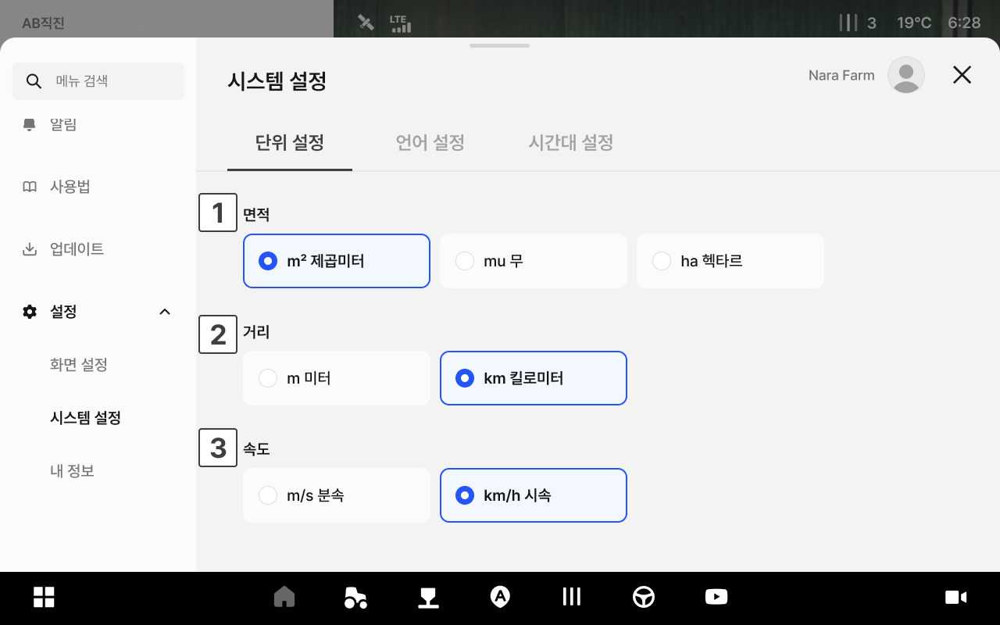
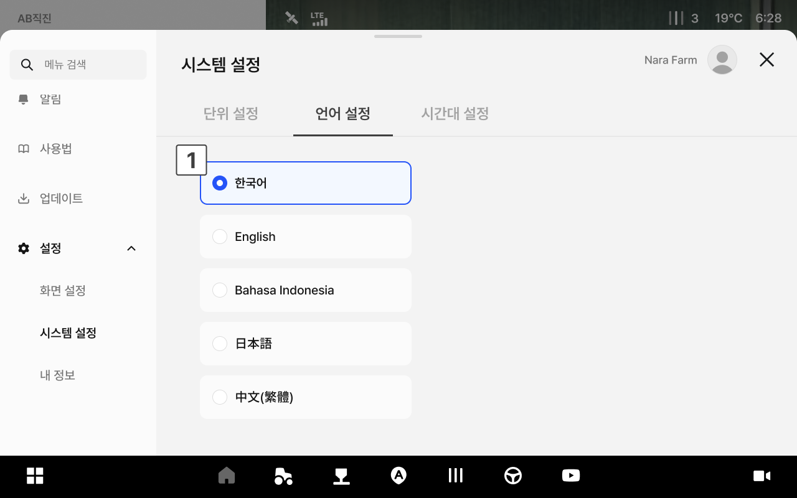
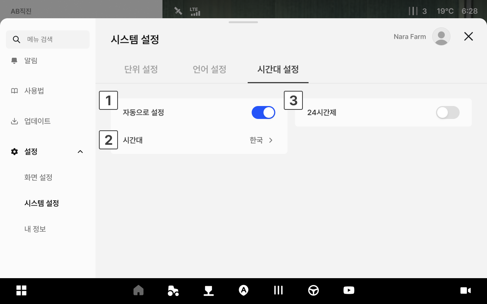
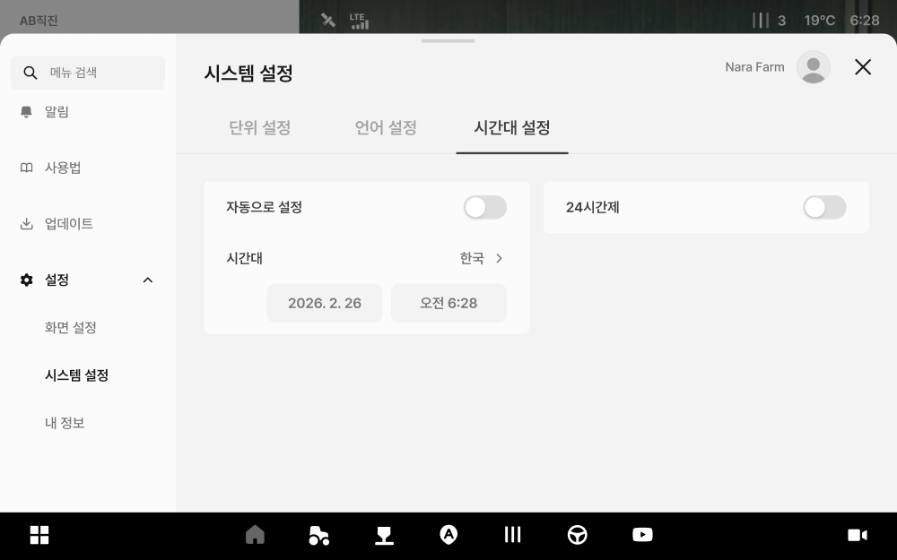
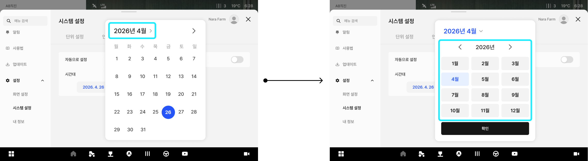
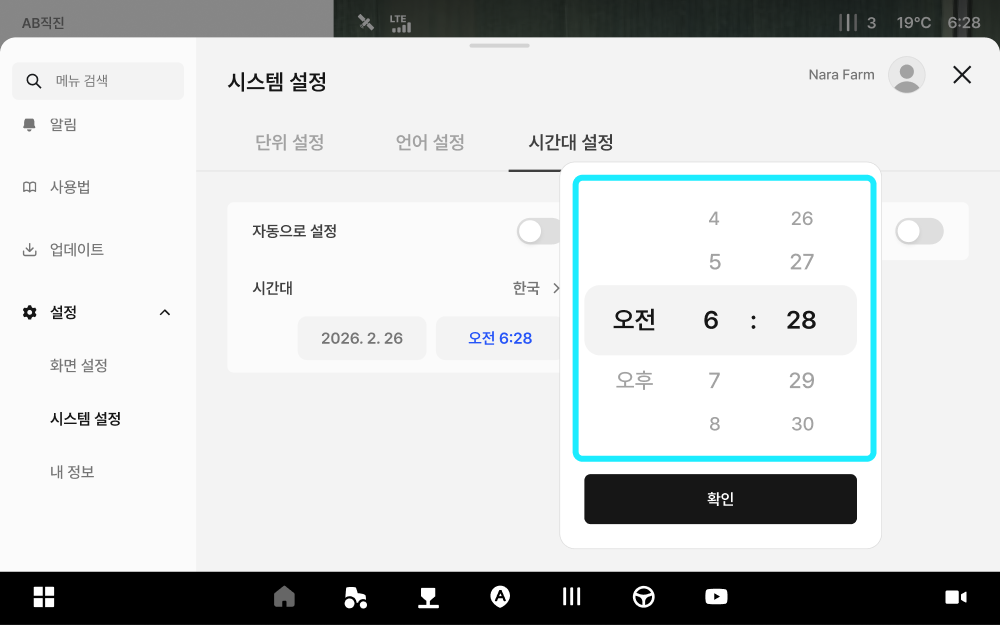

---
metaLinks:
  alternates:
    - https://app.gitbook.com/s/3srvTBakWIhqzDD4BV3T/ion/settings/system
---

# 시스템 설정

앱의 시간대, 언어, 단위 등 기본 환경을 설정합니다.

***

### 진입 방법



앱 하단 내비게이션에서 설정 아이콘을 누릅니다.

<figure><figcaption></figcaption></figure>



좌측 메뉴에서 시스템 설정을 누릅니다.

<figure><figcaption></figcaption></figure>



***

### 단위 설정 화면

면적, 거리, 속도의 표시 단위를 선택합니다.

<figure><figcaption></figcaption></figure>

 **면적**

* 선택 가능 단위: m² 제곱미터 / mu 무 / ha 헥타르

 **거리**

* 선택 가능 단위: m 미터 / km 킬로미터

 **속도**

* 선택 가능 단위: m/s 분속 / km/h 시속

***

### 언어 설정

앱 표시 언어를 변경합니다.

<figure><figcaption></figcaption></figure>

 **언어**

* 한국어 / English / Bahasa Indonesia / 日本語 / 中文(繁體) 중에서 선택합니다.

***

### 시간대 설정

현재 위치에 맞는 시간대를 설정합니다.

<figure><figcaption></figcaption></figure>

 **자동으로 설정**

* **자동으로 설정** 토글을 켜면 기기의 위치를 기반으로 시간대가 자동 설정됩니다.


**자동으로 설정** 토글을 끄면 날짜와 시간을 직접 설정할 수 있습니다.

날짜 영역을 누르면 달력에서 원하는 날짜를 직접 선택할 수 있습니다.

시간 영역을 누르면 스크롤을 통해 원하는 시간을 직접 설정할 수 있습니다.



 **시간대**

* 현재 설정된 시간대가 표시됩니다.

 **24시간제**

* 시간을 24시간 형식으로 표시합니다. 토글을 끄면 12시간(오전/오후) 형식으로 변경됩니다.
