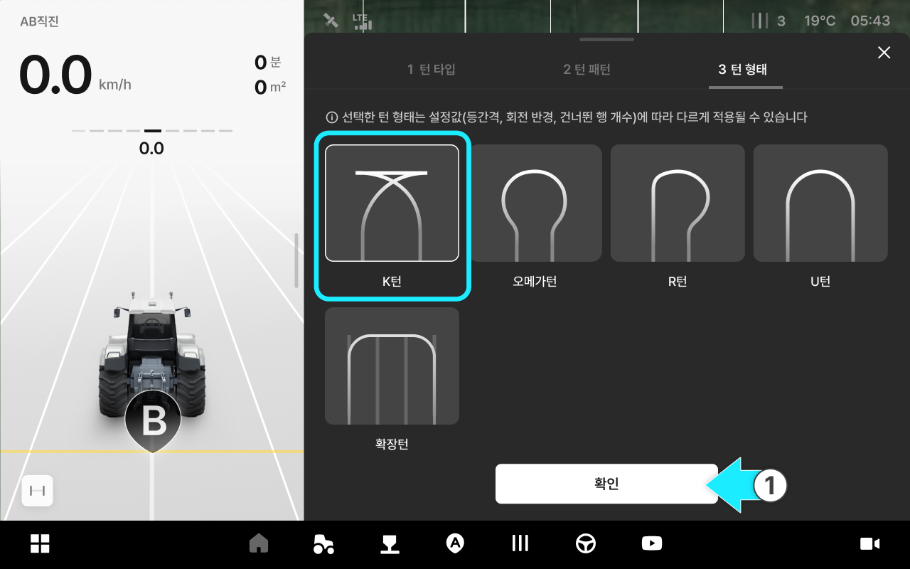
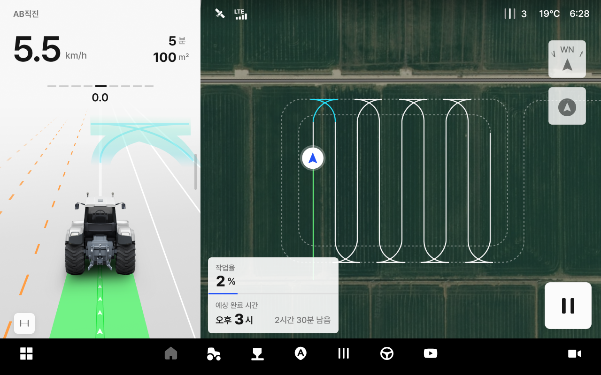
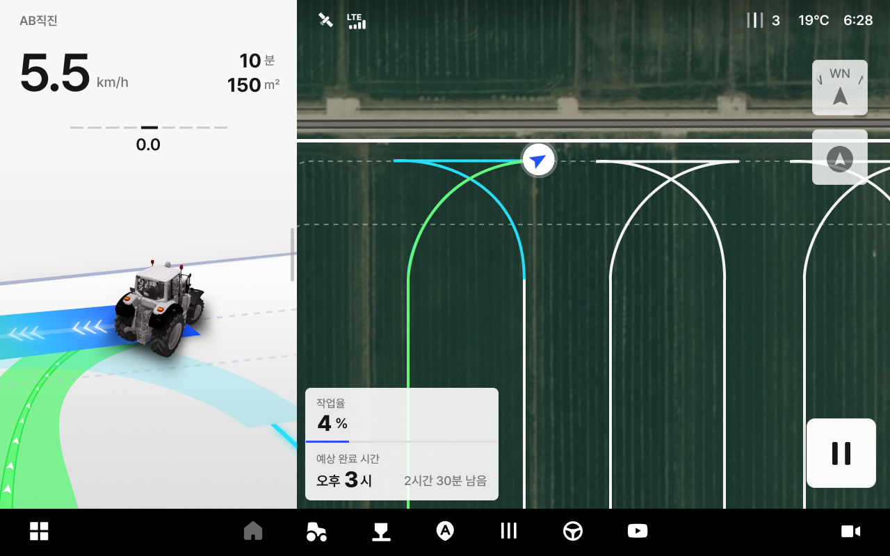
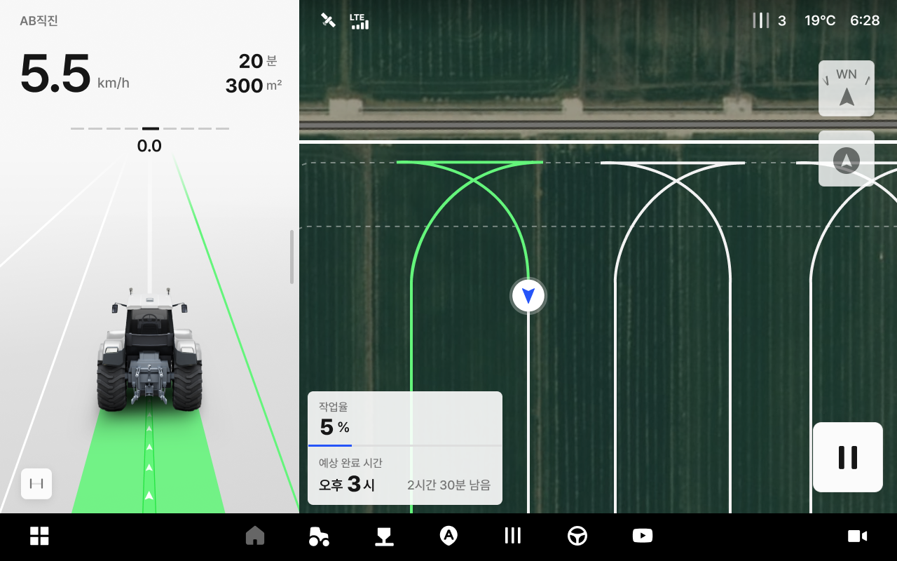

---
metaLinks:
  alternates:
    - https://app.gitbook.com/s/3srvTBakWIhqzDD4BV3T/ion/uturn-mode/kturn
---

# K턴

K턴은 좁은 헤드랜드에서 전진 → 후진 → 전진의 3단계 구간으로 방향을 전환하여 다음 작업 라인으로 이동하는 턴 형태입니다.

***

### 사용 방법



턴 형태에서 K턴을 선택합니다.

<figure><figcaption></figcaption></figure>



\[자율 주행 시작] 버튼을 누르고 K턴 지점에 도달하면 즉시 작업기를 올리세요.

<figure><figcaption></figcaption></figure>



전진 기어를 유지한 상태로 차량이 방향을 전환합니다.

<figure><figcaption></figcaption></figure>



방향 전환이 완료되면, 차량을 다음 작업 진입 라인까지 후진합니다.

<figure><figcaption></figcaption></figure>


**후진 안내 알람이 뜰 때 반드시 변속기를 후진 기어로 변경하세요.**

후진 안내 알림 후 운전자가 직접 후진 기어로 변경해야 주행이 이루어집니다. 안내 이전에 변경하거나 기어를 변경하지 않으면 K턴이 정상적으로 완료되지 않습니다.




후진을 완료한 후, 전진 기어로 변경한 뒤 다음 작업 라인으로 이동합니다.\
다음 작업 라인에 진입하기 전 작업기를 내립니다.

<figure><figcaption></figcaption></figure>


**전진 안내 알람이 뜰 때 반드시 변속기를 전진 기어로 변경하세요.**

전진 안내 알림 후 운전자가 직접 전진 기어로 변경해야 주행이 이루어집니다. 안내 이전에 변경하거나 기어를 변경하지 않으면 K턴이 정상적으로 완료되지 않습니다.




새 작업 라인에서 자율주행 작업이 재개됩니다.

<figure><figcaption></figcaption></figure>




**경로 이탈했을 때**

* **원인**
  * 경사진 지형, 미끄러운 노면, 타이어 헛돎 등으로 가이드라인 추종에 실패하면 자율주행이 중단됩니다.
* **대응 방법**
  * 수동으로 차량을 조작하여 턴을 완료하세요. 작업 라인에 진입한 후 \[자율주행] 버튼을 다시 누르면 자율주행이 재개됩니다.

