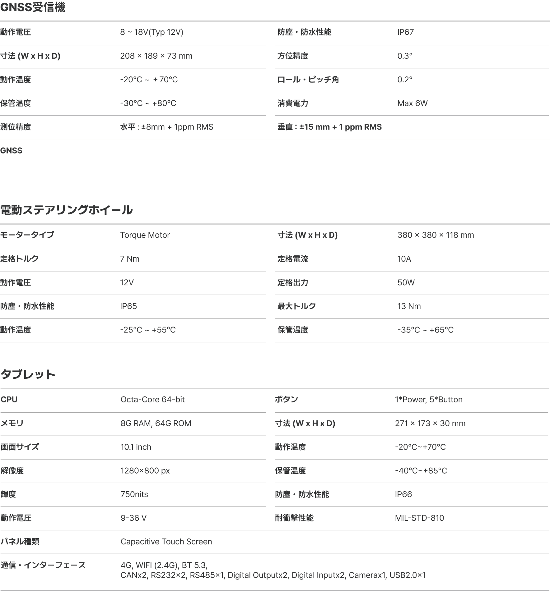

---
layout:
  width: default
  title:
    visible: true
  description:
    visible: false
  tableOfContents:
    visible: true
  outline:
    visible: true
  pagination:
    visible: true
  metadata:
    visible: true
  tags:
    visible: true
metaLinks:
  alternates:
    - >-
      https://app.gitbook.com/s/W9zolTVOCJkGCWFEPCa0/ion/consumer-info/specification-information
---

# 仕様情報

仕様は製造メーカーの規定により、予告なく変更される場合があります。

<figure><figcaption></figcaption></figure>
