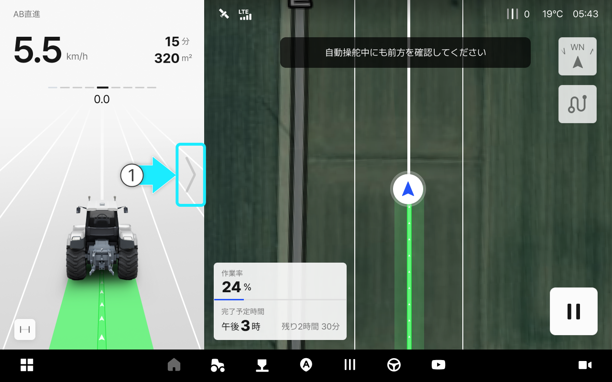
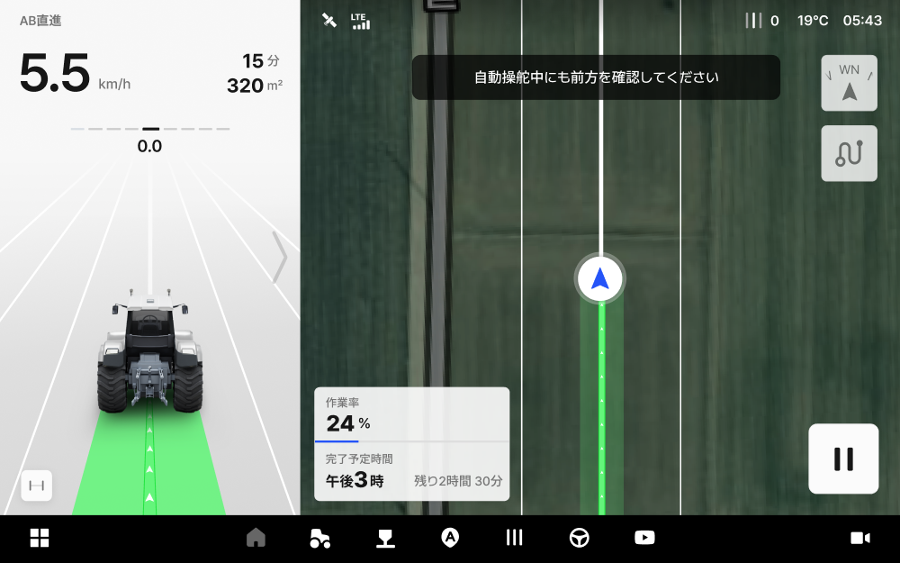
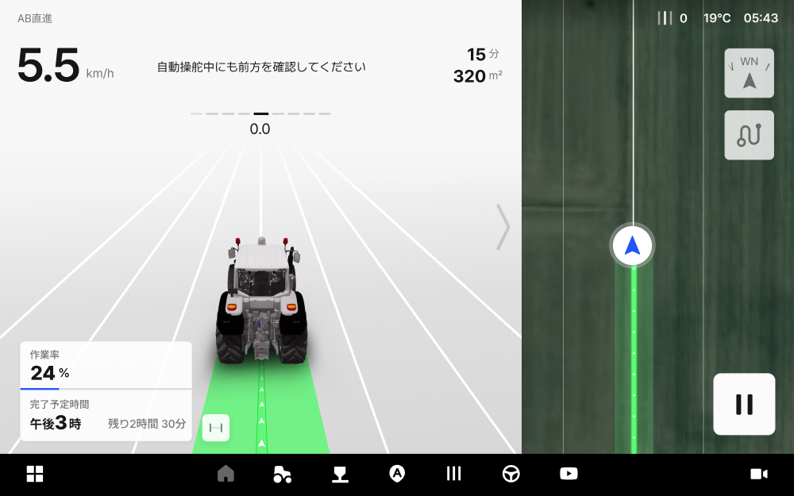
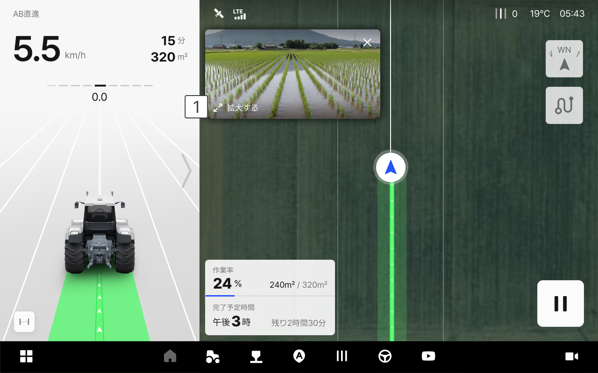
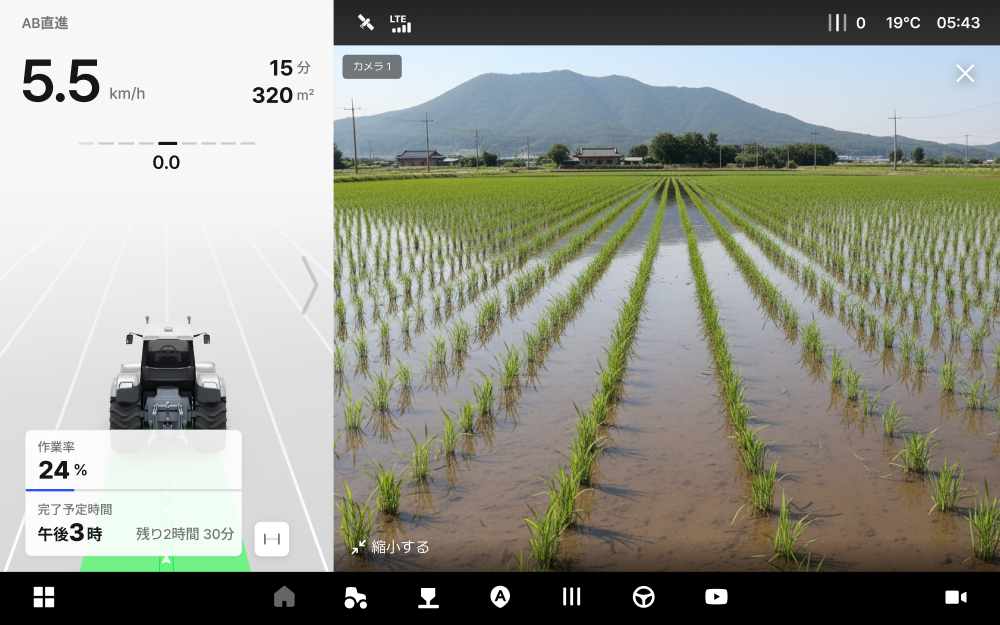
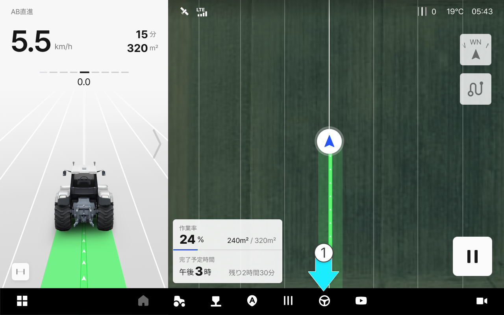
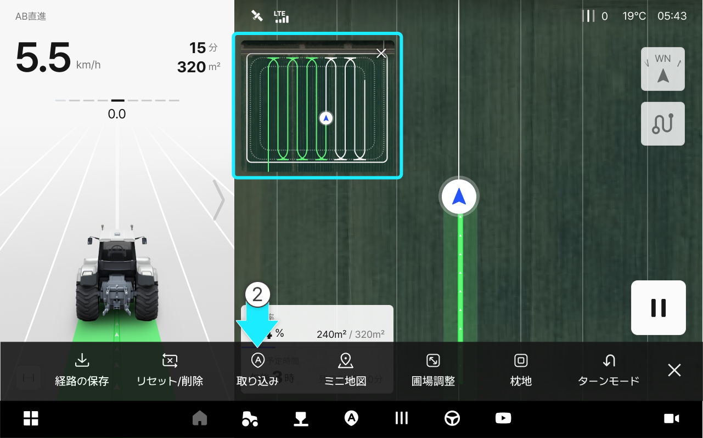

# 走行画面の調整

### 走行画面の調整

***

#### 画面比率の調整機能

リアルタイムでの作業状態と走行画面の比率を適切に調整し、ご希望の作業画面が作れる機能です。



 調整したい方向に画面比率の調整アイコンを動かすと、画面比率の調整ができます。

<figure><figcaption></figcaption></figure>



*   1:2 分割

    <figure><figcaption></figcaption></figure>
*   2:1 分割

    <figure><figcaption></figcaption></figure>
*   全体画面

    <figure><figcaption></figcaption></figure>

***

#### カメラビューをオンにする

作業機の状態をリアルタイムでモニタリングできるカメラビューです。\
後方の作業機を確認することで、安全かつ正確な作業をサポートします。



 カメラアイコンをクリックし、カメラビュー画面を表示してください。

<figure><figcaption></figcaption></figure>



#### カメラビュー画面のご案内 

<figure><figcaption></figcaption></figure>

&#x20;.svg>) 拡大する

*   カメラ画面を走行画面の全画面表示に切り替えることができます。
「閉じるX」をクリックするとカメラ画面が終了されます。 

    <figure><figcaption></figcaption></figure>

***

#### 経路全体を表示する

経路全体が確認できるよう画面の調整ができます。



 「圃場全体を表示する」アイコンをクリックします。

<figure><figcaption></figcaption></figure>



圃場全体に切り替わります。

<figure><figcaption></figcaption></figure>

作業エリアを大きく表示したい場合  「作業エリアの拡大」をクリックしてください。



***

#### ミニ地図の設定

圃場全体が確認できるミニ地図を表示し、作業エリアの拡大モードとあわせて確認できます。



 「作業オプション」アイコンをクリックします。

<figure><figcaption></figcaption></figure>



「ミニ地図」アイコンをクリックすると画面上にミニ地図が表示されます。

<figure><figcaption></figcaption></figure>


