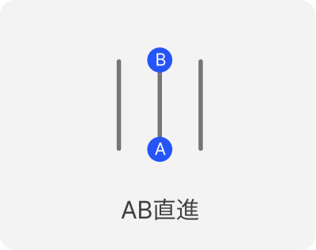
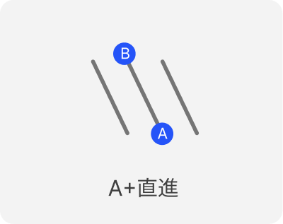
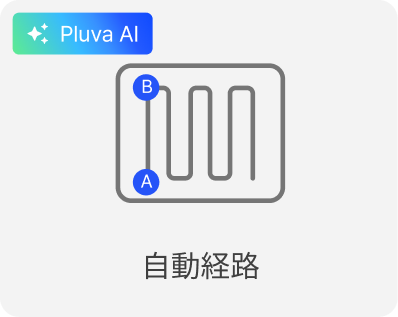
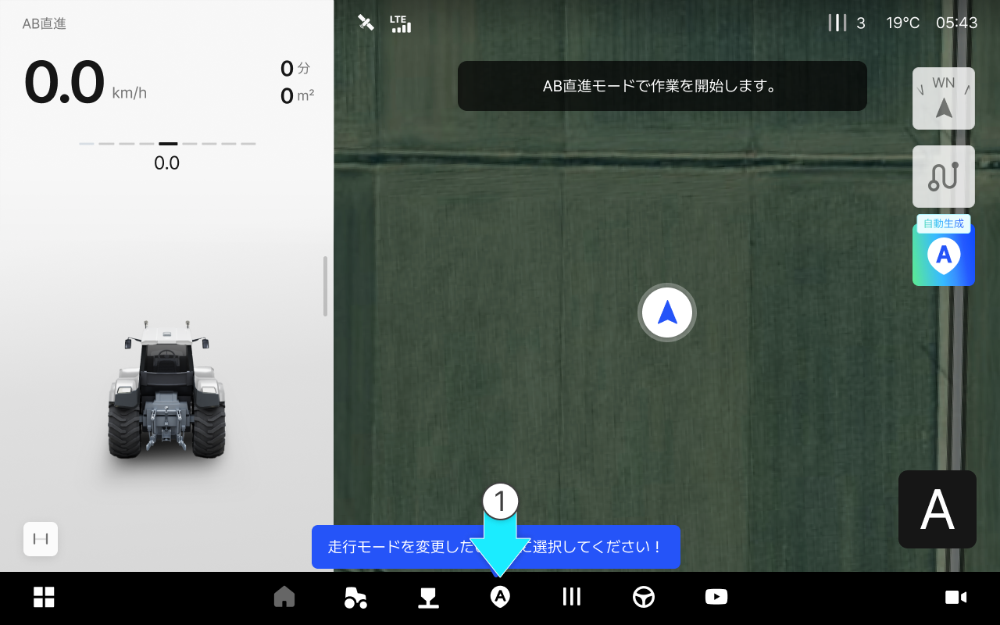
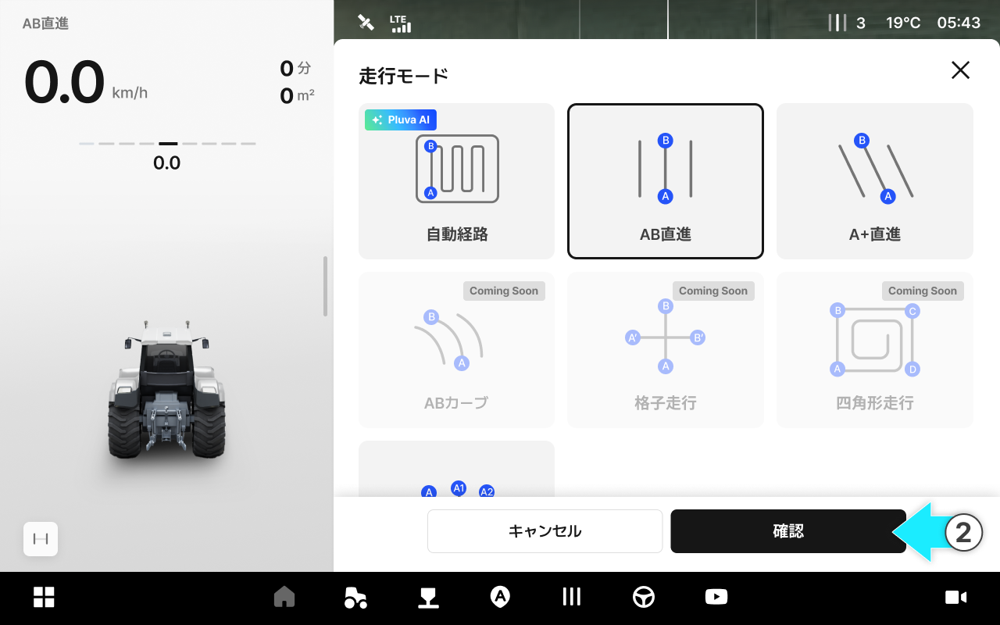
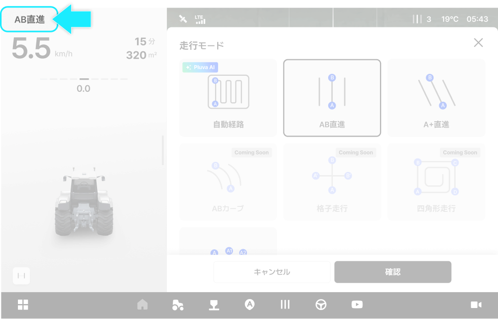
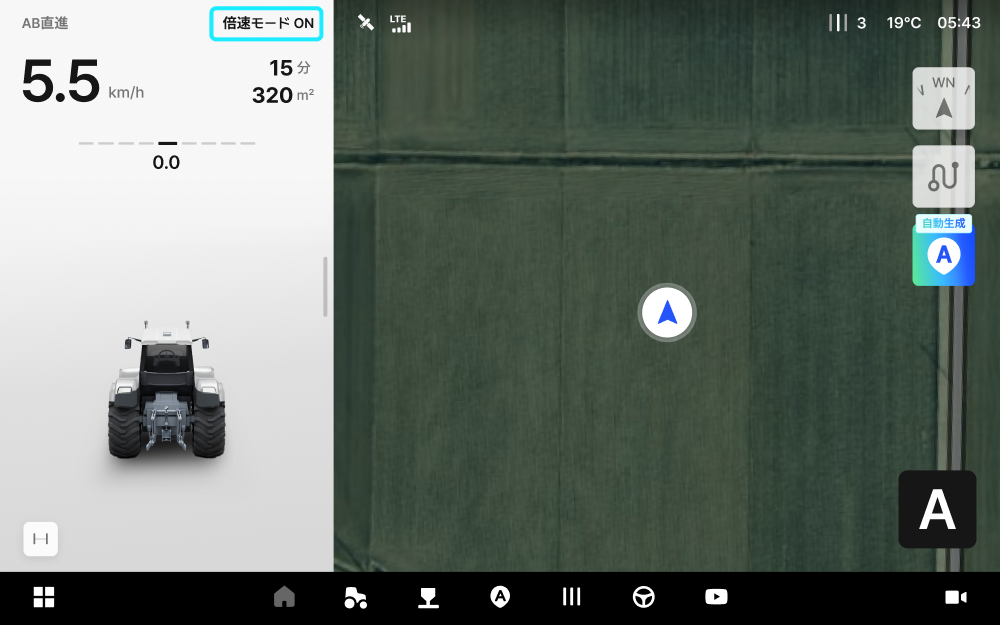
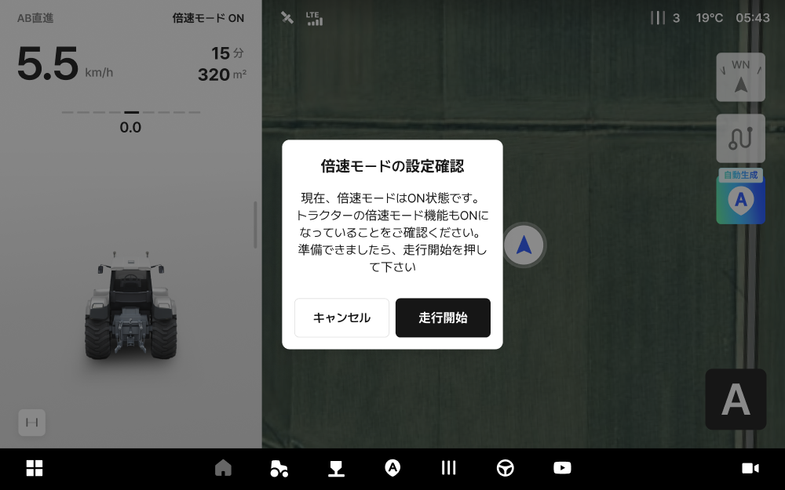
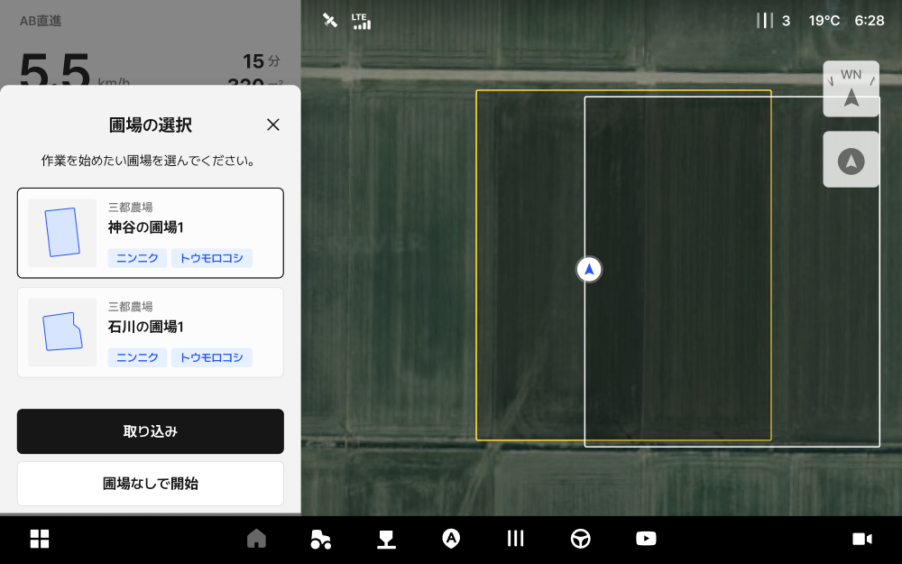

---
layout:
  width: default
  title:
    visible: true
  description:
    visible: false
  tableOfContents:
    visible: true
  outline:
    visible: true
  pagination:
    visible: true
  metadata:
    visible: true
  tags:
    visible: true
metaLinks:
  alternates:
    - >-
      https://app.gitbook.com/s/Lxu7xFAm2ntQK9UKfrU5/ion/driving/route-planning-settings
---

# 経路のプランニングの設定方法

作業内容や作物、目的に合わせて最適な経路生成モードを選択し、
圃場条件に適した経路で作業を行い、重複や作業漏れを最小限に抑え、作業効率と精度の向上を実現します。

#### 経路のプランニングモードの種類

AB直進

* A点とB点を結ぶ方向へ直進走行します。

<figure><figcaption></figcaption></figure>

A+直進

* A点を基準に設定した角度の直線経路を生成して走行します。

<figure><figcaption></figcaption></figure>

自動経路（Pluva AI）

* ユーザーの圃場や車両条件を基に、最適な作業経路を自動生成する機能です。

<figure><figcaption></figcaption></figure>

***

#### 経路のプランニング機能へアクセス



 **\[経路のプランニング]**&#x30DC;タンを押します。

<figure><figcaption></figcaption></figure>



ご希望の走行モードを選択し、 **\[確認]**&#x3092;タップします

<figure><figcaption></figcaption></figure>




基本走行モードは「AB直進モード」です。
他の走行モードを使用するには、ご希望のモードを選択し\[確認]をタップしてください。



現在選択されている走行モードは、画面左上の走行情報エリアから確認できます。




倍速ターンの設定状況は、左画面の右上の走行情報からご確認できます。倍速ターンのオン・オフ状況をご確認ください。

走行モードにアクセスすると、倍速ターンの設定に関する案内が表示されます。\
案内に従って**倍速ターンをオンに設定**し、**\[走行開始]**&#x3092;押すと走行モードへのアクセスが完了します。




2つ以上の圃場が登録されている場合には、走行モードを選択する前に、圃場の選択画面が表示されます。


