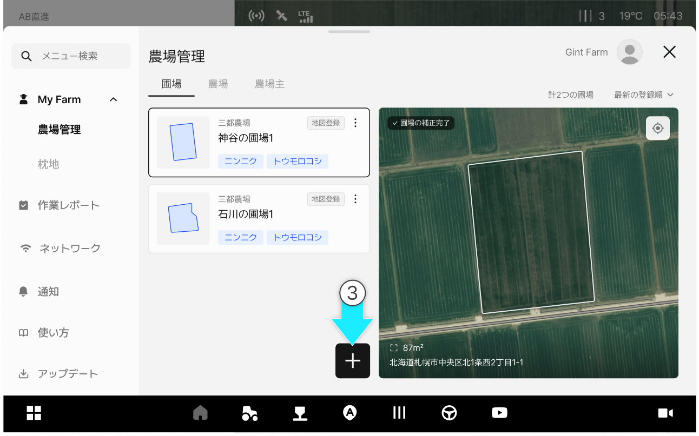
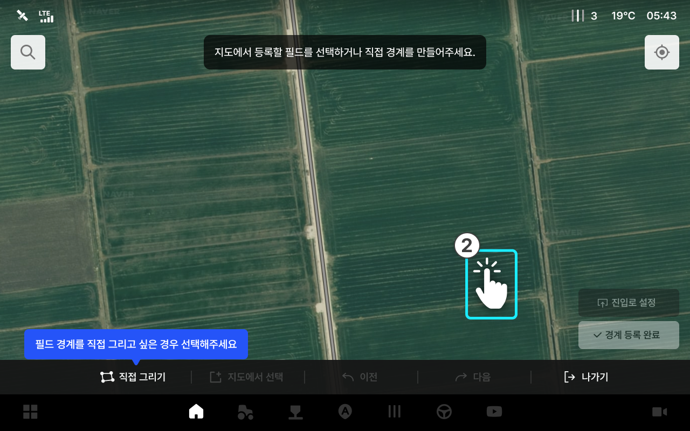
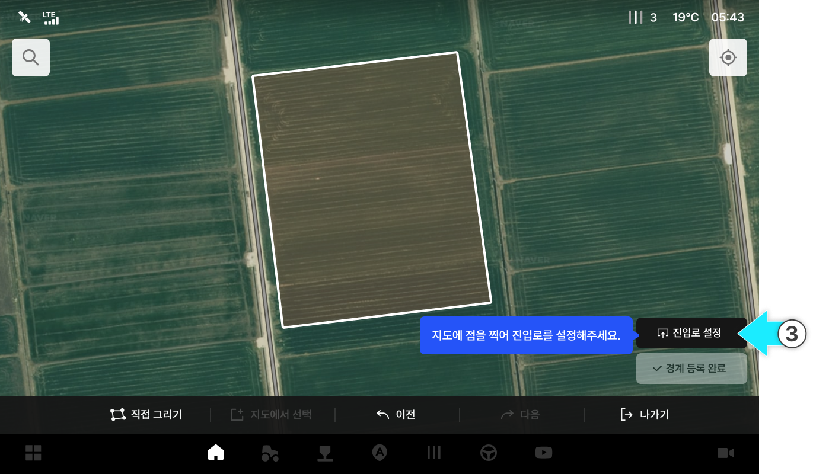
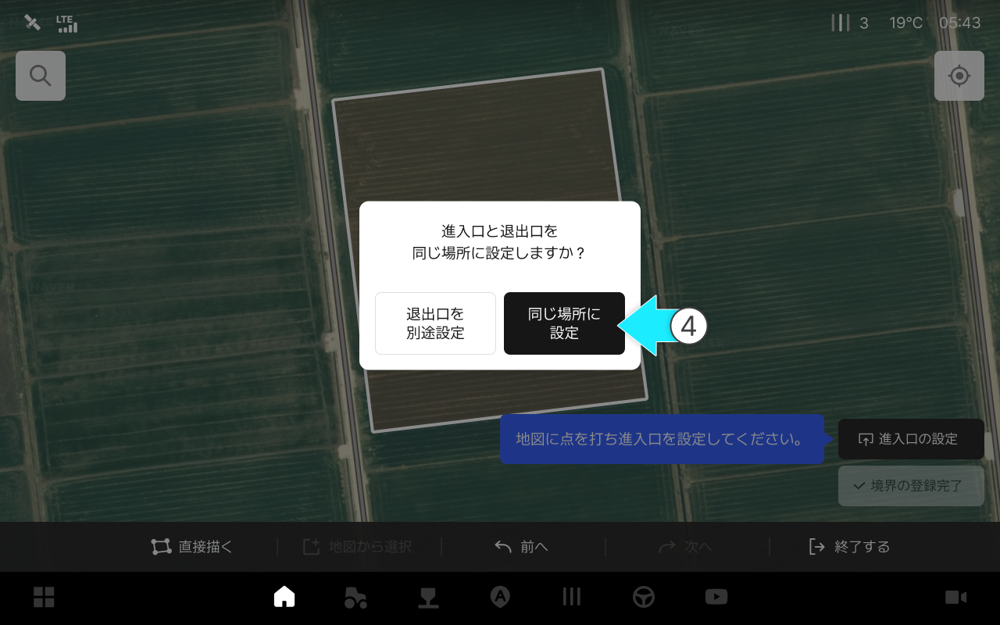
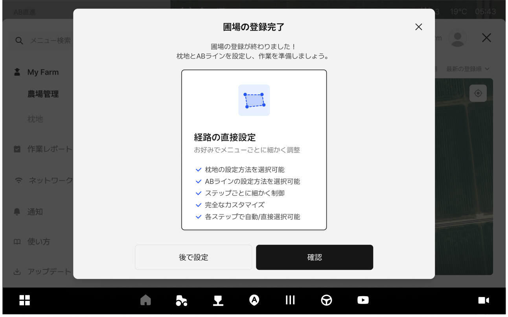
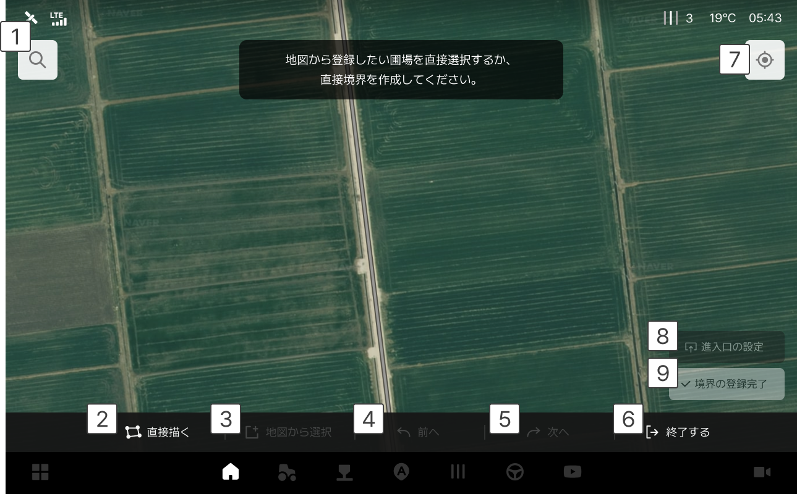
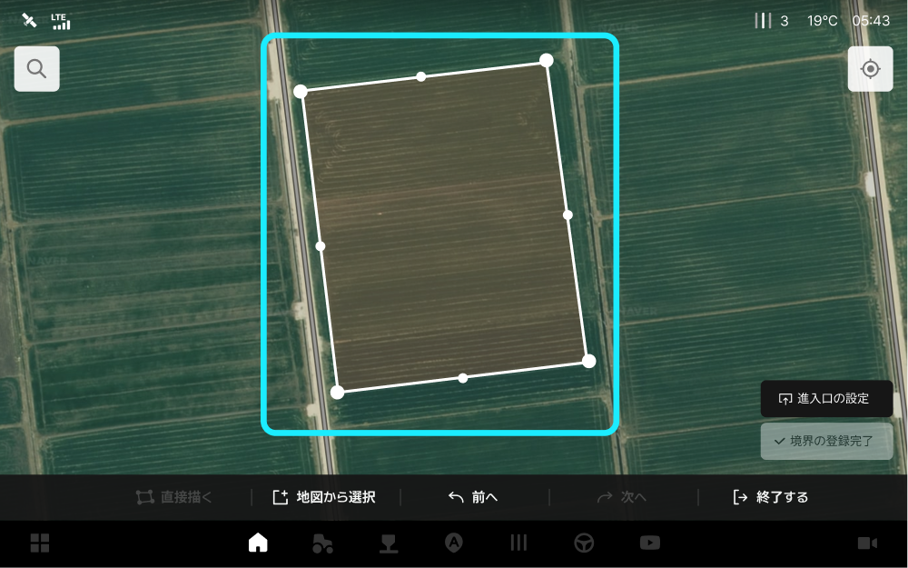
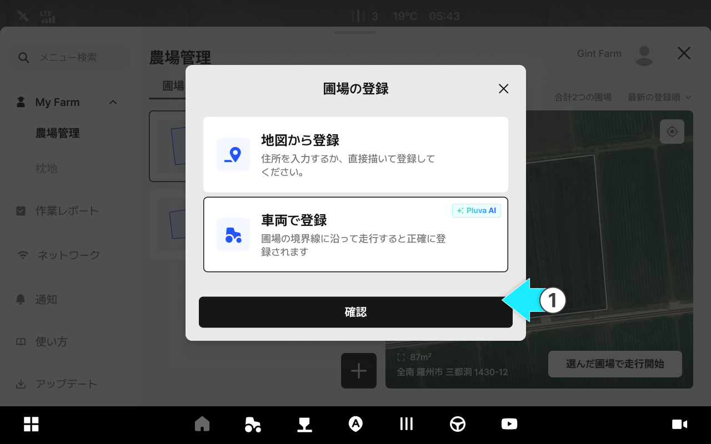
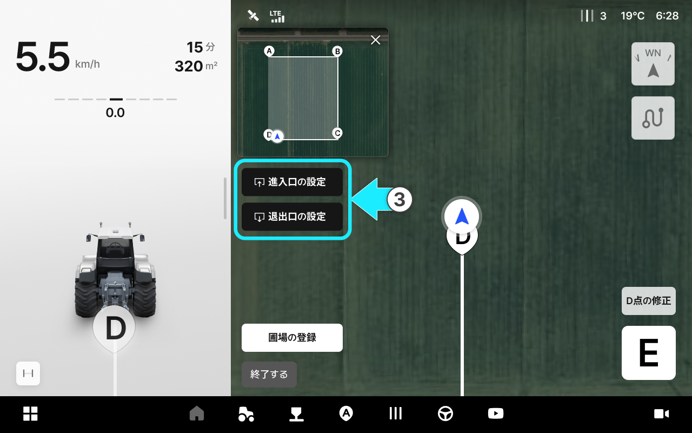
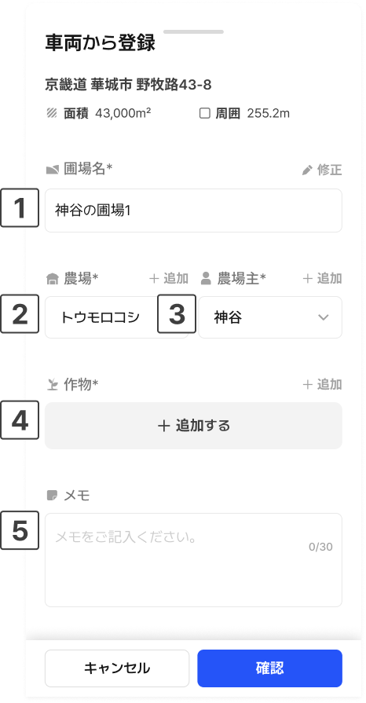

---
layout:
  width: default
  title:
    visible: true
  description:
    visible: false
  tableOfContents:
    visible: true
  outline:
    visible: true
  pagination:
    visible: true
  metadata:
    visible: true
  tags:
    visible: true
metaLinks:
  alternates:
    - https://app.gitbook.com/s/W9zolTVOCJkGCWFEPCa0/ion/my-farm/field-add
---

# 필드 등록

필드를 한 번 등록해두면 각 작업에서 동일한 기준을 사용할 수 있어 작업 준비 시간을 줄이고 반복 설정을 최소화할 수 있습니다. 또한 작업 이력이 필드 단위로 누적·조회되어 필지별 작업 기록을 쉽게 확인하고 농작업을 체계적으로 관리할 수 있습니다.

***

### 필드 등록 진입



 전체 메뉴 아이콘을 누릅니다.

<figure><figcaption></figcaption></figure>



My Farm의 농장관리의 \[필드 탭] 진입이 완료됩니다.

<figure><figcaption></figcaption></figure>



 필드 추가 버튼을 누릅니다.

<figure><figcaption></figcaption></figure>



원하는 필드 등록 옵션을 선택하고 \[확인]을 누릅니다.

<figure><figcaption></figcaption></figure>



***

### 지도에서 등록



지도에서 등록 옵션을 선택한 후 \[확인]을 누릅니다.

<figure><figcaption></figcaption></figure>



지도에서 필드를 선택합니다.

<figure><figcaption></figcaption></figure>


기본 필드 등록은 \[지도에서 선택]으로 설정되어 있습니다.
경계를 직접 만들려면 \[직접 그리기]를 누릅니다.




경계 생성 후 \[진입로 설정]을 누른 다음, 원하는 위치를 선택합니다.

<figure><figcaption></figcaption></figure>



진입출로 위치 설정 팝업에서 \[같은 위치로 설정]을 선택합니다.

<figure><figcaption></figcaption></figure>


\[진출로 따로 설정]을 선택한 경우, 진입/진출 위치를 각각 지정해야 합니다.





진출입로 설정이 완료되고 필드 정보를 입력한 뒤 \[등록]을 누릅니다.

<figure><figcaption></figcaption></figure>



필드 등록이 완료됩니다.

<figure><figcaption></figcaption></figure>



### 지도에서 필드 등록 화면 설명

<figure><figcaption></figcaption></figure>

 **주소 검색으로 필드 선택**

* 주소 검색으로 필드를 선택합니다.

<figure><figcaption></figcaption></figure>

 **직접 그리기**

* 필드 영역을 직접 점을 찍어 생성합니다.

<figure><figcaption></figcaption></figure>

 **지도에서 선택**

* 지도에서 필드를 직접 눌러 선택합니다. \[지도에서 등록]이 기본으로 설정되어있습니다.

 **이전**

* 이전 단계로 돌아갑니다.

 **다음**

* 다음 단계로 넘어갑니다.

 **나가기**

* 필드 추가하기 화면에서 나갑니다.

 **내 위치로 가기**

* 현재 내 위치로 지도를 이동합니다.

 **진(출)입로 설정**

* 진출입로 위치를 설정합니다. 필드를 선택한 후 해당 버튼을 사용할 수 있습니다.
진출입로는 같은 위치로 설정하거나, 각각 따로 설정할 수 있으며, 수정 버튼을 통해\
  위치를 변경할 수 있습니다.

 **경계 등록 완료**

* 경계 등록을 완료합니다. 진출입로를 선택한 후 해당 버튼을 사용할 수 있습니다.

### 지도에서 필드 등록 모달 설명

<figure><figcaption></figcaption></figure>

 **필드 이름**

* 대표로 표기할 필드 이름을 입력합니다.

 **농장**

* 필드와 연결할 농장을 선택합니다.

 **농장 소유자**

* 필드와 연결할 농장 소유자를 선택합니다.

 **작물**

* 현재 필드에서 작업 중인 작물을 추가합니다.

 **메모**

* 추가적인 정보를 메모로 남깁니다.

***

### 車両から登録

直接車両を運転し、圃場の境界を走行しながらポイントを設定する方法です。地図に表示されない圃場や境界が不明確な場合に適してます。



圃場の登録オプションから「車両から登録」を選択し、\[確認]をタップします。

<figure><figcaption></figcaption></figure>



「車両から登録」画面にアクセスできます。車両を圃場の各ポイントへ移動させ、ボタンを押してポイントを登録します。

<figure><figcaption></figcaption></figure>


設定直後に、該当するポイントの修正ボタンが表示されます。位置が不正確な場合は、修正ボタンを押して再設定してください。



各ポイントは順番通りに設定してください。任意に順番を変えて設定すると、境界が正しく生成されません。




Dポイント以上の設定が完了すると、車両を進入・退出口に移動させ、進入口と退出口の設定ボタンを押して登録します。

<figure><figcaption></figcaption></figure>


退出口は、作業完了後に出ていく経路です。設定後にも修正できます。



ポイントは最大6地点まで設定できます。




各ポイントと退出口の設定が完了したら、「圃場の登録」ボタンが表示されます。**圃場の登録**をタップします。

<figure><figcaption></figcaption></figure>



圃場に関する情報入力画面から、圃場名、農場、作物などを入力します。入力後に**登録**をタップすると圃場の登録が完了します。

<figure><figcaption></figcaption></figure>



#### 画面のボタンに関するご案内

<figure><figcaption></figcaption></figure>

 **ミニ地図**

* 現在登録中の圃場の境界を全体画面から確認できます。

 **退出口の設定**

* 退出口を車両の現在地に設定します。

 **圃場の登録**

* 全てのポイントを設定し終わったら、圃場を登録します。

 **終了する**

* 登録を中断し、前の画面に戻ります。

 **修正**

* 既に設定したポイントを現在地に変更します。

 **A / B / C / D**

* 該当するポイントを車両の現在地に設定します。

### 車両から圃場登録モーダルに関するご案内

<figure><figcaption></figcaption></figure>

 **圃場名**

* 表示したい圃場名を入力します。

 **農場**

* 圃場と紐づける農場を選択します。

 **農場主**

* 圃場と紐づける農場主を選択します。

 **作物**

* 現在の圃場で作業中の作物を追加します。

 **メモ**

* 補足情報をメモします。
