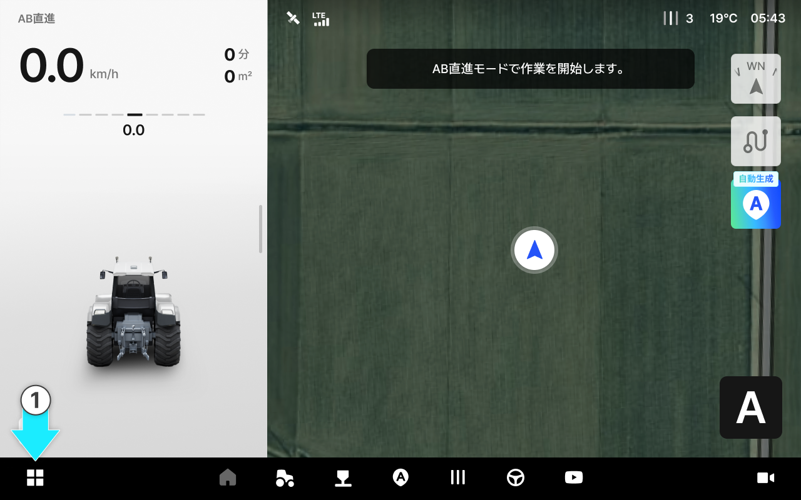
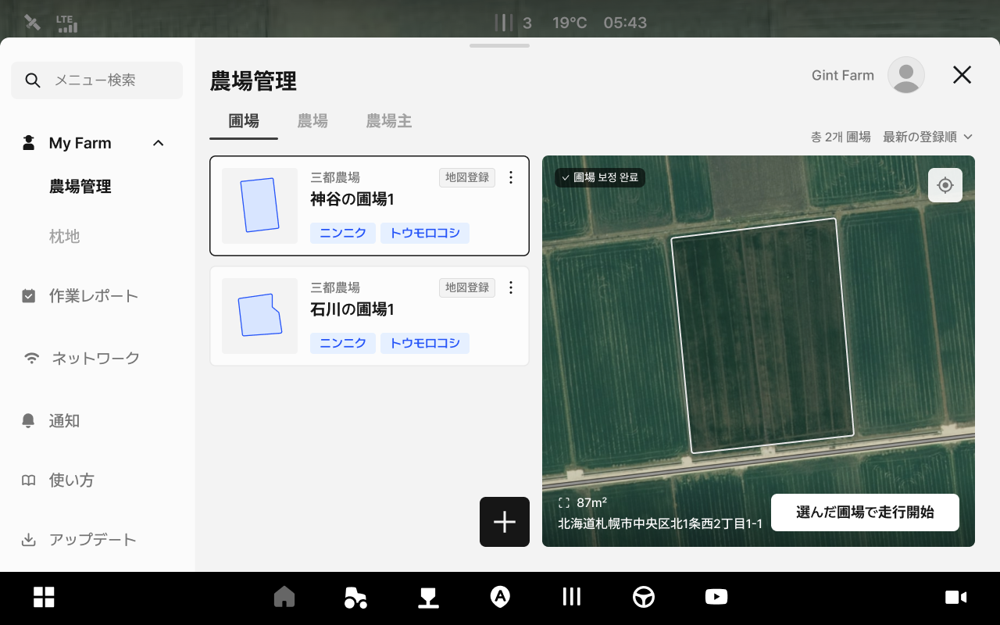
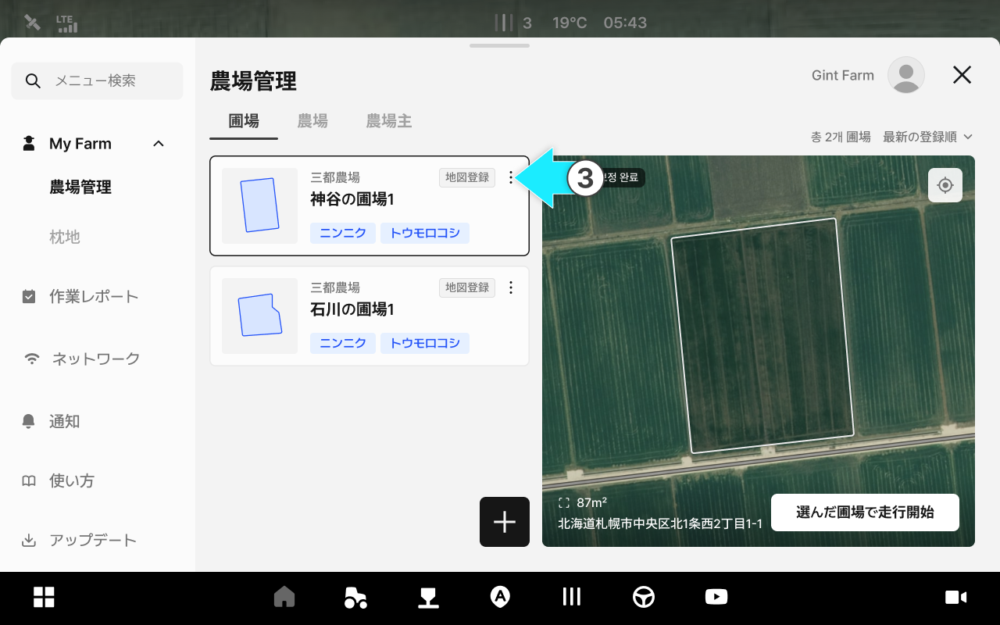
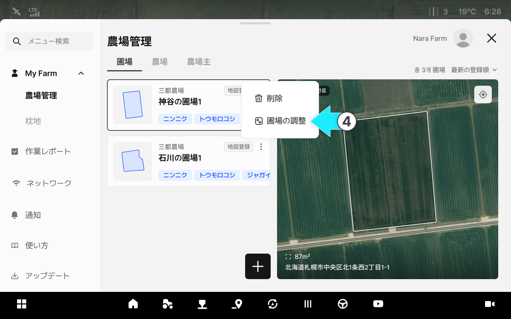
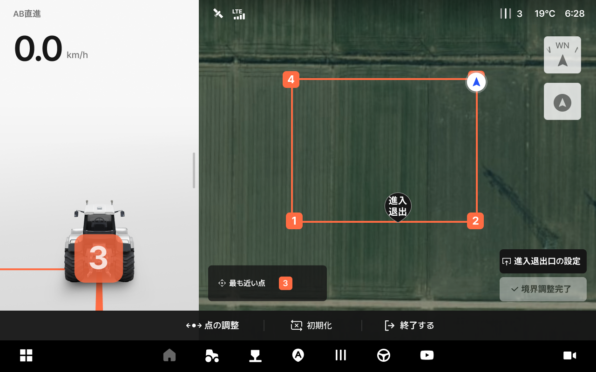
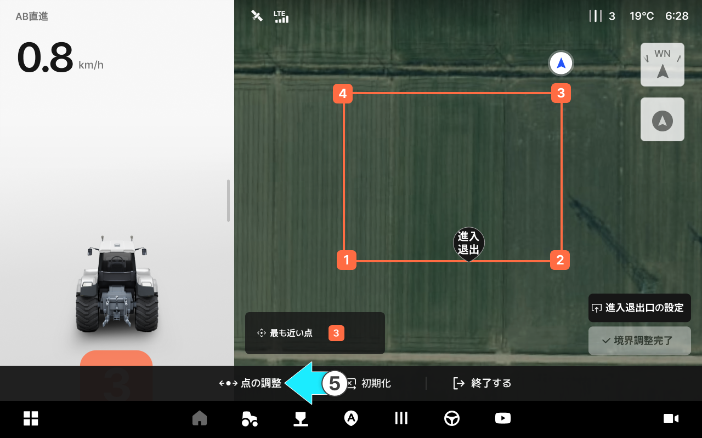
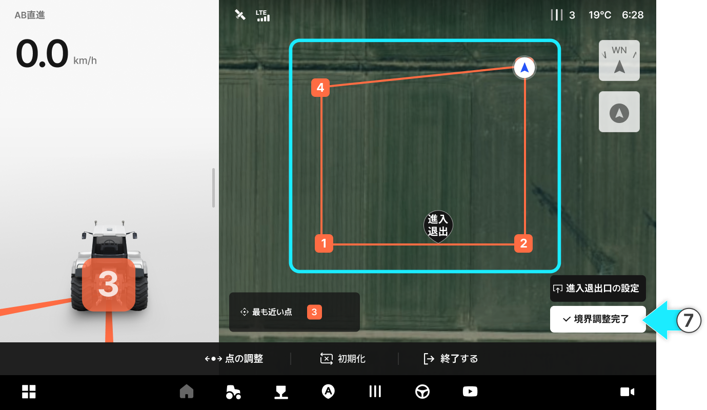
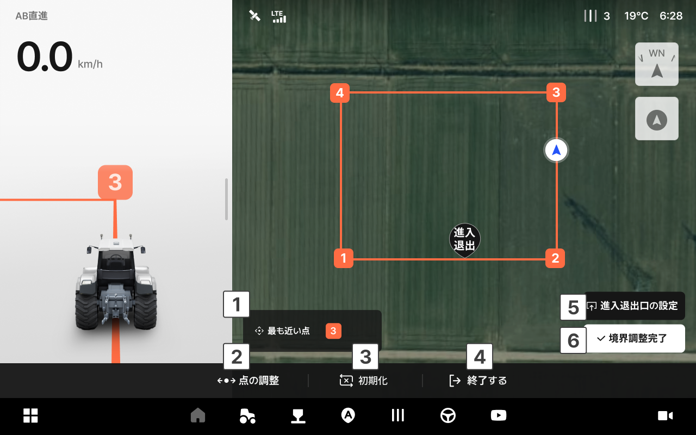

---
metaLinks:
  alternates:
    - >-
      https://app.gitbook.com/s/W9zolTVOCJkGCWFEPCa0/ion/my-farm/field-adjustment
---

# 圃場の調整

登録済みの圃場の形を調整できる機能です。直接車両を移動させ圃場を調整します。

***

#### 圃場の調整プロセス



 メニュー一覧アイコンをタップします。

<figure><figcaption></figcaption></figure>



My Farmの農場管理の\[圃場]タブにアクセスできます。

<figure><figcaption></figcaption></figure>



調整したい圃場のアイコンをタップします。

<figure><figcaption></figcaption></figure>



\[圃場の調整]を選択します。

<figure><figcaption></figcaption></figure>



圃場の調整画面にアクセスされます。

<figure><figcaption></figcaption></figure>


圃場登録の初期設定&#x306F;**\[地図から選択]**&#x306B;なっています。境界を直接作成するに&#x306F;**\[直接画く]**&#x3092;選択してください。




調整したい位置に車両を移動させ、**\[ポイント調整]**&#x3092;タップします。

<figure><figcaption></figcaption></figure>


車両の現在地から最も近いポイントが調整されます。




圃場の調整後に&#x306F;**\[境界の調整完了]**&#x3092;タップし、圃場の調整を終了します。

<figure><figcaption></figcaption></figure>



***

#### 圃場の調整画面のご案内

<figure><figcaption></figcaption></figure>

&#x20; **最も近いポイント**

* 車両の現在地から最も近いポイントを表示します。

&#x20; **ポイント調整**

* 車両の位置から最も近いポイントの位置を調整します。

&#x20; **リセット**

* 圃場の調整を進める前の初期状態に復元します。

&#x20;  **終了する**

* 圃場の調整画面を終了します。

&#x20; **進入・退出口の変更**

* 進入・退出口の位置を変更します。このボタンを選択するか、進入・退出口のアイコンをタップすると移動可能な状態に切り替わります。
* 進入口と退出口が異なる位置に設定されている場合は、それぞれのボタンが表示されます。

&#x20; **境界の調整完了**

* 境界の調整を完了します。
