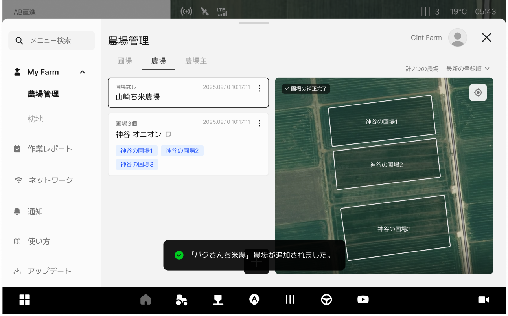
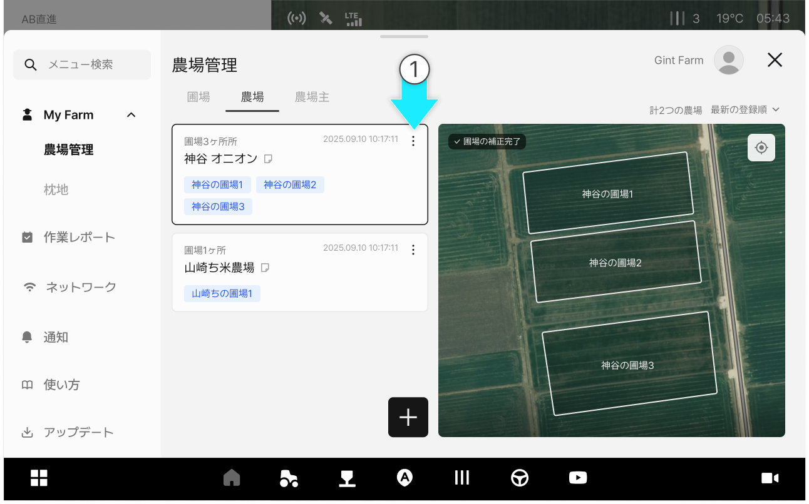

---
layout:
  width: default
  title:
    visible: false
  description:
    visible: false
  tableOfContents:
    visible: true
  outline:
    visible: true
  pagination:
    visible: true
  metadata:
    visible: true
  tags:
    visible: true
---

# 農場管理

### 農場管理

農場管理では農場を追加・修正・削除できます。
また、農場に紐づいた圃場や所有者情報も一緒に確認することができます。

***

#### 農場管理へアクセス



 \[メニュー一覧のアイコン]をクリックします。

<figure><figcaption></figcaption></figure>



My Farmの農場管理から\[農場]タブをクリックすると、農場管理にアクセスできます。

<figure><figcaption></figcaption></figure>




農場カードと右の地図画面から、紐づいている圃場の数を確認できます。



***

#### 農場の追加



 \[農場の追加ボタン]をクリックします。

<figure><figcaption></figcaption></figure>



\[農場の追加]ポップアップ上に内容を入力し、\[追加]を押します。

<figure><figcaption></figcaption></figure>



農場の追加が完了します。

<figure><figcaption></figcaption></figure>



***

#### 農場の修正



ご希望の農場項目の  アイコンをクリックします。

<figure><figcaption></figcaption></figure>



\[修正]をクリックします。

<figure><figcaption></figcaption></figure>



内容を修正し、\[修正完了]をクリックします。

<figure><figcaption></figcaption></figure>



修正が完了します。

<figure><figcaption></figcaption></figure>



***

#### 農場の削除



ご希望の農場項目の  アイコンをクリックします。

<figure><figcaption></figcaption></figure>



\[削除]をクリックします。

<figure><figcaption></figcaption></figure>



\[農場の削除ポップアップ] から\[削除]をクリックします。

<figure><figcaption></figcaption></figure>



農場の削除が完了します。

<figure><figcaption></figcaption></figure>


