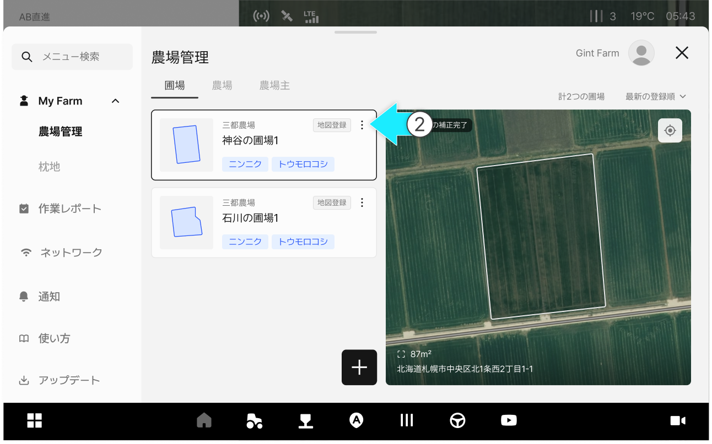
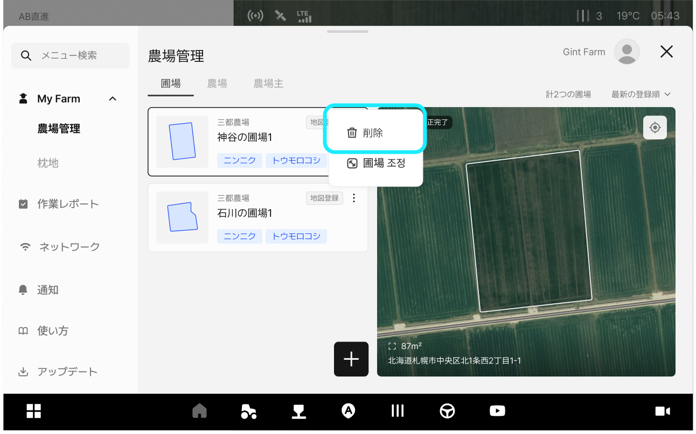
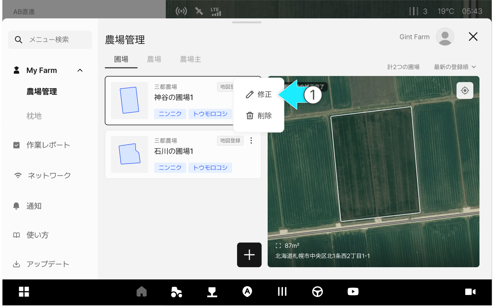
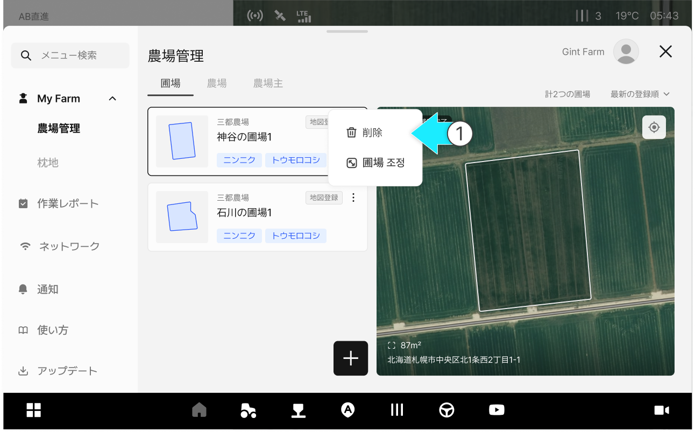
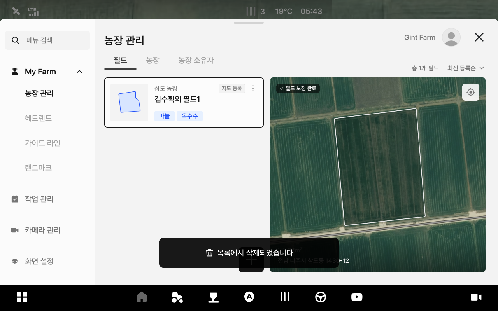

# 圃場情報の修正/削除

### 圃場情報の管理

圃場名、農場などの情報を修正し削除できる機能です。

***

#### 圃場情報の管理機能へアクセス



 \[メニュー一覧のアイコン]をクリックします。

<figure><figcaption></figcaption></figure>



ご希望の圃場項目の  アイコンをクリックします。

<figure><figcaption></figcaption></figure>



ポップアップからご希望の管理機能を選択します。

<figure><figcaption></figcaption></figure>



***

#### 圃場情報の修正



\[修正]オプションを選択します。

<figure><figcaption></figcaption></figure>



修正したい圃場の情報を入力し、\[修正完了]をクリックします。

<figure><figcaption></figcaption></figure>



圃場情報の修正が完了します。

<figure><figcaption></figcaption></figure>



***

#### 圃場情報の削除



\[削除]オプションをクリックします。

<figure><figcaption></figcaption></figure>



\[削除]ボタンを押します。

<figure><figcaption></figcaption></figure>



削除が完了します。

<figure><figcaption></figcaption></figure>


