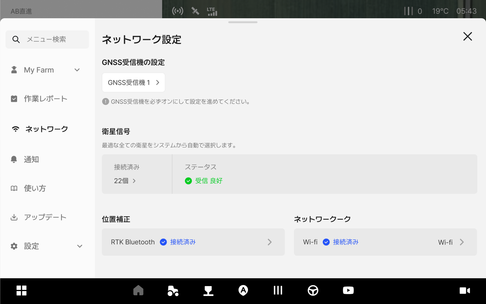
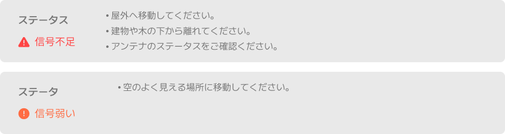

# ネットワーク設定へのアクセスおよび画面のご案内

### ネットワーク設定へのアクセスおよび画面のご案内

ネットワーク設定では、GNSS受信機のステータスや衛星信号の品質、位置補正の接続状態やタブレットのネットワーク（Wi-Fi/セルラー）を確認し、変更することができます。

***

#### ネットワーク設定はなぜ必要ですか？

走行作業の精度を保つために必要な設定です。以下の3つの項目を確認し、円滑な自動操舵を行います。 

1. 衛星信号を受信し、現在地を特定します。
2. 位置補正により、精度の高い走行作業が可能です。
3. ネットワークが安定していると、補正信号が切断せず受信できます。

***

#### ネットワーク設定へのアクセス方法



 メニュー一覧のアイコンをクリックします。

<figure><figcaption></figcaption></figure>



\[ネットワーク設定]をクリックします。

<figure><figcaption></figcaption></figure>



ネットワーク設定画面へのアクセスが完了します。

<figure><figcaption></figcaption></figure>



***

#### ネットワーク設定画面のご案内

<figure><figcaption></figcaption></figure>

&#x20; **GNSS受信機の設定**

* 接続されたGNSS受信機を確認し、必要に応じて他の受信機に変更することができます。

&#x20; **衛星信号**

* GNSSは、GPS（米国）、GLONASS（ロシア）、BDS（中国）、Galileo（ヨーロッパ）、QZSS（日本）など、複数の国の衛星システムから受信した衛星信号を統合して使用するものです。
複数の国の衛星信号を同時に受信すると、接続可能な衛星の数が増えるため、位置の正確度や信号の安定性が向上されます。
* 現在の環境で最適な衛星をシステムから自動で選択されます。
信号のステータスが良好でない場合は、案内文に従って対応してください。
*

    <figure><figcaption></figcaption></figure>

&#x20; **位置補正**

* RTKの手動接続/RTKのBluetoothなど、補正方法や接続方法を設定します。\
  詳細については、[位置補正の設定](rtk-setting.md)をご参照ください。

&#x20; **ネットワーク**

* タブレットのセルラー（LTE）およびWi-Fi接続の状態を設定します。\
  詳細については、[ネットワーク設定](./)をご参照ください。
