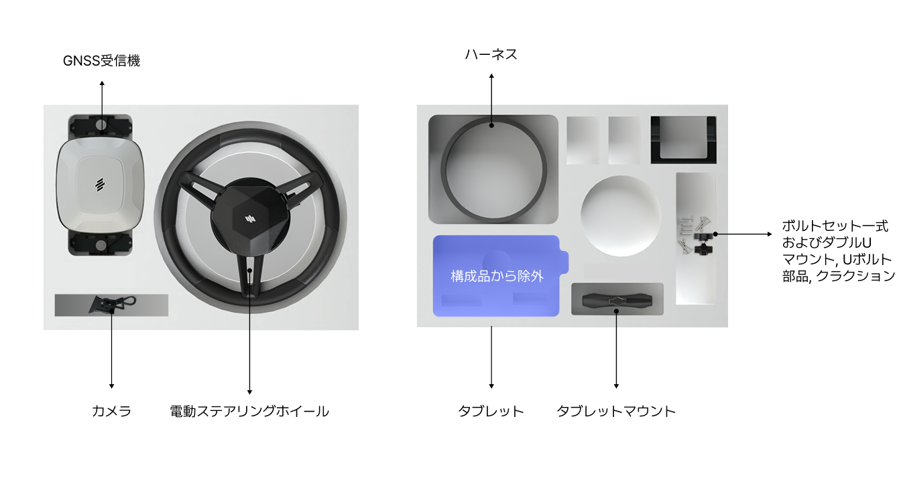
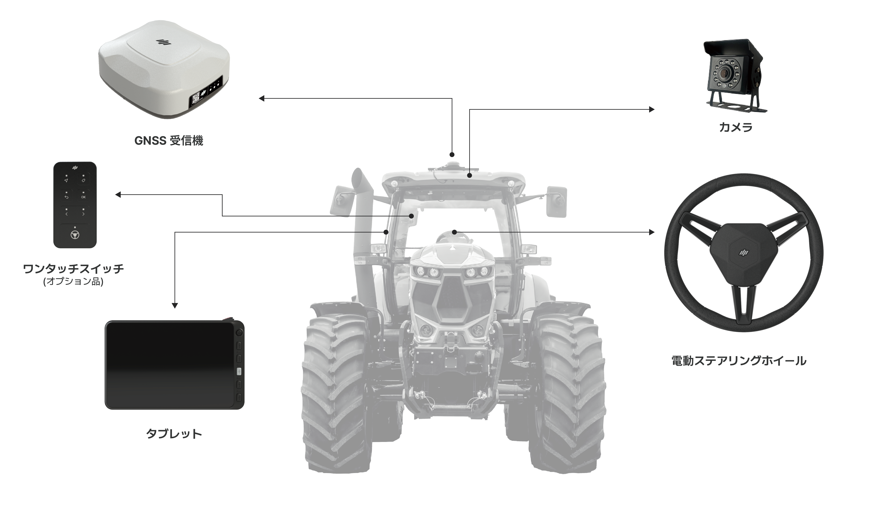
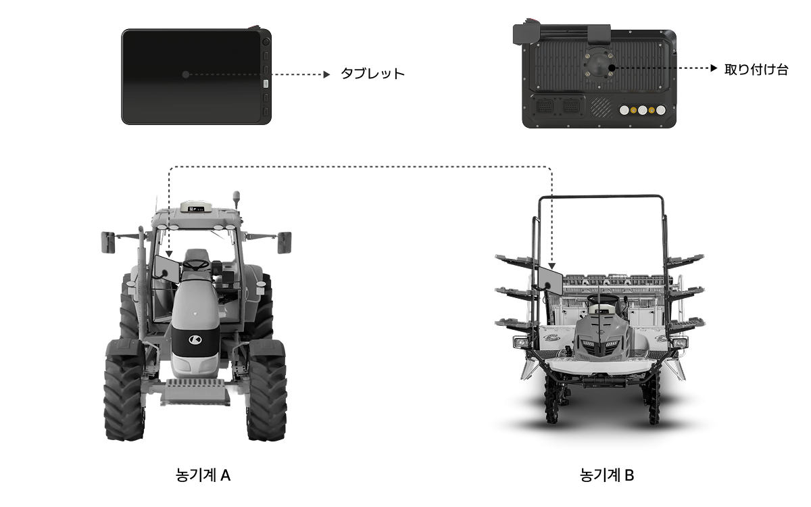

# PLUVA iONのご紹介

### PLUVA iONのご紹介

PLUVA iONは、トラクター及び田植え機向けのオートガイダンス（Autoguidance）システムとして、GNSS（衛星測位システム）及び電動ステアリングを用いて、高精度な直進走行や自動Uターンなどをサポートする装置です。運転者の操作負担を軽減し、作業品質及び作業効率の向上を目的とした作業補助システムです。

自動操舵機能は、複数の構成品が連携して動作します。下記にて、構成品と各装置の役割について説明いたします。

***

### 製品構成

※本製品をご購入いただくと、下記の構成品が同梱されていますので必ずご確認ください。\
構成品の一部は、モデルタイプによって外観や色がイメージと異なる場合があります。

※製品構成は製造メーカーの規定により、予告なく変更される場合があり、販売国によって異なることがあります。

#### プルバアイオン

> PLUVA iONの全構成品です。GNSS受信機、電動ステアリングホイール、タブレット、カメラが含まれています。

<figure><figcaption></figcaption></figure>

#### エクスパンション　キット

> 本製品はタブレットを含みません。GNSS受信機、電動ステアリングホイール、カメラが含まれています。
ハーフセットをご購入の際には、すでにPLUVA iONのタブレットをお持ちであることをご確認ください。

<figure><figcaption></figcaption></figure>

***

### 主な構成品のご紹介



#### 電動ステアリングホイール

<figure><figcaption></figcaption></figure>

農業機械の従来のハンドルを取り外し、ステアリング位置に取り付ける電動モーター式のステアリング装置です。\
詳細は、[電動ステアリングホイール](electric-steering-wheel.md)をご参照ください。



#### GNSS受信機

<figure><figcaption></figcaption></figure>

高精度測位（RTK）技術を活用し、農業機械のリアルタイムでの位置を精密に測定する装置です。\

詳しい仕様及び機能に関しては、[GNSS受信機](gnss-receiver.md)をご参照ください。





#### タブレット

<figure><figcaption></figcaption></figure>

自動操舵システムのディスプレイ装置として、作業経路の設定、走行状態のモニタリング、システム制御及び各種設定機能をご提供します。\

詳しい使用方法は[タブレット](tablet.md)をご参照ください。



#### ワンタッチスイッチ (オプション品)

<figure><figcaption></figcaption></figure>

作業者が操作しやすい位置に取り付けられ、自動操舵システムの開始/停止などの主要機能を簡単に制御できます。

オプション品は別途ご購入が必要です。\
詳細は[ワンタッチスイッチ](switch.md)をご参照ください。









#### カメラ

<figure><figcaption></figcaption></figure>

後方をモニタリングするため、農機の後部上方に
カメラを設置し、後方の作業状況をリアルタイムで確認することが可能です。\
詳細は[カメラ](camera.md)をご参照ください。



***

### 製品の取り付け位置

各構成品は、農業機械の指定された位置に取り付けられます。\
ただし、実際の取り付け位置は、車両モデル及び取り付けキットの構成によって異なる場合があります。

<figure><figcaption></figcaption></figure>

***

### エクスパンションキット使用方法

エクスパンションキット（Expansion Kit）を活用することで、1台のタブレットで複数台の農機の自動操舵が可能になります。

<figure><figcaption></figcaption></figure>


\[エクスパンションキット]\
タブレットを除いた経済的なキットです。GNSS受信機、電動ステアリングホイール、カメラが含まれています。ご注文の前に、PLUVA iONタブレットをお持ちであることをご確認ください。

