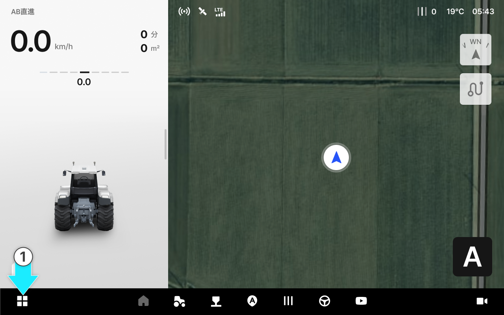
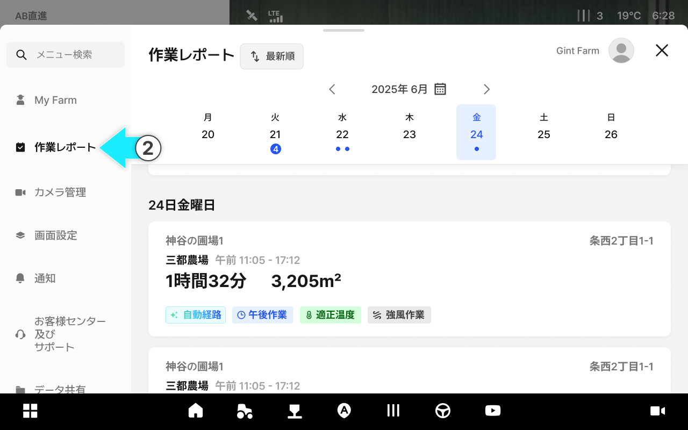
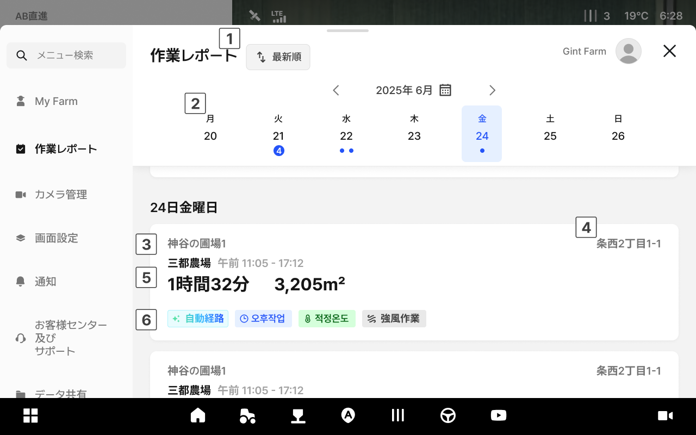
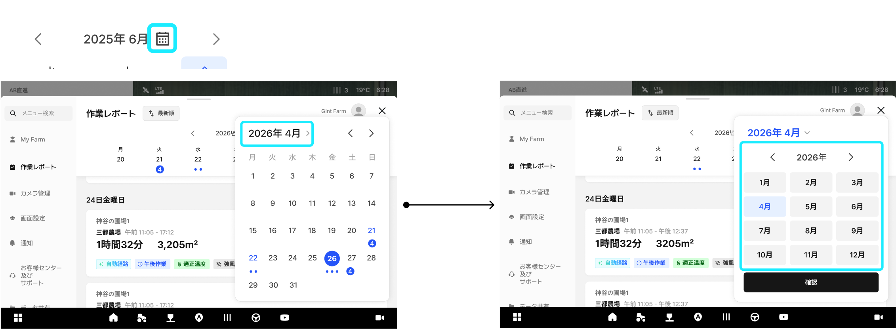
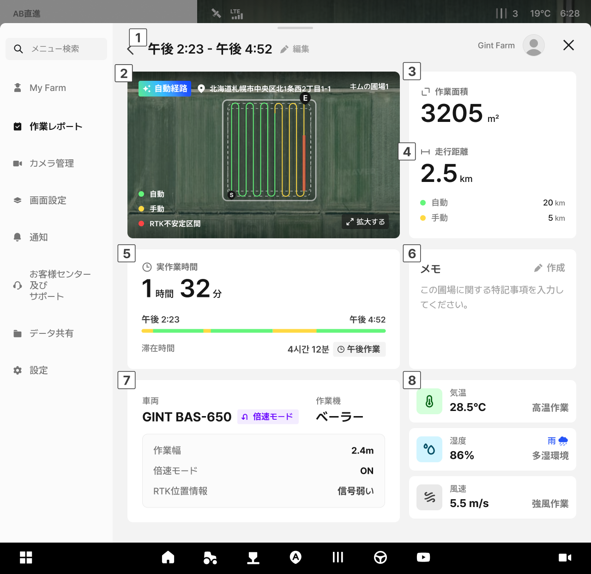

---
metaLinks:
  alternates:
    - https://app.gitbook.com/s/4rNrDNCqOFVCh006UOXy/ion/report
---

# 作業日誌

作業日誌では、完了した作業記録を日付ごとに確認でき、作業軌跡や作業効率、環境情報を一目で把握できます。

また、記録を残すだけでなく、作業当時の天候や機器の状態を作業結果と繋ぎ合わせることで、次の作業の効率を高めるための判断材料としてご活用いただけます。

***

### アクセス方法



ホーム画面から  をタップします。

<figure><figcaption></figcaption></figure>



\[作業日誌]を選択すると、作業日誌リストへアクセスします。

<figure><figcaption></figcaption></figure>




作業完了直後には、完了画面から\[作業記録を確認する]をタップすると、すぐにアクセスできます。


***

### リスト画面

作業履歴​リストは、日付ごとにまとめられたカード形式で表示されます。

<figure><figcaption></figcaption></figure>

 **並べ替え**

* 最新順・古い順にリストの並べ替えができます。

 **日付の選択**

* 週間カレンダーでご希望の日付を選択すると、その日の作業記録が確認できます。
* 上部の年月表示やカレンダーアイコンをタップすると、年月を変更できます。

<figure><figcaption></figcaption></figure>

 **圃場情報**

* 作業が行われた圃場の名前が表示されます。

 **作業場所の住所**

* 作業が行われた圃場の住所が表示されます。

 **作業情報**

* 作業名、開始および終了時刻、実作業時間、作業面積が表示されます。

 **作業状況に関するタグ**

* 作業の状況がタグで表示されます。経路のタイプ（自動経路）や作業時間帯（午前・午後作業）、気温・湿度・風速などが表示されます。

***

### 詳細画面

リスト上のカードをクリックすると、該当する作業の詳細情報が確認できます。

<figure><figcaption></figcaption></figure>

 **作業時刻**

* 作業の開始および終了時刻が表示されます。

 **作業地の地図**

* 作業経路および作業完了区間を地図上から確認できます。
* 経路は走行方法に応じて色で区分されます。
* 地図の上部には、圃場の住所および圃場名が表示されます。
* 自動経路で作業した際には、地図の左上部に自動経路のタグが表示されます。


- **自動：** 自動操舵で作業した区間
- **手動：** 手動運転で作業した区間
- **RTK不安定区間：** RTKの信号が不安定だった区間



「拡大する」をタップすると、地図を全体画面に拡大して表示できます。


 **作業面積**

* 自動操舵で作業完了した総面積を表します。

 **走行距離**

* 自動および手動で走行した距離の合計です。

 **作業時間に関する情報**

* 実作業時間は、自動操舵または手動運転で実際作業した時間の合計を表します。
* 滞在時間は、作業開始から終了まで圃場内にいた時間の合計として、待機・移動時間も含まれます。
* 作業が行われた時間帯（午前作業/午後作業）が併せて表示されます。

 **メモ**

* 作業時に入力したメモが確認できます。

 **機器に関する情報**

* この作業で使用した車両および作業機の情報です。

 **天候情報**

* 作業当時の気温、湿度、風速が表示されます。高温・多湿・強風などの作業当時の環境状況も併せて表示されます。

