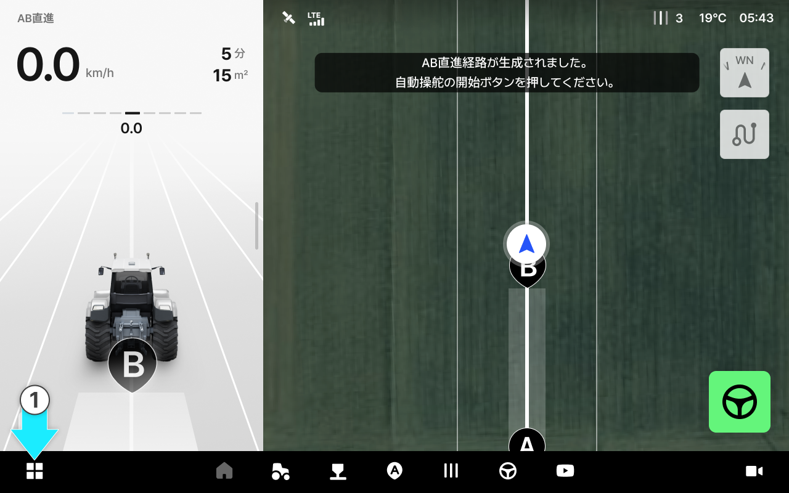
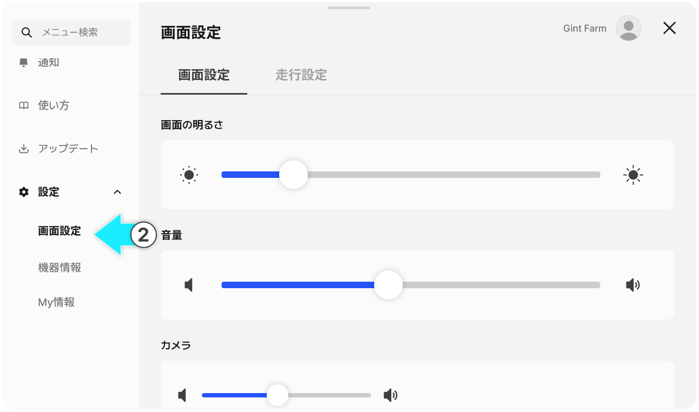
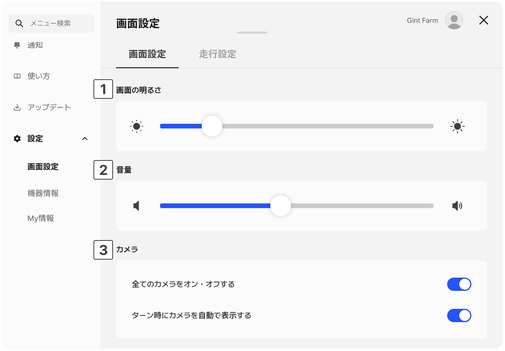
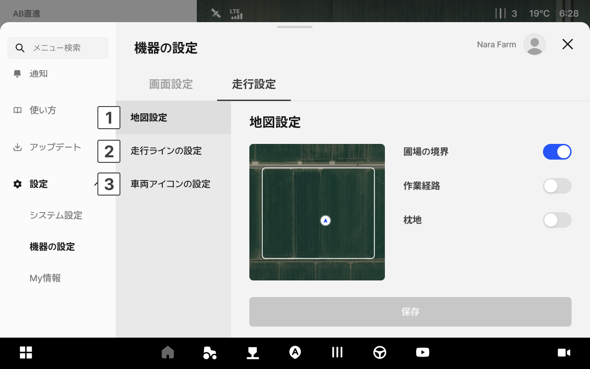
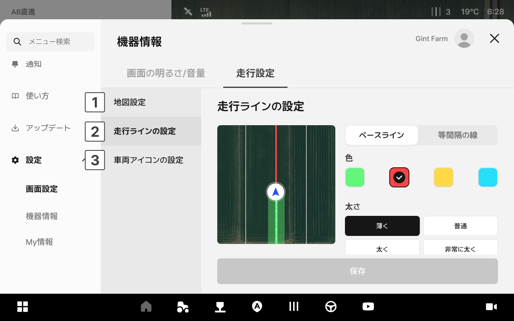
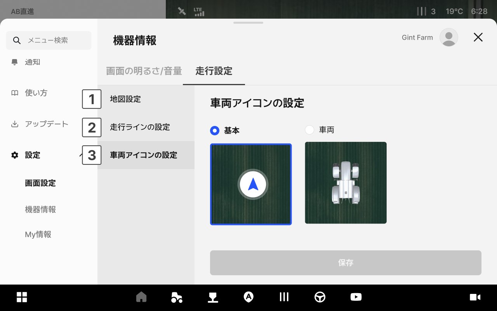

---
metaLinks:
  alternates:
    - https://app.gitbook.com/s/4rNrDNCqOFVCh006UOXy/ion/settings/display
---

# 画面設定

走行画面の明るさや音量、カメラ表示の設定を行います。

### アクセス方法



アプリ下部の設定アイコンをタップします。

<figure><figcaption></figcaption></figure>



左側のメニューから「画面設定」をタップします。

<figure><figcaption></figcaption></figure>



***

### 画面設定のご案内

<figure><figcaption></figcaption></figure>

 **画面の明るさ**

* スライダーを左右にドラッグすることで、画面の明るさを調整できます。

 **音量**

* スライダーを左右にドラッグすることで、音量を調整できます。

 **カメラ**

* 走行画面上のカメラ動画の表示有無に関する設定を行います。

***

### 走行設定のご案内

<figure><figcaption></figcaption></figure>

 **地図設定**

* 走行画面に表示する地図の内容を設定します。
  * 圃場の境界：圃場の境界線の表示有無
  * 作業経路：走行済みの経路の表示有無
  * 枕地：枕地エリアの表示有無

<figure><figcaption></figcaption></figure>

 **走行ライン設定**

* 走行の基準ラインの表示方法を設定します。ご希望のオプションを選択してください。

<figure><figcaption></figcaption></figure>

 **車両アイコンの設定**

* 走行画面に表示される車両アイコンの形を選択できます。
