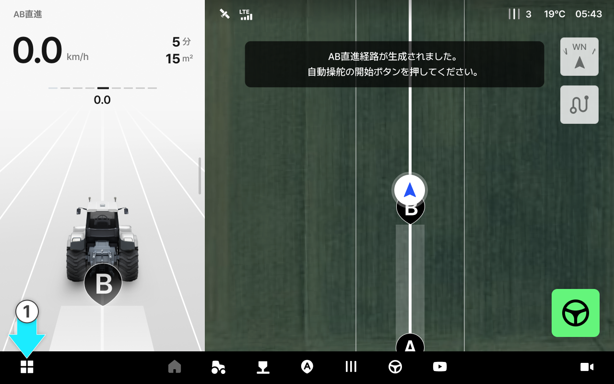
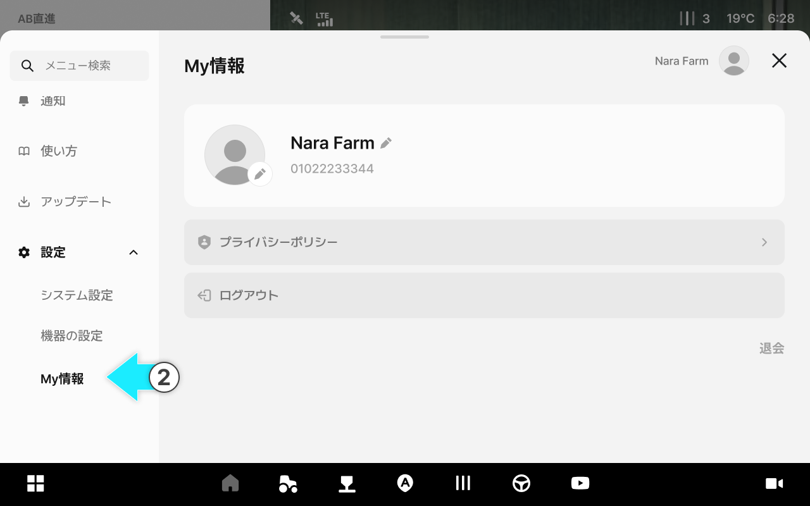
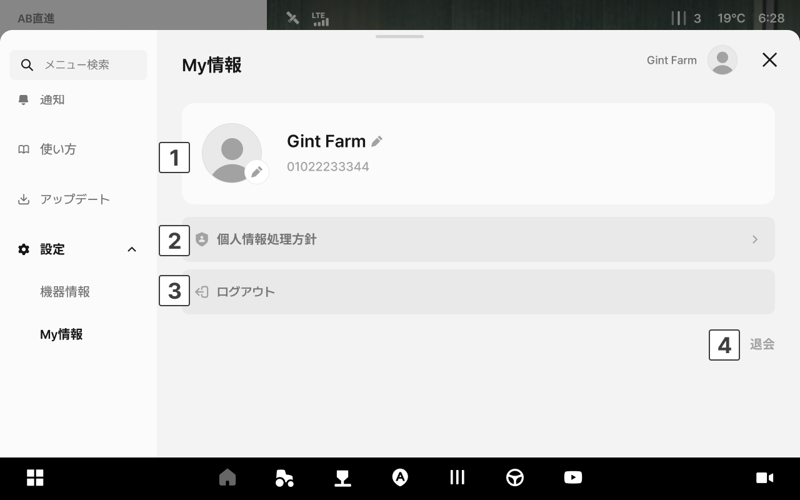

---
metaLinks:
  alternates:
    - https://app.gitbook.com/s/4rNrDNCqOFVCh006UOXy/ion/settings/my-info
---

# マイページ

マイページでは、ログインされたアカウントのプロフィール情報が確認でき、プライバシーポリシーの閲覧、アカウントに関する設定ができます。

### アクセス方法



アプリ下部の設定アイコンをタップします。

<figure><figcaption></figcaption></figure>



左側のメニューからマイページをタップします。

<figure><figcaption></figcaption></figure>



***

### プロフィール画面

<figure><figcaption></figcaption></figure>

 **プロフィール**

* **プロフィール写真：** 円形のアイコンで表示されます。タップすると画像の変更ができます。
* **名前：** 登録した名前が表示されます。
* **電話番号：** 会員登録時に登録した連絡先が表示されます。

 **プライバシーポリシー**

* プライバシーポリシーをタップすると、個人情報の収集及び利用に関する方針を確認できます。

 **初期化**

* アプリデータを初期化します。


**ご注意：**&#x521D;期化時には、保存された作業設定及びデータが削除されます。初期化する前に、保存しておきたいデータを必ずご確認ください。


 **ログアウト**

* 現在のアカウントからログアウトされます。

 **退会**

* サービスアカウントを完全に削除します。


**ご注意：** 退会時には、全てのデータが完全に削除されます。削除されたデータは復元できません。

