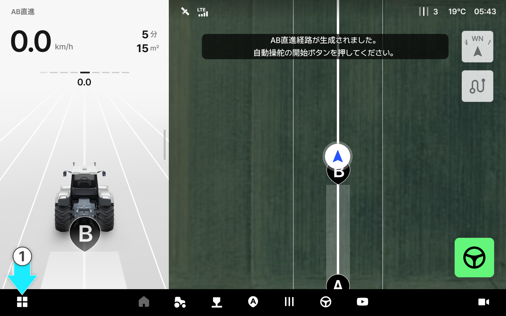
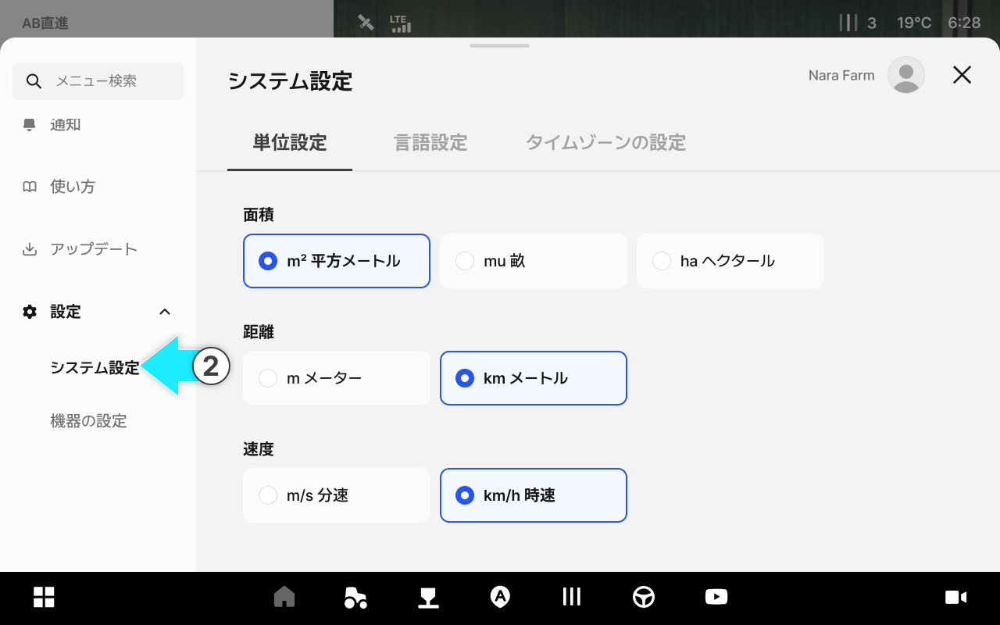
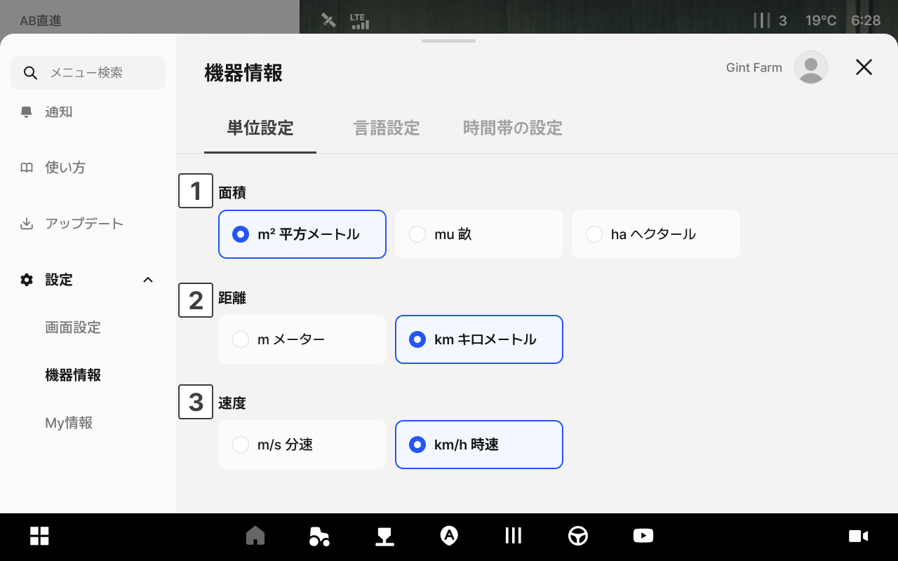
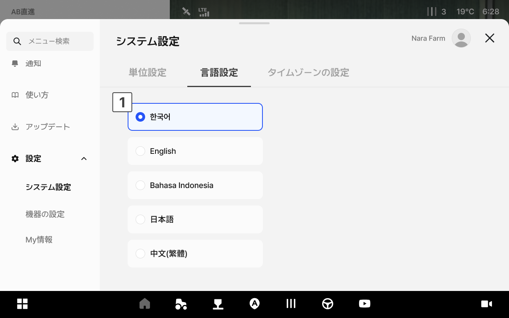
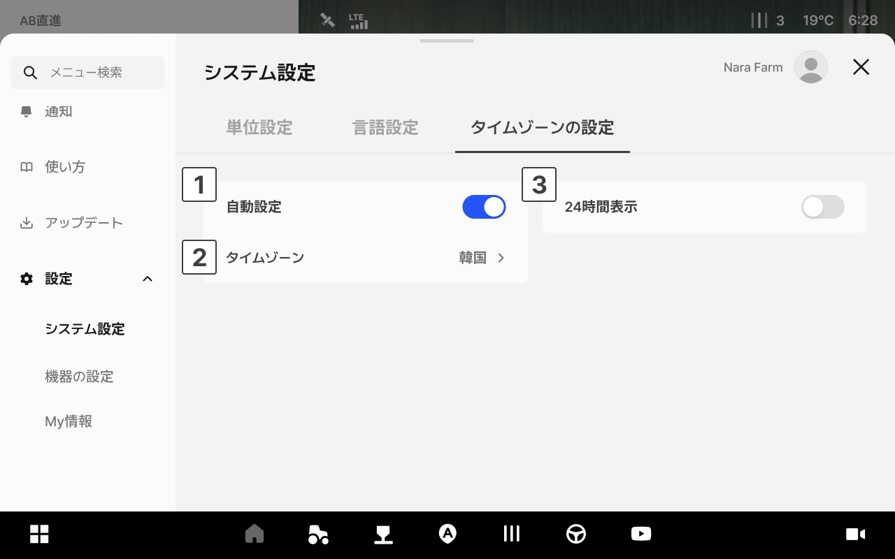
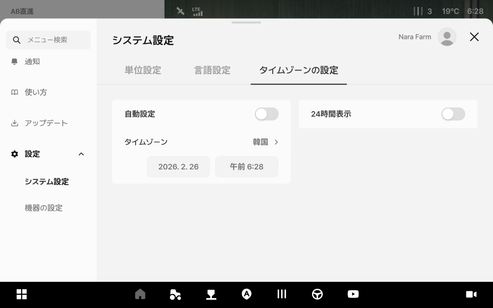
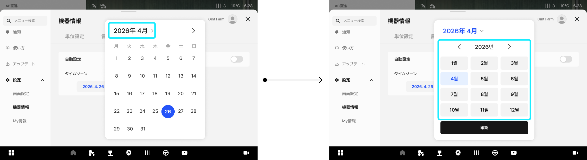
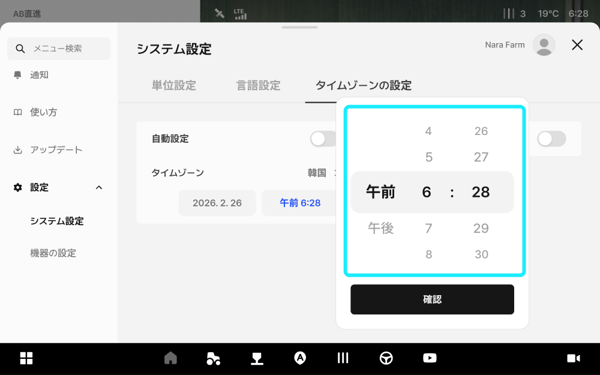

---
metaLinks:
  alternates:
    - https://app.gitbook.com/s/4rNrDNCqOFVCh006UOXy/ion/settings/system
---

# システム設定

アプリのタイムゾーンや言語、単位などの基本的な環境設定を行います。

***

### アクセス方法



アプリ下部の設定アイコンをタップします。

<figure><figcaption></figcaption></figure>



左側のメニューからシステム設定をタップします。

<figure><figcaption></figcaption></figure>



***

### 単位設定画面のご案内

面積や距離、速度などの表示単位を選択します。

<figure><figcaption></figcaption></figure>

 **面積**

* 選択可能な単位： m² 平方メートル / mu 畝 / ha ヘクタール

 **距離**

* 選択可能な単位：m メートル / km キロメートル

 **速度**

* 選択可能な単位： m/s 分速 / km/h 時速

***

### 言語設定

アプリの表示言語を変更します。

<figure><figcaption></figcaption></figure>

 **言語**

* 韓国語 / English / Bahasa Indonesia / 日本語 / 中文（繁體）から選択します。

***

### タイムゾーンの設定

現在地に合わせたタイムゾーンを設定します。

<figure><figcaption></figcaption></figure>

 **自動で設定**

* **「自動で設定」**&#x3092;有効にすると、タイムゾーンは機器の位置を基盤として自動で設定されます。


**自動で設定**を無効にすると、日付と時間を直接設定できます。

日付エリアをタップすると、カレンダーからご希望の日付を直接選択できます。

時間エリアをタップすると、スクロールでご希望の時間を直接選択できます。



 **タイムゾーン**

* 現在設定されたタイムゾーンが表示されます。

 **24時間表示**

* 24時間で時間表示されます。トグルを無効にすると、12時間表示（午前/午後）に変更されます。
