---
layout:
  width: default
  title:
    visible: true
  description:
    visible: false
  tableOfContents:
    visible: true
  outline:
    visible: true
  pagination:
    visible: true
  metadata:
    visible: true
  tags:
    visible: true
metaLinks:
  alternates:
    - >-
      https://app.gitbook.com/s/W9zolTVOCJkGCWFEPCa0/ion/uturn-mode/uturn-mode-setting
---

# ターンの設定方法

ターン設定では、ターンを開始する位置、ターン方法、回転形態、速度などを作業環境に合わせて調整できます。設定を適用すると、作業の流れを中断することなく、より安定した走行が可能になります。

#### ターン設定のステップ

1. ターンラインの位置調整
2. ターンタイプの設定
3. ターンパターンの設定
4. ターン形態の設定

***

#### ターン機能の設定及びターンラインの位置調整



ABラインを生成した状態で\[作業] ボタンを押します。

<figure>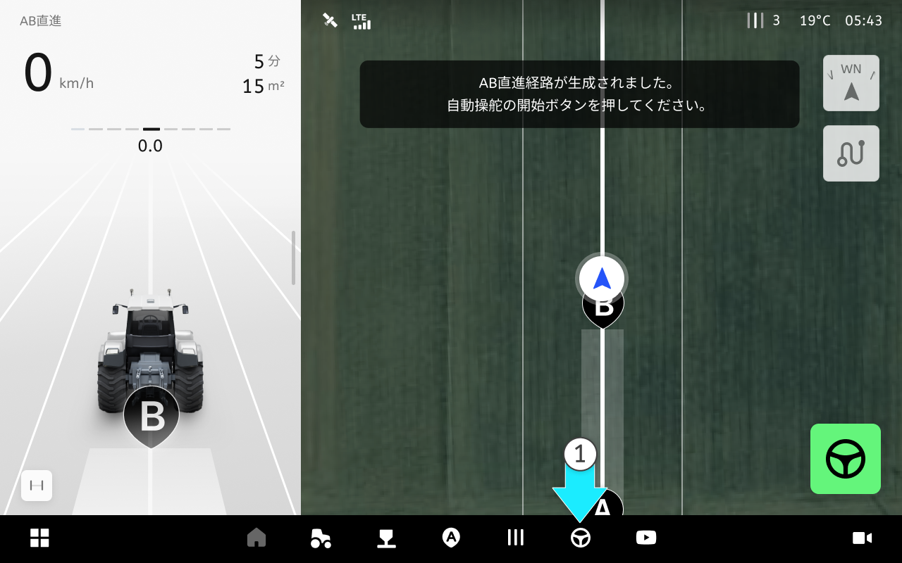<figcaption></figcaption></figure>


経路が生成されたときのみUターンモードを使用できます。




\[ターンモード]をクリックします。

<figure>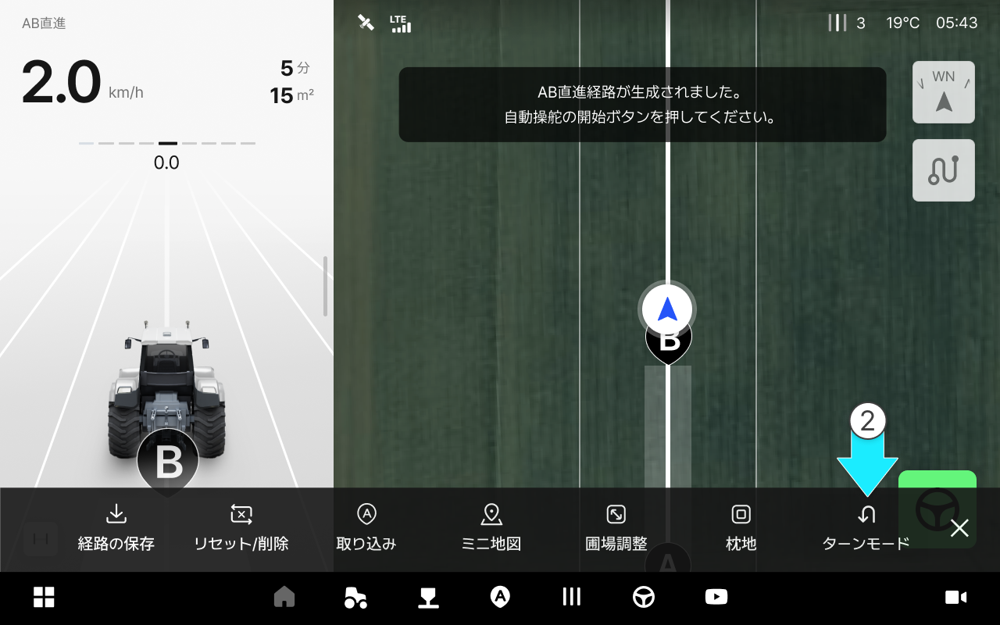<figcaption></figcaption></figure>



ターンのオン/オフを押して、ターンを有効にします。

<figure>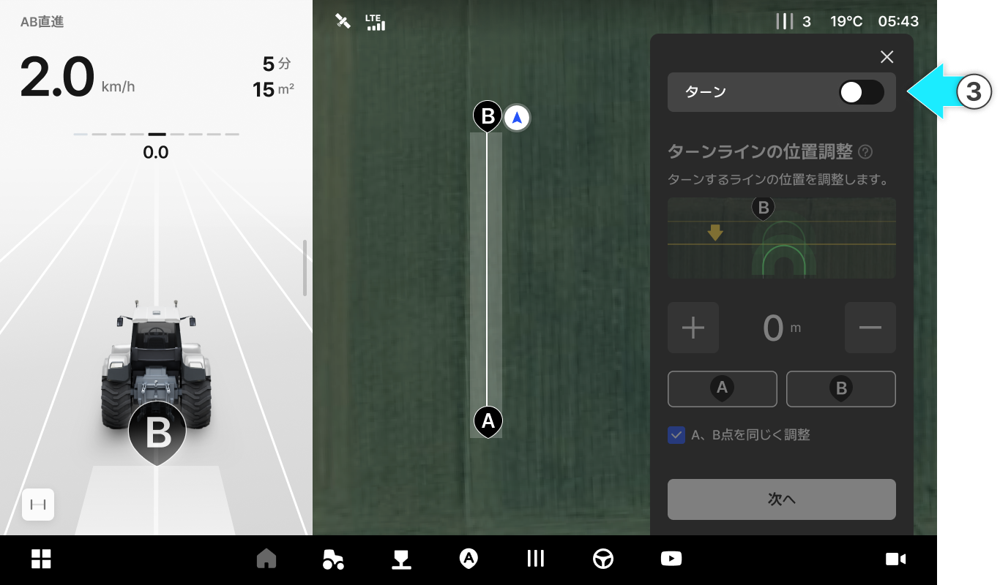<figcaption></figcaption></figure>



AまたはBを選択した後、ターンラインの位置を数字で調整します。

<figure>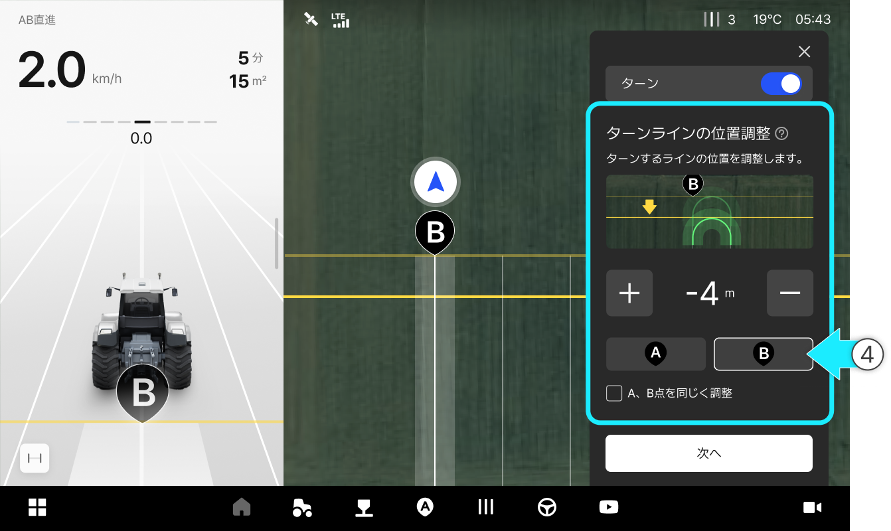<figcaption></figcaption></figure>


A、B点を同じく調整：位置の修正値を入力すると、A・B点の位置が同じく調整されます。

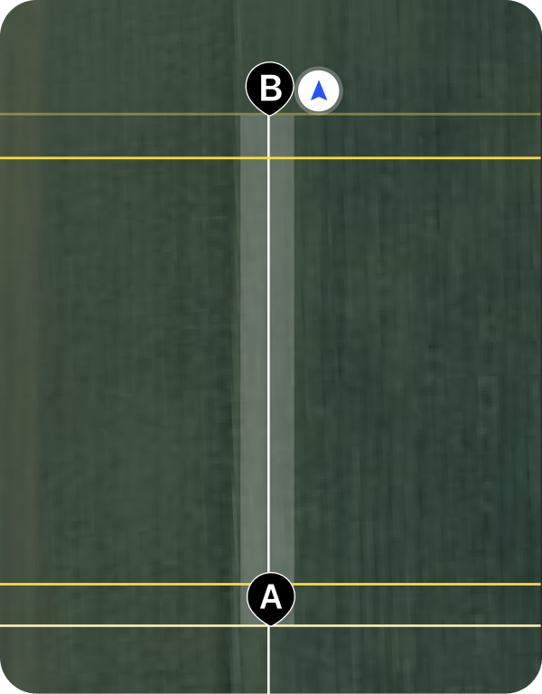




\[次へ]をクリックします。

<figure>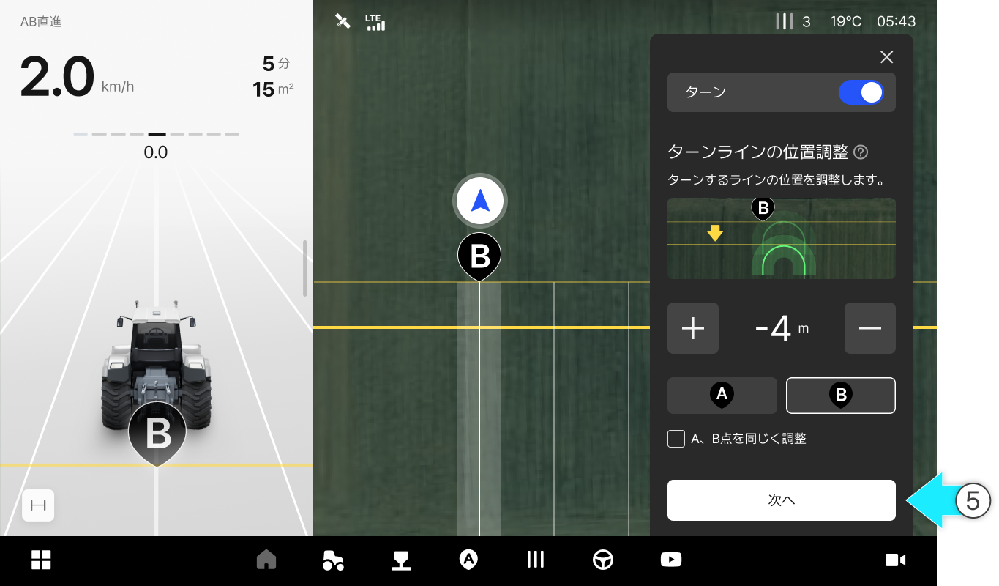<figcaption></figcaption></figure>



***

#### ターンタイプの設定



使用したいターンのタイプを選択します。

<figure>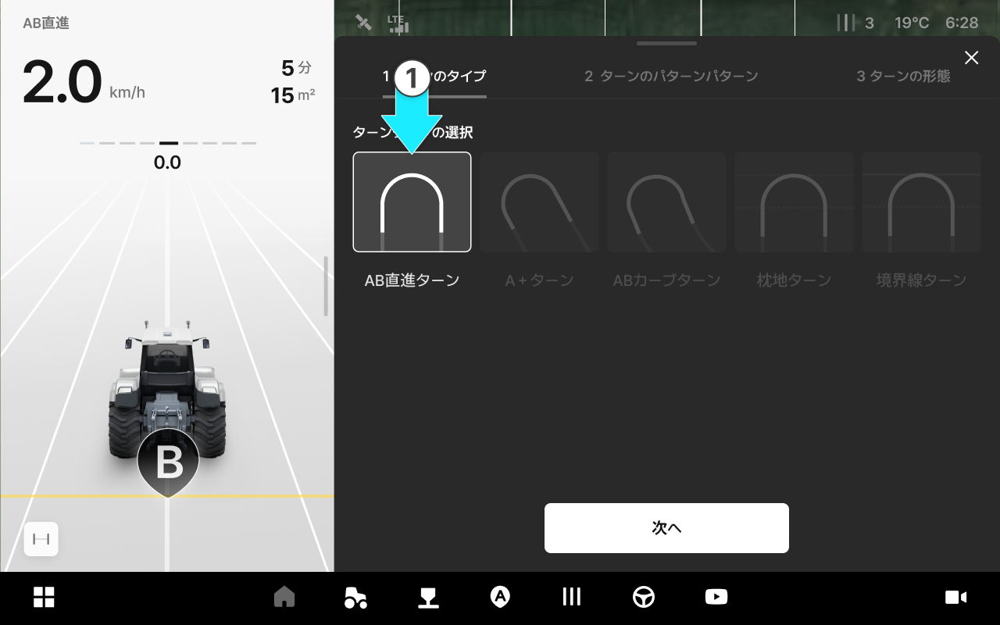<figcaption></figcaption></figure>



詳細値を設定し、\[次へ]をクリックします。

<figure>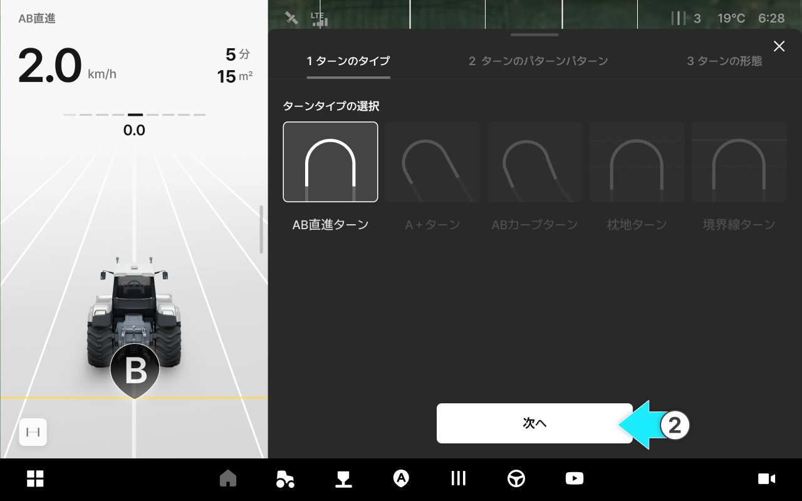<figcaption></figcaption></figure>



#### ターンタイプのご案内

<figure>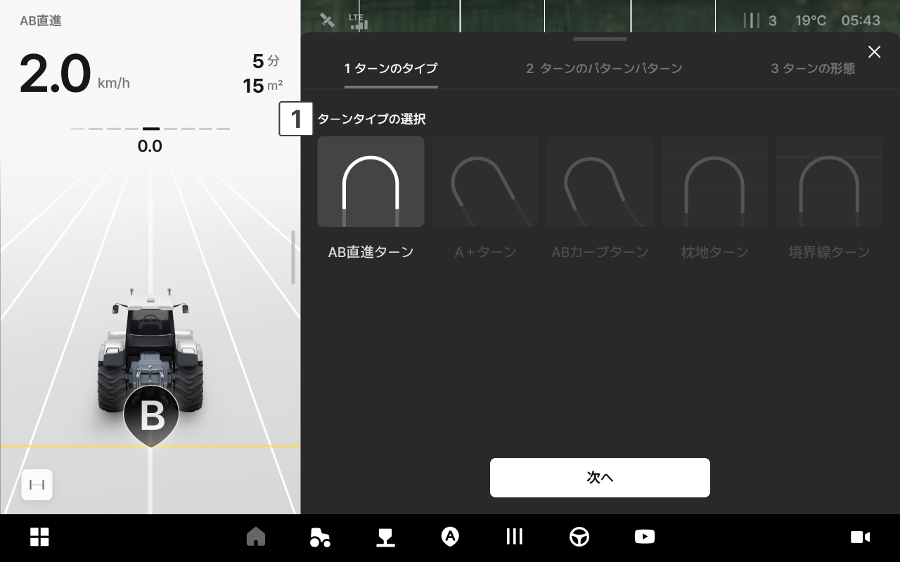<figcaption></figcaption></figure>

 **ターンのタイプ**

**AB直進ターン**

* ABラインの基準点を中心に設定値を基にターンします。

<figure><figcaption></figcaption></figure>


AB直進モードでのみ使用でき、それ以外のモードでは無効になります。


***

#### ターンのパターン設定



使用したいターンのパターンを選択します。

<figure>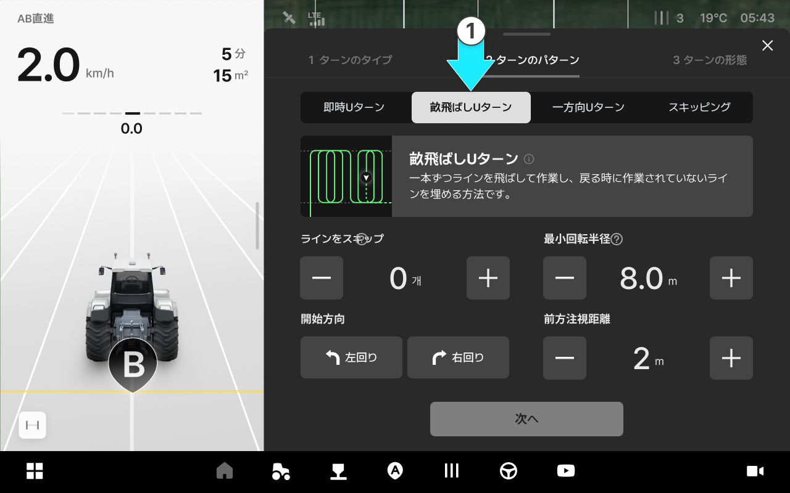<figcaption></figcaption></figure>



ターンの方向と細かい数値を設定し、\[次へ]をクリックします。

<figure>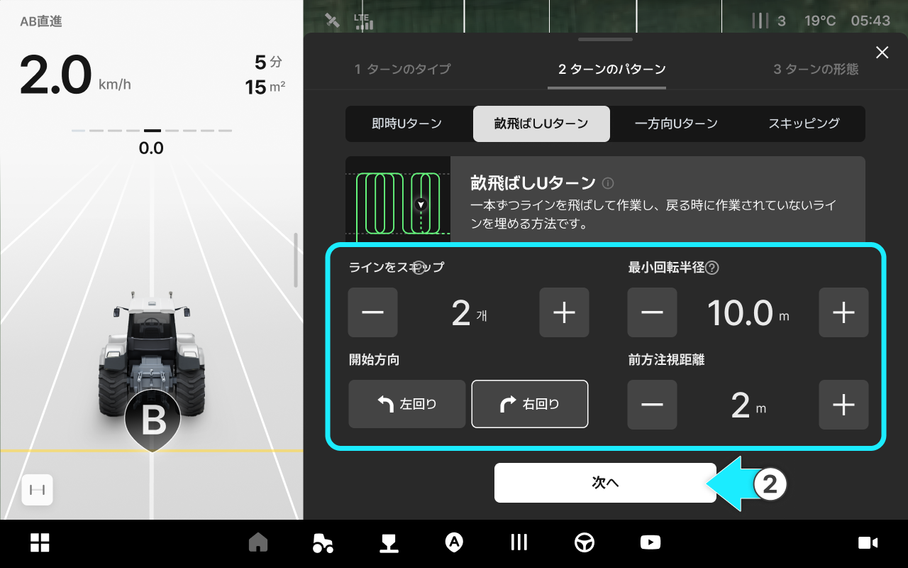<figcaption></figcaption></figure>



#### ターンパターン画面の説明

<figure>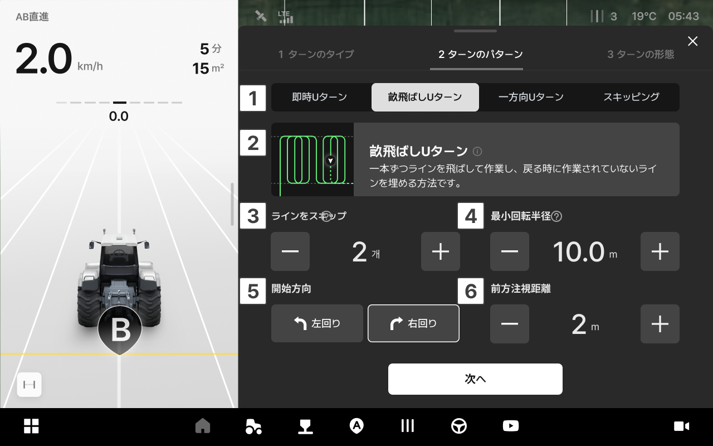<figcaption></figcaption></figure>

 **ターンのパターン**

 **ターンパターンのプレビュー**

* 現在設定されているターンのパターンが実際の作業ラインにどのように適用されるかを事前に確認することができます。

<figure>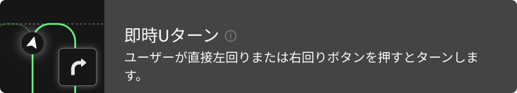<figcaption></figcaption></figure>

<figure>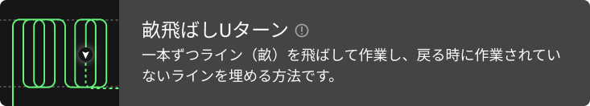<figcaption></figcaption></figure>

<figure>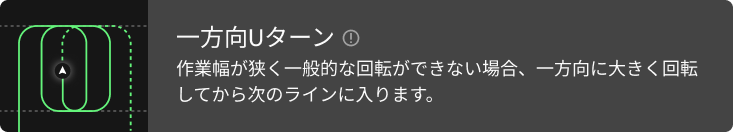<figcaption></figcaption></figure>

<figure>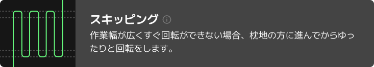<figcaption></figcaption></figure>

 **ラインをスキップ**

* ターン時のスキップするライン（畝）の数を設定します。

 **最小回転半径**

* ターンするときの最小回転半径を設定します。

 **開始方向**

* 直進走行後、一回目にターンする方向（左回り/右回り）を設定します。

 **前方注視距離**

* 車両が前方を認識する際に基準となる距離です。設定値を大きくするほど滑らかな走行になります。

***

#### ターン形態の設定



使用するターンの形態を選択します。最小回転半径などのターン設定値に基づいて可能なターン形態のみが有効になります。

<figure>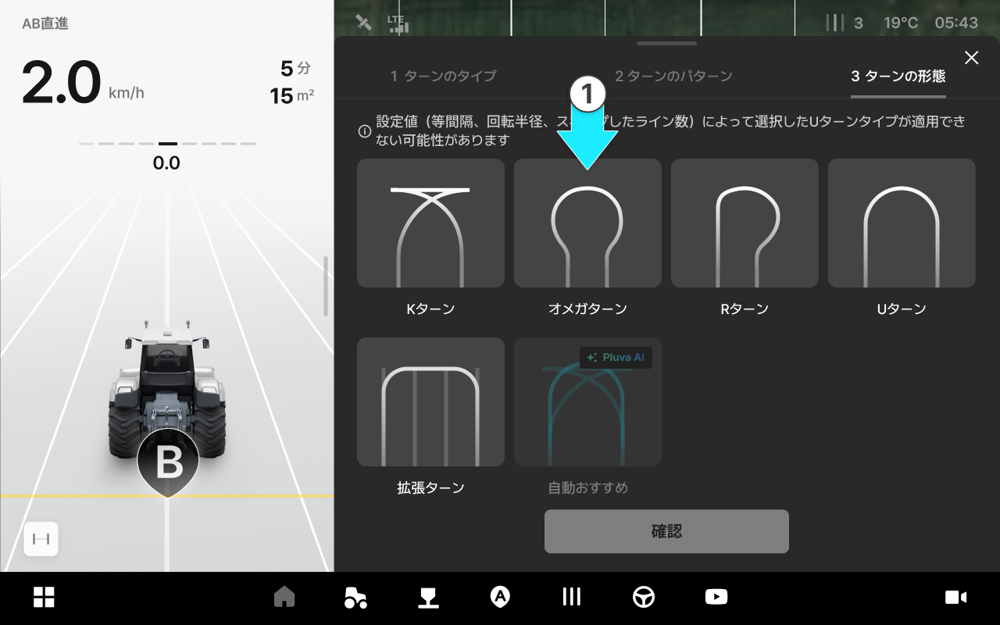<figcaption></figcaption></figure>



\[確認]をクリックします。

<figure>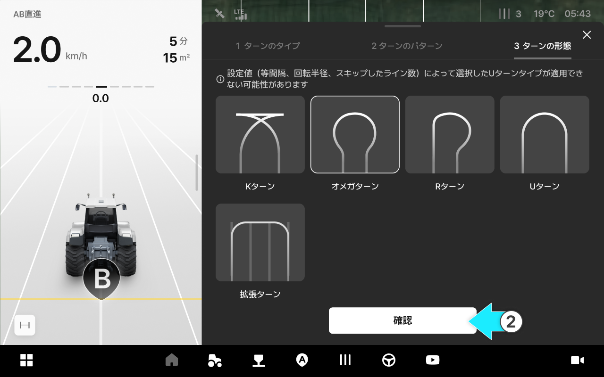<figcaption></figcaption></figure>



ターン経路が生成されたら \[自動操舵]を押し、ターンが含まれた自動操舵を開始します。

<figure>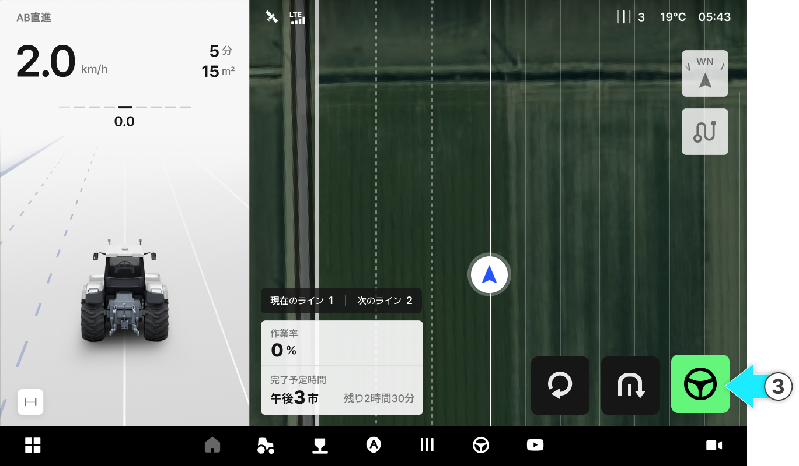<figcaption></figcaption></figure>



#### Uターン形態画面のご案内

<figure>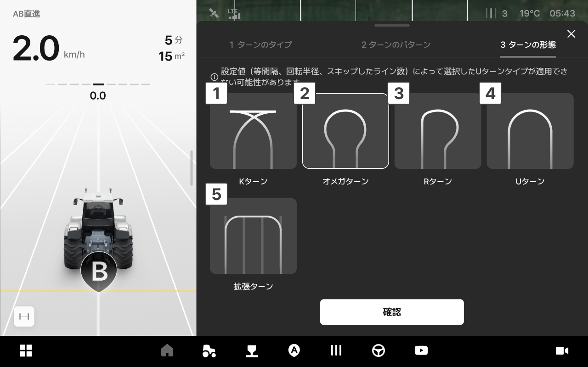<figcaption></figcaption></figure>

 **Kターン**

* 角張った直角型のUターンです。素早い方向転換が可能で、狭いスペースで有利です。

<figure>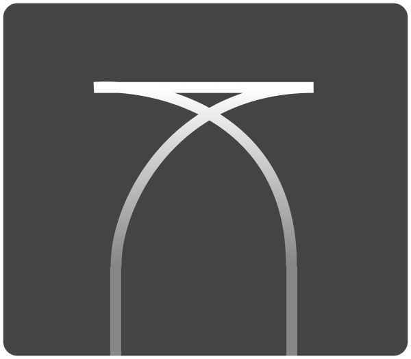<figcaption></figcaption></figure>

 **オメガターン**

* 丸いU字型の滑らかなUターンです。機械の負荷を軽減し、Uターンの安定性を高めるのに適しています。

<figure><figcaption></figcaption></figure>

 **Rターン**

* 滑らかな曲線のUターンです。余裕のある枕地や追加の枕地（回耕）作業をする場合に適しています。

<figure><figcaption></figcaption></figure>

 **Uターン**

* 滑らかな曲線Uターンです。一般的な作業や中距離の圃場に適しています。

<figure><figcaption></figcaption></figure>

 **拡張ターン**

* 直線状のUターンです。不整形な圃場、障害物を回避する時に適しています。

<figure><figcaption></figcaption></figure>

