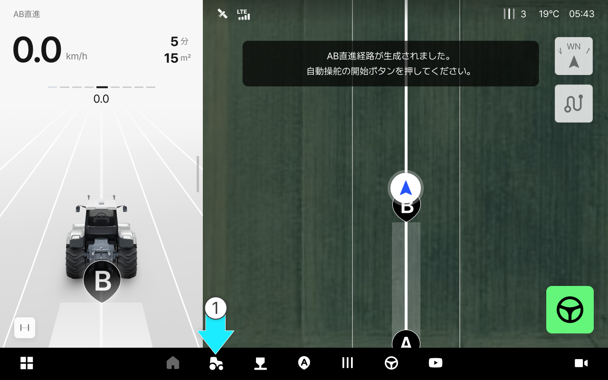
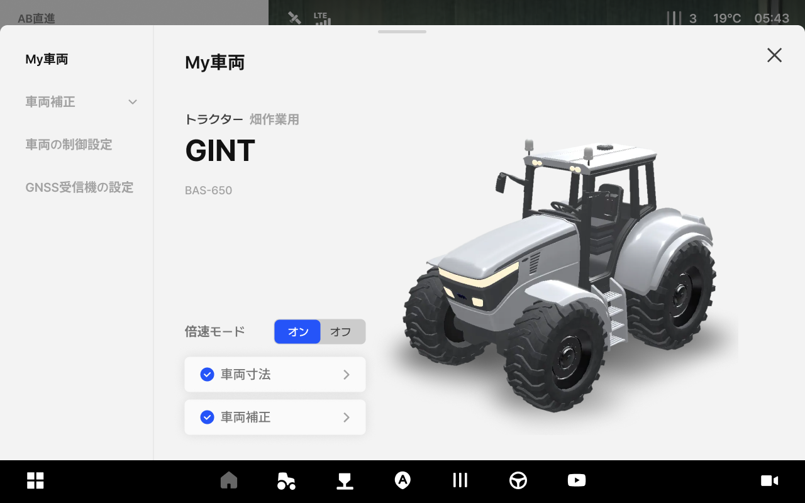
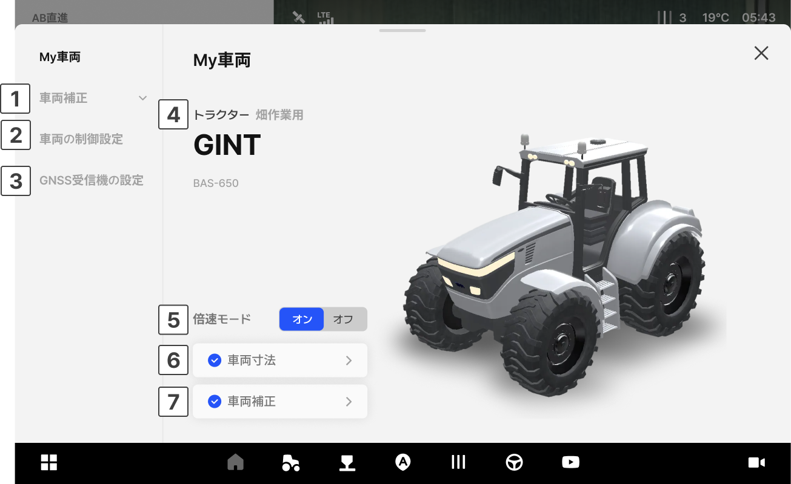

---
layout:
  width: default
  title:
    visible: true
  description:
    visible: false
  tableOfContents:
    visible: true
  outline:
    visible: true
  pagination:
    visible: true
  metadata:
    visible: true
  tags:
    visible: true
metaLinks:
  alternates:
    - >-
      https://app.gitbook.com/s/W9zolTVOCJkGCWFEPCa0/ion/vehicle-settings/entering-my-vehicle
---

# My車両へのアクセスおよび画面のご案内

作業に使用する車両を追加、または補正できる管理機能です。\
現在タブレットが取り付けられている車両の情報が表示されます。\
車両の変更及び修正は購入先（販売店）にお問い合わせください。

***

#### My車両へのアクセス方法



 \[車両]をタップします。

<figure><figcaption></figcaption></figure>



My車両へのアクセスが完了します。

<figure><figcaption></figcaption></figure>



***

#### My車両画面のご案内

<figure><figcaption></figcaption></figure>

 **車両補正**

* 車両が揺れたり曲がったりせず、正確に直進できるようオートステア、ロール・ピッチ・ヨー、慣性センサーなどを補正します。

 **車両の制御設定**

* 作業環境に合わせて走行の特性を調整できます。\
  設定変更すると自動操舵の性能に影響を与えかねません。

 **GNSS受信機の設定**

* 車両に取り付けられたGNSS受信機の位置を入力し、位置精度を最適化できます。（または位置精度を高められます。）

 **車両情報**

* 取り付けられている車両のタイプ、別名、メーカー、機種を表示します。

 **倍速ターン ON/OFF**

* 倍速ターン付きの車両の場合、車両の倍速ターンのON/OFF状態を表示します。倍速ターン付きの車両でない場合には表示されません。

 **車両寸法**

* 車両の寸法を入力し終わったかどうかが表示されます。タップすると車両の寸法を変更できます。

 **車両補正の有無**

* 車両の補正が終わったかどうかが表示されます。タップすると車両の補正画面にアクセスされます。
