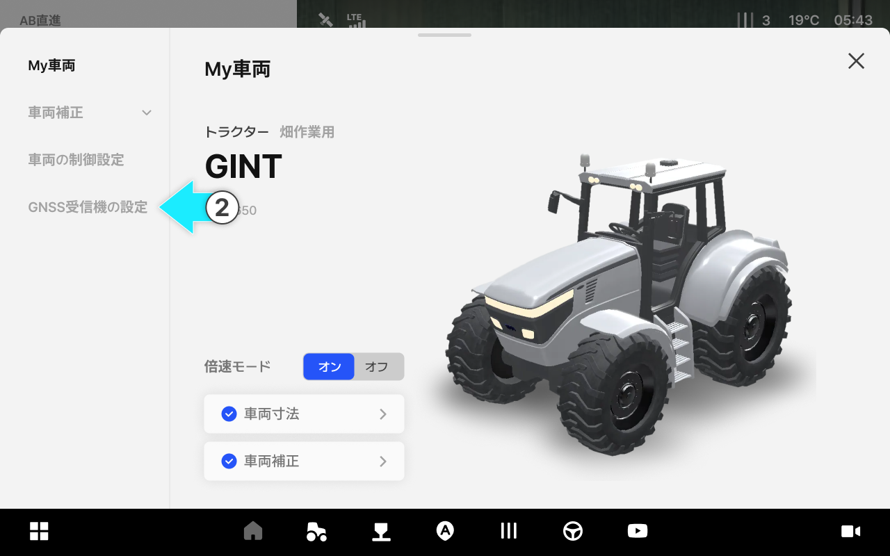

---
layout:
  width: default
  title:
    visible: false
  description:
    visible: false
  tableOfContents:
    visible: true
  outline:
    visible: true
  pagination:
    visible: true
  metadata:
    visible: true
  tags:
    visible: true
---

# GNSS受信機の設定

### GNSS受信機の設定

車両に取り付けられたGNSS受信機の正確な位置を登録し、測位精度を向上させます。



 \[車両]をタップします。

<figure><figcaption></figcaption></figure>



車両補正をタップしてください。

<figure><figcaption></figcaption></figure>



GNSS受信機の設定を押すと、アクセスできます。

<figure><figcaption></figcaption></figure>



ご希望の項目を選択して修正し、\[確認]を押すと設定が完了します。

<figure><figcaption></figcaption></figure>



***

#### GNSS受信機の設定項目のご案内

<figure><figcaption></figcaption></figure>

&#x20; **縦方向の位置**

* フロントアクスルから受信機までの前後距離を意味します。

&#x20; **横方向の位置**

* 車両の中心線から受信機までの左右の距離を意味します。

&#x20; **取り付け高さ**

* 地面から受信機までの高さを意味します。
