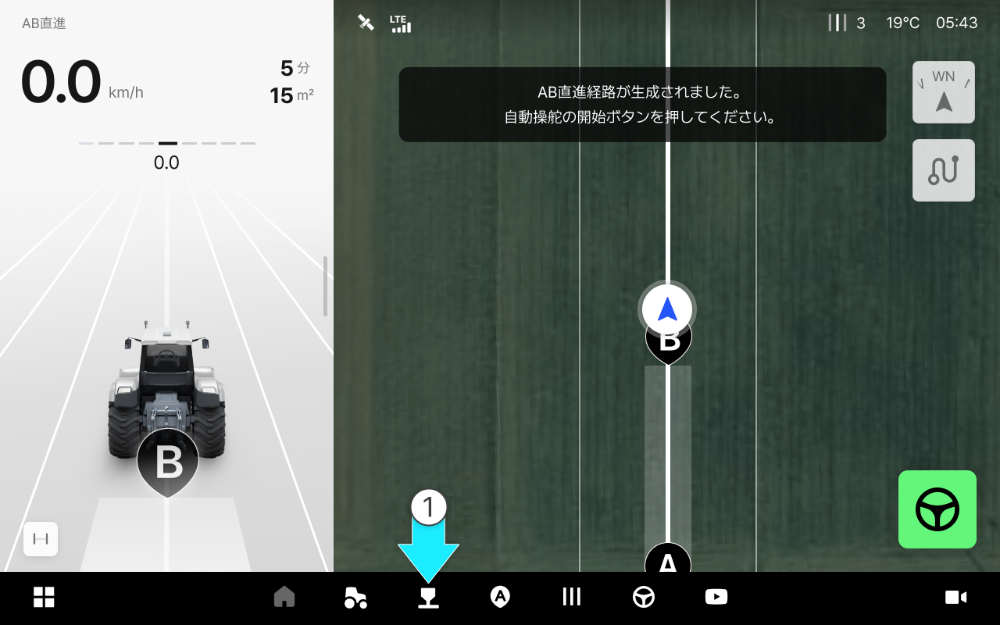

---
layout:
  width: default
  title:
    visible: false
  description:
    visible: false
  tableOfContents:
    visible: true
  outline:
    visible: true
  pagination:
    visible: true
  metadata:
    visible: true
  tags:
    visible: true
---

# 作業機リストへのアクセス及び画面のご案内

### 作業機リストへのアクセス及び画面のご案内

作業機リストでは、現在登録済みの作業機を確認し、追加・修正・削除できます。

***

#### 作業機リストへのアクセス



 \[作業機]をタップします。

<figure><figcaption></figcaption></figure>



作業機リストへのアクセスができます。

<figure><figcaption></figcaption></figure>



***

#### 作業機リストのご案内

<figure><figcaption></figcaption></figure>

&#x20; **取り付け済みの作業機**

* 現在取り付け済みの作業機を表示します。

&#x20; **リストを確認する**

*   作業機を一覧形式でご確認できます。リスト表示では\[拡大する]と表記されます。 

    <figure><figcaption></figcaption></figure>

&#x20; **作業機3D**

* 登録された作業機を3Dで表示します。

&#x20; **作業機の情報**

* 作業機タイプ、別名など作業機を追加した際に入力した情報が表示されます。

&#x20; **詳細をみる**

* 作業機の幅や偏差など、作業機の詳細情報を確認できます。

&#x20; **作業機の追加ボタン**

* 作業機を追加できるボタンです。
