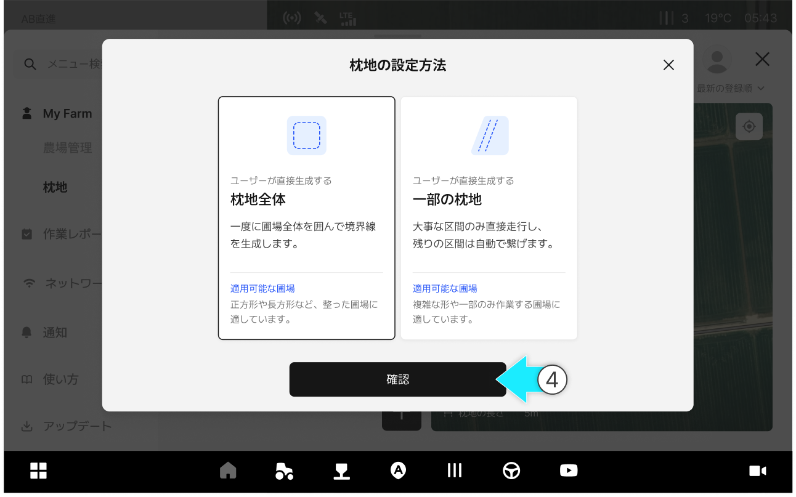
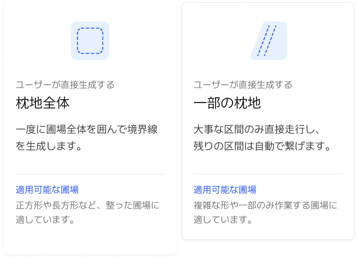
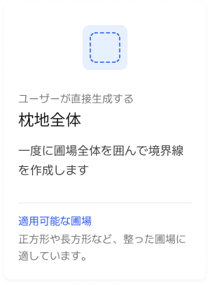
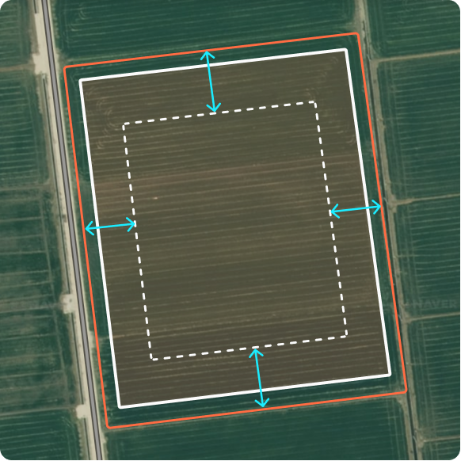
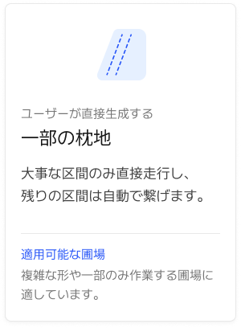

# 枕地の登録

### 枕地の登録

枕地とは？

> 枕地は、圃場の端で安全に回転したり、作業機を操作できるよう確保する余裕区間のことです。圃場の境界から設定した距離だけ内側に作られ、作業環境に合わせて幅（距離）を調整できます。

***

#### 枕地の登録へアクセス



 \[メニュー一覧のアイコン]をクリックします。

<figure><figcaption></figcaption></figure>



My Farmの枕地項目をクリックします。

<figure><figcaption></figcaption></figure>



 枕地の生成ボタンを押します。

<figure><figcaption></figcaption></figure>



ご希望の設定オプションを選択し確認を押すと、枕地の生成が始まります。

<figure><figcaption></figcaption></figure>



枕地の設定モーダルから詳細設定を入力し、\[確認]をクリックすると　枕地の生成が完了します。

<figure><figcaption></figcaption></figure>



***

#### 枕地の設定オプション

様々な圃場や状況に合わせて、複数の枕地設定オプションをご提供します。

<figure><figcaption></figcaption></figure>

#### 枕地の表示ラインのご案内

<figure><figcaption></figcaption></figure>

&#x20; **圃場の境界オフセットの表示ライン**

* 赤の実線で表示されます。

&#x20; **圃場の境界線**

* 白の実線で表示されます。

&#x20; **枕地の表示ライン**

* 白の点線で表示されます。

***

#### 枕地全体

すべての方向に同じ枕地を適用します。素早く簡単に設定できます。

<figure><figcaption></figcaption></figure>

**枕地全体の設定モーダル**

<figure><figcaption></figcaption></figure>

&#x20; **圃場の選択**

* 適用する枕地の圃場を選択します。

&#x20; **枕地名**

* 区分するための枕地名を記入します。

&#x20; **枕地の長さ**

* 枕地の長さを数値で調整します。
  * 

&#x20; **枕地の数**

* 枕地の数を調整します。
  * 枕地を1つに設定する場合\
    
  * 枕地を2つに設定する場合\
    

&#x20; **圃場の境界オフセット**

* 数値で圃場の境界を調整します。\
  オン/オフでき、＋は外側、－は内側に移動します。
  * ＋で設定した場合\
    
  * －で設定した場合\
    

&#x20; **作業機**

* 作業する作業機を選択します。

&#x20; **メモ**

* メモに追加情報を残します。

***

#### 一部の枕地

必要な区間のみを選択して枕地を生成します。危険エリアのみ安全に注意して生成し、残りは最大作業面積を確保できます。

<figure><figcaption></figcaption></figure>

**一部の枕地の設定モーダル**

<figure><figcaption></figcaption></figure>

&#x20; **圃場の選択**

* 適用する枕地の圃場を選択します。

&#x20; **枕地名**

* 区分するための枕地名を記入します。

&#x20; **作業機**

* 作業する作業機を選択します。

&#x20; **枕地の数**

* 枕地の数を調整します。枕地全体とは異なり、各面の枕地の数を調整できます。
  *  に枕地を1つ設定時\
    
  *  に枕地を3つ設定時\
    

&#x20; **枕地の長さ**

* 枕地の長さを数値で調整します。
  * 

&#x20; **圃場の境界オフセット**

* 数値で圃場の境界を調整します。\
  オン/オフでき、＋は外側、－は内側に移動します。
  * ＋で設定した場合\
    
  * －で設定した場合\
    

&#x20; **メモ**

* メモに追加情報を残します。
