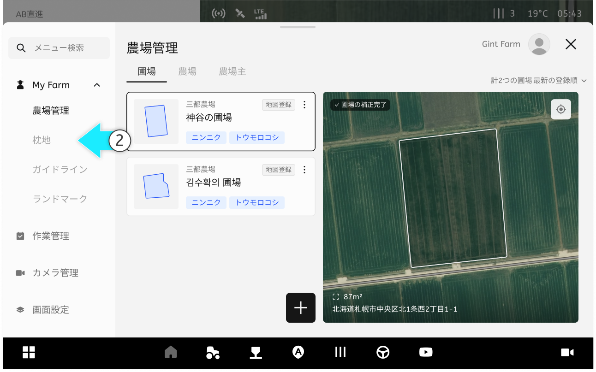
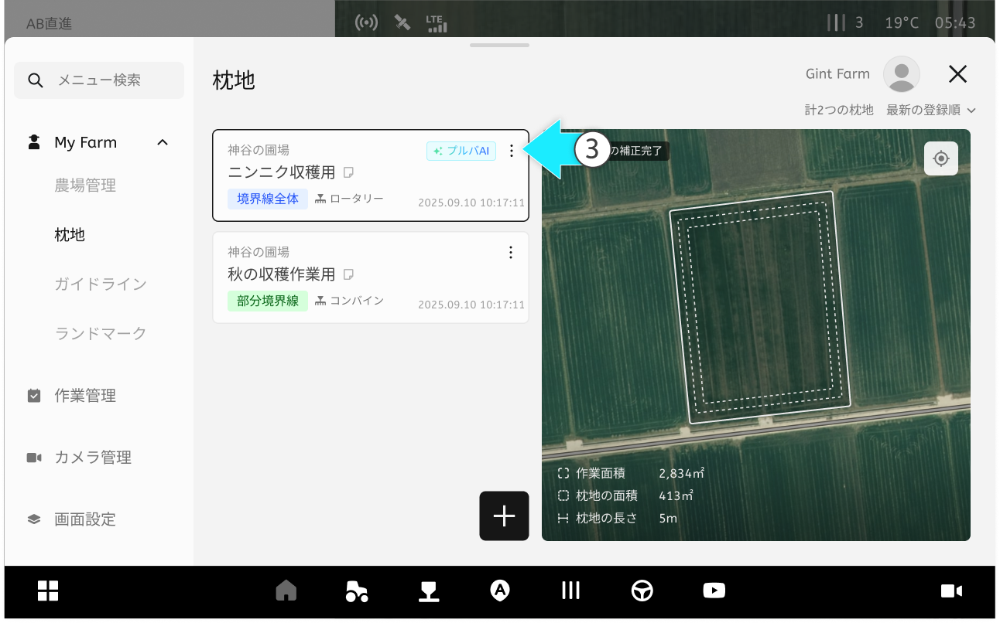
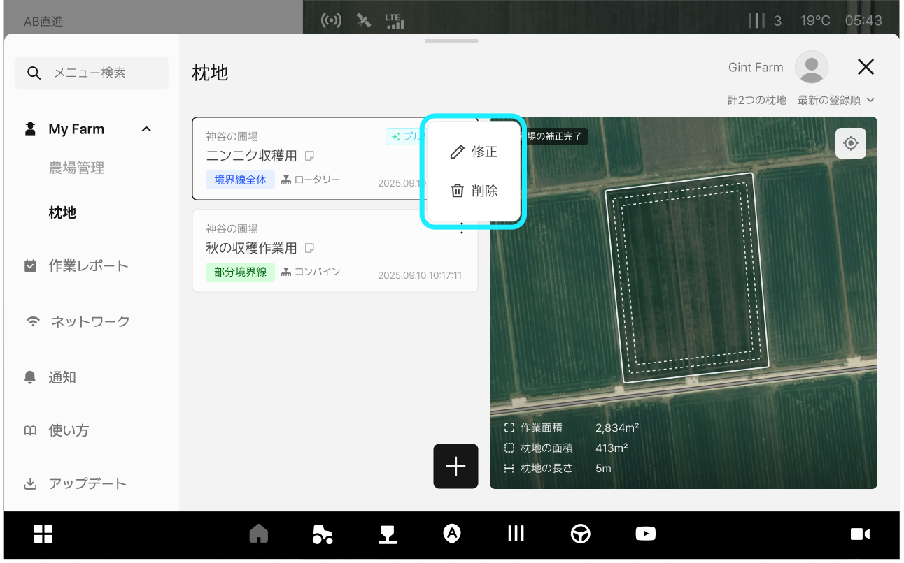
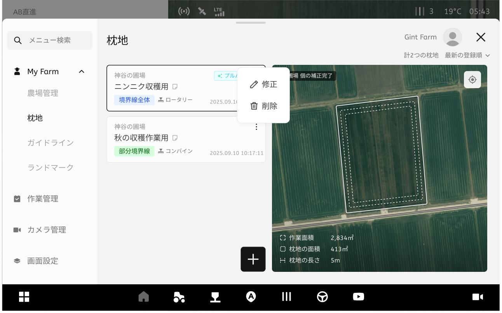
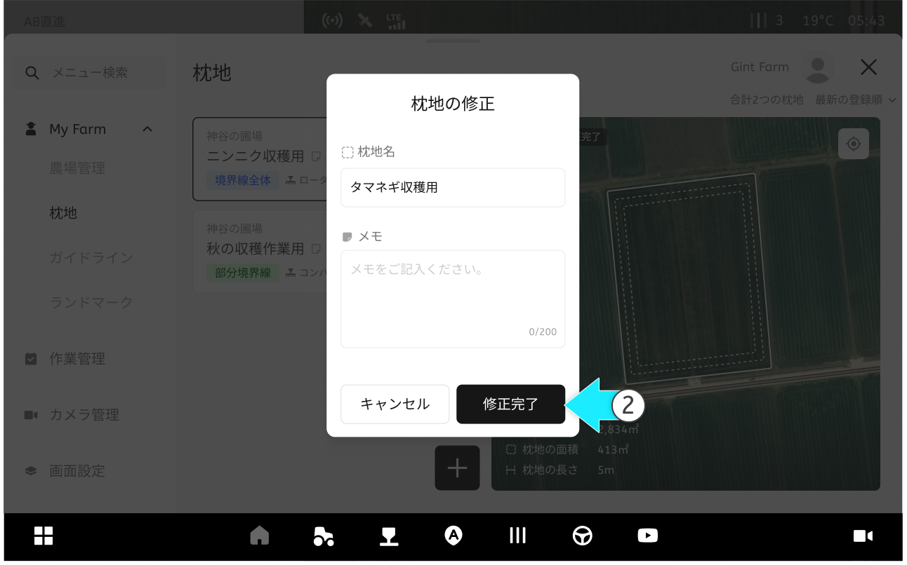
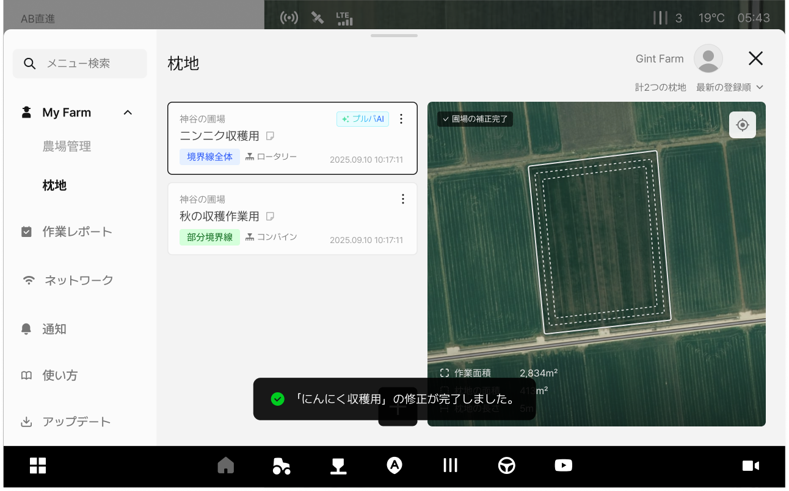
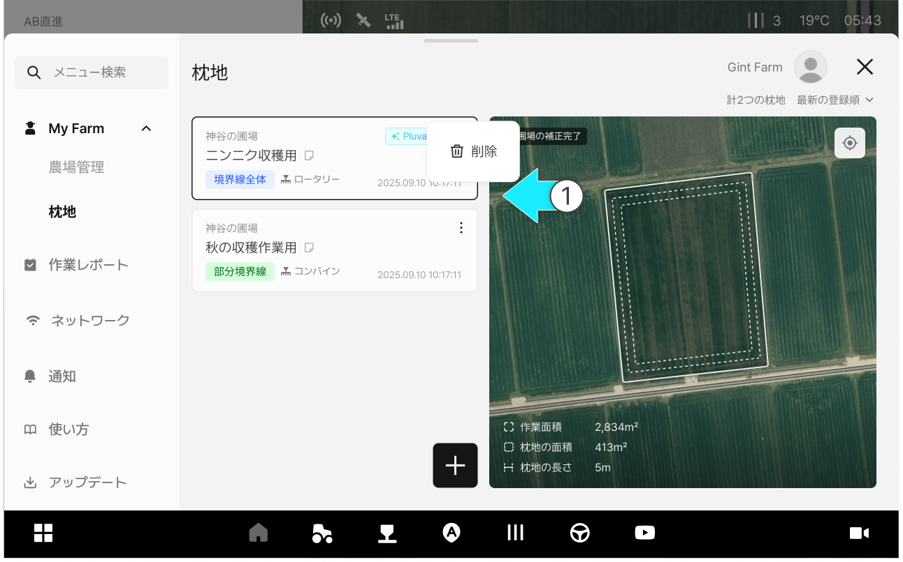
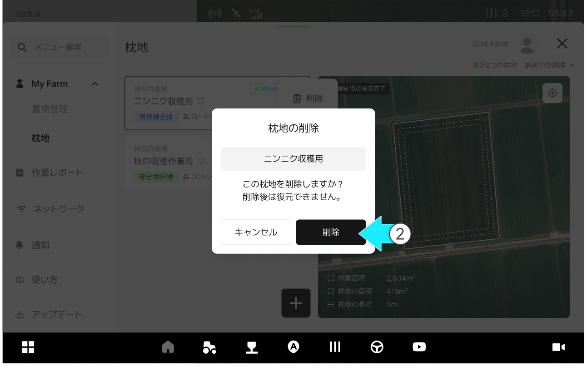
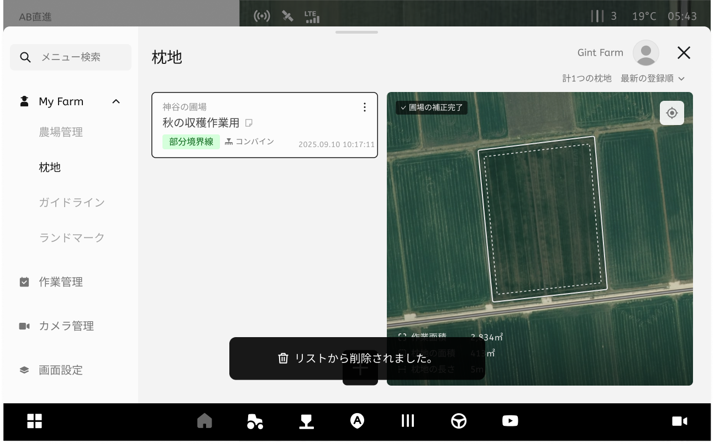

# 枕地情報の修正/削除

### 枕地情報の管理

枕地情報の管理では、登録された枕地の情報を修正または削除することができます。距離、個数、位置調整値などを作業環境に合わせて変更して適用することができます。

***

#### 枕地情報の管理機能へアクセス



 \[メニュー一覧のアイコン]をクリックします。

<figure><figcaption></figcaption></figure>



My Farmの枕地項目をクリックします。

<figure><figcaption></figcaption></figure>



ご希望の枕地項目の  アイコンを押します。

<figure><figcaption></figcaption></figure>



ポップアップからご希望の管理機能を選択します。

<figure><figcaption></figcaption></figure>



***

#### 枕地情報の修正



\[修正]オプションを選択します。

<figure><figcaption></figcaption></figure>



修正したい内容を入力し、\[修正完了]をクリックします。

<figure><figcaption></figcaption></figure>



枕地情報の修正が完了します。

<figure><figcaption></figcaption></figure>



***

#### 枕地情報の削除



\[削除]オプションをクリックします。

<figure><figcaption></figcaption></figure>



\[削除]ボタンを押します。

<figure><figcaption></figcaption></figure>



削除が完了します。

<figure><figcaption></figcaption></figure>


