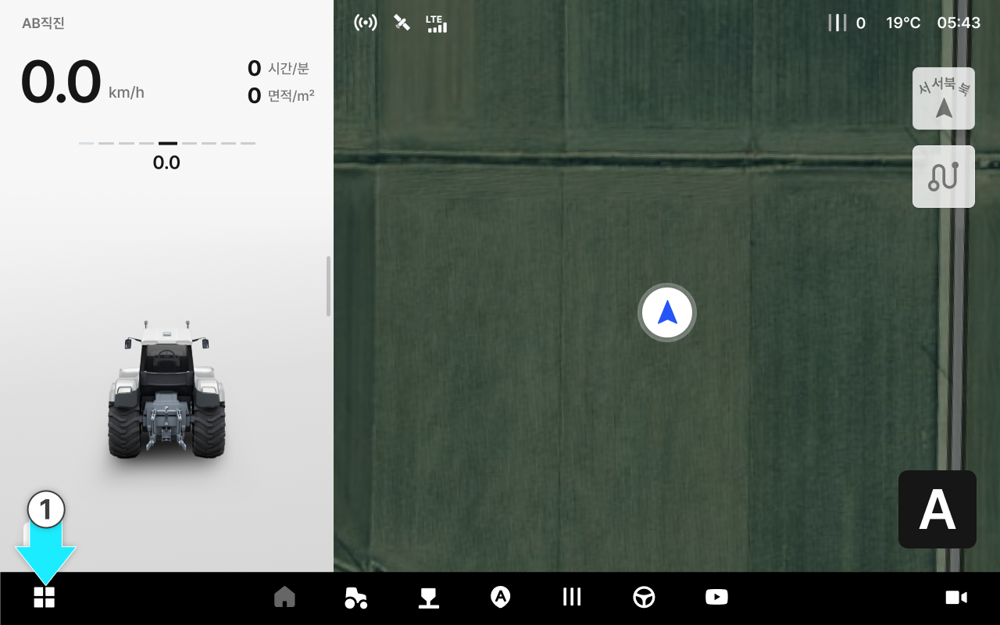
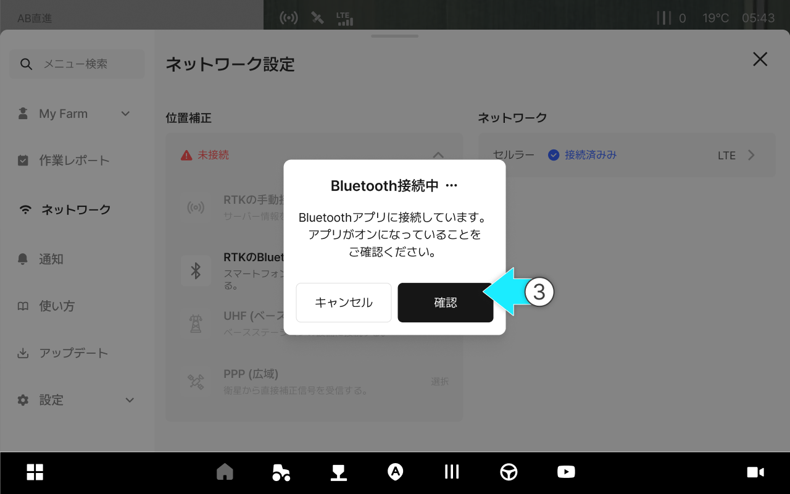

# 位置補正の設定

### 位置補正の設定

位置補正とは、RTKなどの補正信号を接続し位置の精度を向上させるための設定です。現場の環境に適した方法を選択し、接続状態を設定します。

#### 位置補正とは何ですか？

衛星信号によって算出された「基本位置」に対し、誤差を減らすための補正情報を受信して精度を向上させる作業です。ネットワーク状態が不安定な場合、精度が低下したり、切断される恐れがあります。

***

#### 位置補正の設定へのアクセス



 メニュー一覧のアイコンをクリックします。

<figure><figcaption></figcaption></figure>



\[ネットワーク設定]をクリックします。

<figure><figcaption></figcaption></figure>



\[位置補正] をクリックします。

<figure><figcaption></figcaption></figure>



ご希望の補正方法を選択して設定します。

<figure><figcaption></figcaption></figure>



***

#### 位置補正の設定画面に関するご案内

<figure><figcaption></figcaption></figure>

&#x20; **RTKの手動接続**

* サーバー情報を入力し、補正信号を直接受信します。

&#x20; **RTKのBluetooth接続**

* スマートフォンの外部アプリを通して補正信号を受信した後、Bluetoothで接続します。外部アプリが落ちると、補正信号が切断される恐れがあります。

***

#### RTKの手動接続

RTKの手動接続とは、タブレット端末をRTKサービスへ直接接続し、補正信号を受信する方法です。



\[RTKの手動接続]の\[情報入力]をクリックします。

<figure><figcaption></figcaption></figure>



基地局名やサーバー情報を入力し、\[接続]をクリックします。

<figure><figcaption></figcaption></figure>



RTKの手動接続が完了します。

<figure><figcaption></figcaption></figure>


接続できない場合や、接続が頻繁に切断される場合は、まずネットワークの状態及び入力情報（アドレス/ポート/アカウント/マウントポイント）を確認してください。英語の大文字・小文字を正確に入力し、不要なスペースを入れないようにしてください。正しく入力しない場合、正常にサービスが利用できません。




***

#### RTKのBluetooth接続

RTKのBluetooth接続は、スマートフォンのRTKアプリとBluetoothをペアリングさせ、\
基地局（RTK）の補正信号をGNSS受信機に送るための設定です。



RTKのBluetooth接続の\[選択]を押してください。

<figure><figcaption></figcaption></figure>



以下のプロセスに従って、外部のBluetoothアプリ（RTK-GPSなど）からRTK Bluetooth接続の設定を行ってください。

1. RTK-GPSアプリがインストールされたスマートフォンのBluetoothをオンにしてください。
2. スマートフォンやタブレットからRTK-GPSアプリを起動してください。
3. アプリの設定から基地局の信号入力方法を「Bluetooth（ブルートゥース）」に選択します。
4. 使用可能なデバイス一覧から「PLUVA iON」を選択します。
5. パスワードを入力し、ペアリングを完了してください。
6. アプリまたはスマートフォン及びタブレットのBluetooth画面から接続状態を確認してください。



Bluetoothが接続されます。

<figure><figcaption></figcaption></figure>



接続が完了したら\[確認]をタップしてください。

<figure><figcaption></figcaption></figure>


接続に失敗した場合は、確認事項をチェックしてから\[再接続]を押してください。




