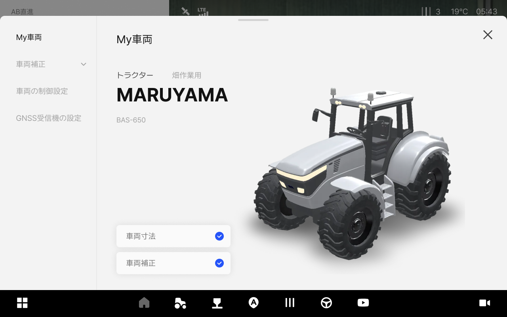

# My車両へのアクセスおよび画面のご案内

### My車両へのアクセスおよび画面のご案内

作業に使用する車両を追加、または補正できる管理機能です。\
現在タブレットが取り付けられている車両の情報が表示されます。\
車両の変更及び修正は購入先（販売店）にお問い合わせください。

***

#### My車両へのアクセス方法



 \[車両]をタップします。

<figure><figcaption></figcaption></figure>



My車両へのアクセスが完了します。

<figure><figcaption></figcaption></figure>



***

#### My車両画面のご案内

<figure><figcaption></figcaption></figure>

&#x20; **車両補正**

* 車両が揺れたり曲がったりせず、正確に直進できるようオートステア、ロール・ピッチ・ヨー、慣性センサーなどを補正します。

&#x20; **車両の制御設定**

* 作業環境に合わせて走行の特性を調整できます。\
  設定変更すると自動操舵の性能に影響を与えかねません。

&#x20; **GNSS受信機の設定**

* 車両に取り付けられたGNSS受信機の位置を入力し、位置精度を最適化できます。（または位置精度を高められます。）

&#x20; **車両の情報**

* 自動操舵キットが取り付けられた車両のタイプ、別名、メーカー、モデルを表示します。

&#x20; **車両寸法**

* 車両の寸法入力が完了したかどうかを表示します。

&#x20; **車両補正の有無**

* 車両の補正作業が完了したかどうかを表示します。
