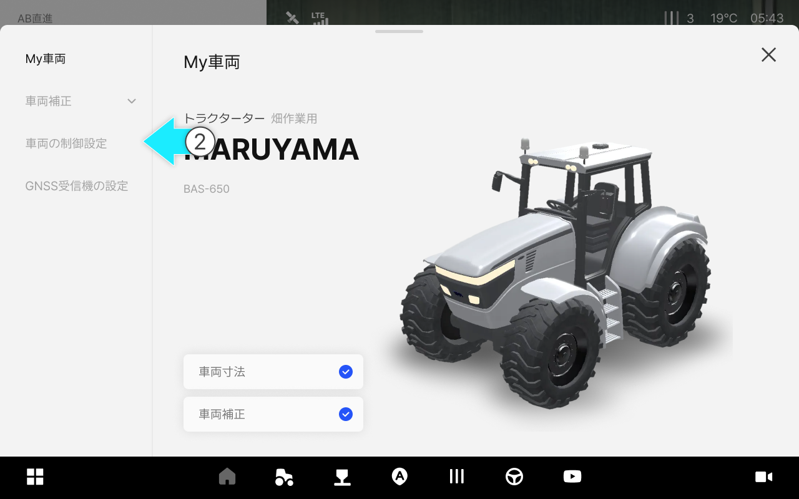
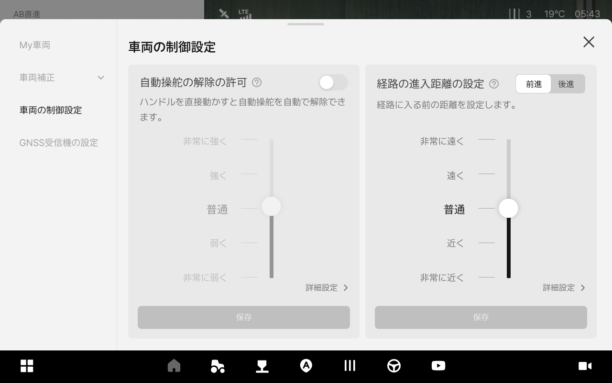

---
layout:
  width: default
  title:
    visible: false
  description:
    visible: false
  tableOfContents:
    visible: true
  outline:
    visible: true
  pagination:
    visible: true
  metadata:
    visible: true
  tags:
    visible: true
---

# 車両の制御設定

### 車両の制御設定

車両の制御設定とは、作業環境に合わせて自動操舵の反応（自動操舵の解除感度、経路進入の特性など）を調整する機能です。設定変更は、走行の性能に影響を与えかねませんので、購入先の案内に従って調整することをおすすめします。



 \[車両]をタップします。

<figure><figcaption></figcaption></figure>



\[車両]をタップします。

<figure><figcaption></figcaption></figure>



車両の制御設定へアクセスできます。

<figure><figcaption></figcaption></figure>



***

#### 車両の制御設定のご案内

> #### 一般設定方法

<figure><figcaption></figcaption></figure>

&#x20;

 **自動操舵の解除の許可**

* 運転者がハンドルを直接操作したときに、自動操舵を自動で解除するかどうかを設定します。


手動解除強度の許可トグルをオンにすると強度を設定できます。




設定を弱くするほど、ステアリングホイールにわずかな力を加えるだけで自動操舵が解除されます。



アイコンを押すと、その機能に関する説明を確認できます。


&#x20;

 **経路の進入距離の設定**

* 車両が走行経路上のどの程度離れた地点を目標にして進入するかを設定します。


前進、後進を選択して設定できます。



遠い地点を目標にする場合、ゆっくりと滑らかに進入し、近い地点を目標にする場合、素早く機敏に進入します。



経路の進入距離は、詳細設定から数値で細かく設定でき、変更値は一般設定と連動されます。



アイコンを押すと、その機能に関する説明を確認できます。


> #### 詳細設定の方法



詳細設定  をタップし、高度な設定機能を使用できます。

<figure><figcaption></figcaption></figure>




> #### 詳細設定項目のご案内

#### **a.** 自動操舵の解除の許可（前進）

&#x20;  **前進での開始条件**

1. 前進開始条件
：前進で自動操舵を開始する際に、安全条件を使用するかどうかを設定します。


トグルで機能をオン・オフできます。




使用する場合：安全条件を満たした場合にのみ自動操舵を開始できます。\
使用しない場合：いつでも自動操舵を開始できます。



安全条件を使用しない場合、危険な状況でも自動操舵が開始される恐れがあります。特別な理由がない限り、安全条件をオンにした状態で使用してください。


2. 前進距離条件
：前進で自動操舵を開始できる最大距離を設定します。


経路から車両がこの値より遠い距離に位置している場合、自動操舵を開始できません。


3. 前進角度条件
：前進で自動操舵を開始できる最大の角度差を設定します。


車両と経路の角度差がこの値より大きい場合、自動操舵を開始できません。


4. 前進速度条件
：前進で自動操舵を開始できる最大速度を設定します。


この速度より速く走行している場合は、自動操舵を開始できません。


&#x20;

 **前進での解除条件**

1. 前進解除条件の使用
：前進時に条件から外れた場合、自動操舵を自動で解除するかどうかを設定します。


使用する場合：条件から外れた場合、自動で自動操舵が解除されます。\
使用しない場合：運転者の操作のみで自動操舵が解除されます。



安全条件を使用しない場合、危険な状況でも自動操舵が開始される恐れがあります。特別な理由がない限り、安全条件をオンにした状態で使用してください。


2. ランディング前の前進距離
：前進で経路に完全に入る前に、自動操舵が解除される最大距離を設定します。


車両が経路からこの値より遠い距離に位置すると、自動操舵が解除されます。


3. ランディング前の前進角度
：前進で経路に完全に入る前に、自動操舵が解除される最大の角度差を設定します。


車両と経路の角度差がこの値より大きい場合、自動操舵が解除されます。


4. ランディング後の前進距離
：前進で経路に完全に進入した後、自動操舵が解除される最大距離を設定します。


車両が経路からこの値より遠い距離に位置すると、自動操舵が解除されます。


5. ランディング後の前進角度
：前進で経路に完全に進入した後、自動操舵が解除される最大の角度差を設定します。


車両と経路の角度差がこの値より大きい場合、自動操舵が解除されます。


6. 前進速度条件
：前進中に自動操舵が自動で解除される最大速度を設定します。


この速度より速く走行すると、自動操舵が自動で解除されます。


&#x20;

 **前進での最低速度条件**

* 前進自動操舵に必要な最低速度を設定します。


この速度より遅い場合は、自動操舵が開始されないか、解除されます。



開始条件と解除条件の使用有無に応じて、該当する時点でのみ適用されます。


#### **b.** 自動操舵の解除の許可 (後進)

&#x20;  **後進での開始条件**

1. 後進開始条件
：後進で自動操舵を開始する際に、安全条件を使用するかどうかを設定します。


使用する場合：安全条件を満たした場合にのみ自動操舵を開始できます。\
使用しない場合：いつでも自動操舵を開始できます。



安全条件を使用しない場合、危険な状況でも自動操舵が開始される恐れがあります。特別な理由がない限り、安全条件をオンにした状態で使用してください。


2. 後進距離条件
：後進で自動操舵を開始できる最大距離を設定します。


経路から車両がこの値より遠い距離に位置している場合、自動操舵を開始できません。


3. 後進角度条件
：後進で自動操舵を開始できる最大の角度差を設定します。


車両と経路の角度差がこの値より大きい場合、自動操舵を開始できません。


4. 後進速度条件
：後進で自動操舵を開始できる最大速度を設定します。


この速度より速く走行している場合は、自動操舵を開始できません。


&#x20;  **後進での解除条件**

1. 後進解除条件の使用
：後進時に条件から外れた場合、自動操舵を自動で解除するかどうかを設定します。


使用する場合：条件から外れた場合、自動で自動操舵が解除されます。\
使用しない場合：運転者の操作のみで自動操舵が解除されます。



安全条件を使用しない場合、危険な状況でも自動操舵が開始される恐れがあります。特別な理由がない限り、安全条件をオンにした状態で使用してください。


2. ランディング前の後進距離
：後進で経路に完全に進入する前に自動操舵が解除される最大距離を設定します。


車両が経路からこの値より遠い距離に位置すると、自動操舵が解除されます。


3. ランディング前の後進角度
：後進で経路に完全に入る前に自動操舵が解除される最大の角度差を設定します。


車両と経路の角度差がこの値より大きい場合、自動操舵は解除されます。


4. ランディング後の後進距離
：後進で経路に完全に進入した後、自動操舵が解除される最大距離を設定します。


車両が経路からこの値より遠い距離に位置すると、自動操舵が解除されます。


5. ランディング後の後進角度
：後進で経路に完全に進入した後、自動操舵が解除される最大の角度差を設定します。


車両と経路の角度差がこの値より大きい場合、自動操舵は解除されます。


6. 後進速度条件
：後進中に自動操舵が自動で解除される最大速度を設定します。


この速度より速く走行すると、自動操舵が自動で解除されます。


&#x20;  **後進での最低速度条件**

* 後進自動操舵に必要な最低速度を設定します。


この速度より遅い場合は、自動操舵が開始されないか、解除されます。



開始条件と解除条件の使用有無に応じて、該当する時点でのみ適用されます。


#### **c.** 経路の進入距離の詳細設定

&#x20;  **進入傾向**

1. 前進経路の進入距離 :
前進で車両が経路上のどれくらい遠い地点を目標に進入するかを設定します。


経路の進入距離は、詳細設定から数値で細かく設定でき、変更値は一般設定と連動されます。


2. 後進経路の進入距離 :
後進で車両が経路上のどれくらい遠い地点を目標に進入するかを設定します。


経路の進入距離は、詳細設定から数値で細かく設定でき、変更値は一般設定と連動されます。


3. 経路の進入角度 :
車両が経路に進入する際にどれだけ積極的に入るかを設定します。


値が大きいほど経路に急激に進入し、値が小さいほど緩やかに進入します。



あまりにも小さく設定すると、進入速度が遅すぎる恐れがあります。


4. 経路への進入時間 :
経路に進入するために、事前に計画する時間を設定します。


値が大きいほど時間をかけて計画するため滑らかに進入し、値が小さいほど直前に計画するため機敏に進入します。



車両の経路進入度合いを調整するには、進入距離 → 進入角度 → 進入時間の順に設定することをおすすめします。


&#x20;

  **追従感度**

1. 前進経路の追従感度 :
前進で進入した後、経路をどれだけ正確に追従するかを設定します。


値が大きいほどゆったりと追従し、値が小さいほど機敏に追従します。



この設定は走行性能に大きな影響を与えるため、慎重に調整してください。


2. 後進経路の追従感度 :
後進で進入した後、経路をどれだけ正確に追従するかを設定します。


値が大きいほどゆったりと追従し、値が小さいほど機敏に追従します。



この設定は走行性能に大きな影響を与えるため、慎重に調整してください。


  **ステアリング感度**

1. ランディング前の前進ステアリング感度 :
前進で経路に完全に入る前のステアリング感度を設定します。


値が大きいほどハンドル操作が滑らかになり、値が小さいほどハンドル操作が敏感になります。


2. ランディング前の後進ステアリング感度 :
後進で経路に完全に入る前のステアリング感度を設定します。


値が大きいほどハンドル操作が滑らかになり、値が小さいほどハンドル操作が敏感になります。


3. ランディング後の前進ステアリング感度 :
前進で経路に完全に入った後のステアリング感度を設定します。


値が大きいほどハンドル操作が滑らかになり、値が小さいほどハンドル操作が敏感になります。


4. ランディング後の後進ステアリング感度 :
後進で経路に完全に入った後のステアリング感度を設定します。


値が大きいほどハンドル操作が滑らかになり、値が小さいほどハンドル操作が敏感になります。


5. 死角ゾーンの補正 :
ハンドルを回しても車輪が動かない区間を補正します。


設定値と実際の死角ゾーンの誤差が大きいほど、死角ゾーンの範囲が広いほど粗く制御される可能性があります。



正しくない値は自動操舵の性能に大きな影響を与えるため、死角ゾーンは必ず実測してから正確に設定してください。


6. ターンステアリング補正 :
ターン時に、設定された経路を基準にステアリングを補正します。


値が大きいほど経路の内側に入り、積極的にターンします。


  **曲率半径の制限**

* カーブ経路の生成時に最大曲率を制限して経路を補正します。


ABカーブモードでのみ設定可能です。

