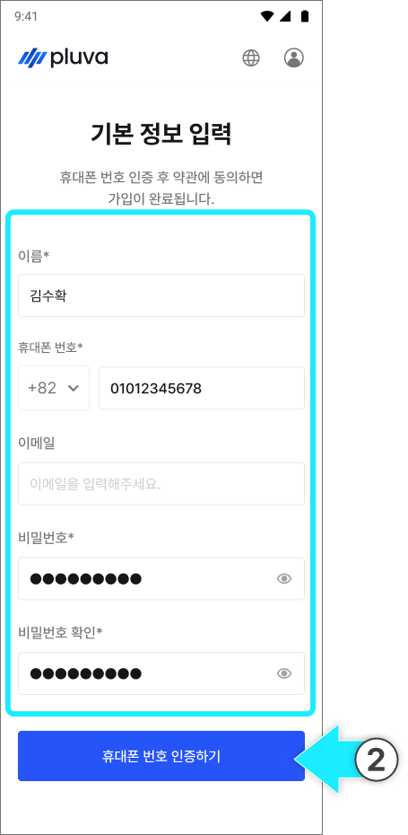
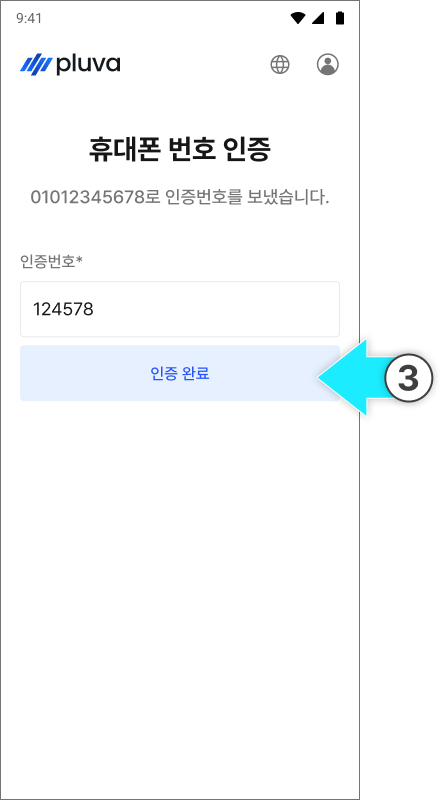
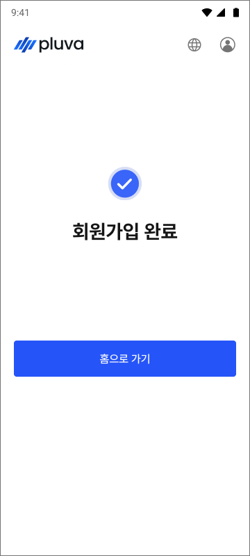
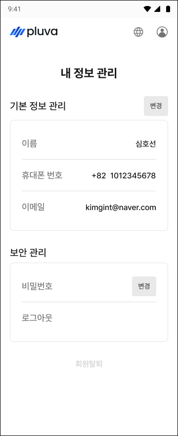
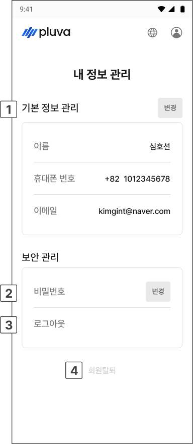

# 계정 생성 및 관리

플루바 아이온을 사용하려면 먼저 통합회원가입 홈페이지에서 계정을 만들어야 합니다. 아래 순서대로 회원가입합니다. 


[플루바 아이온 홈페이지 바로가기](https://gint.pluva.kr/)




[플루바 아이온 회원가입 홈페이지](https://gint.pluva.kr/)에 접속해 \[회원가입하기]를 누릅니다.

<figure><figcaption></figcaption></figure>



이름, 휴대폰 번호, 비밀번호를 입력한 후 \[휴대폰 번호 인증하기]를 누릅니다.

<figure><figcaption></figcaption></figure>


이메일은 선택 항목으로, 입력하지 않아도 회원가입을 진행할 수 있습니다.




휴대폰 번호로 전송된 인증번호 6자리를 입력하고 \[인증완료]를 누릅니다.

<figure><figcaption></figcaption></figure>



휴대폰 번호 인증이 완료되면 약관 동의를 체크하고 \[가입완료]를 누릅니다.

<figure><figcaption></figcaption></figure>



회원가입이 완료됩니다.

<figure><figcaption></figcaption></figure>



***

### 계정 정보 수정



로그인 후 홈페이지 우측 상단의 프로필(계정) 아이콘을 누릅니다.

<figure><figcaption></figcaption></figure>



\[내 정보 관리] 화면으로 들어가고 원하는 정보를 수정합니다.

<figure><figcaption></figcaption></figure>



***

### 내 정보 관리 화면

<figure><figcaption></figcaption></figure>

 **기본 정보 관리**

* 이름, 휴대폰 번호, 이메일을 확인하고 \[변경]으로 수정합니다.

 비밀번호

* \[변경]으로 비밀번호를 수정합니다.

 로그아웃

* 현재 계정에서 로그아웃합니다.

 회원탈퇴

* 계정을 탈퇴합니다.


회원탈퇴 시 계정과 저장된 정보가 모두 삭제되며, 삭제된 정보는 다시 복구할 수 없습니다. 탈퇴 전에 필요한 정보를 미리 확인하세요.

