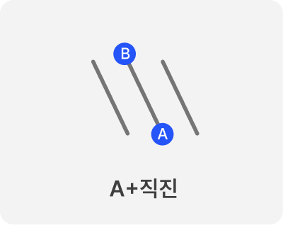
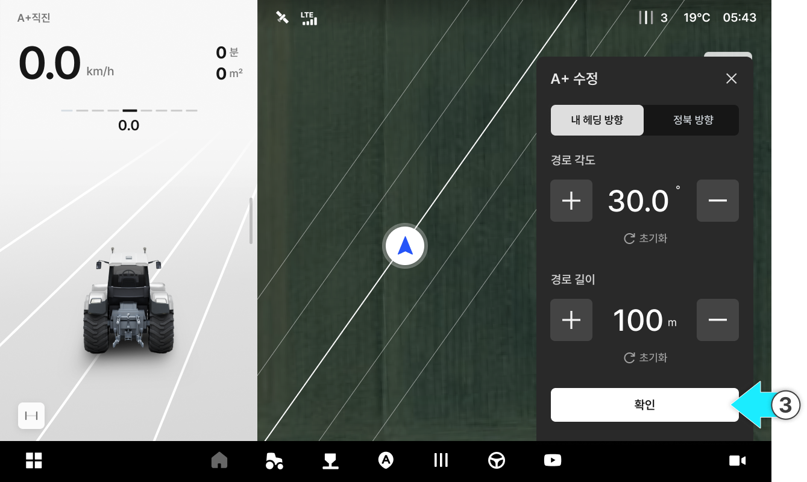

# A+직진

### A+직진

A+직진은 배수·일조·경사처럼 방향이 중요한 작업에 유용합니다.
방위각을 수치로 고정해 라인 흔들림과 누적 오차를 최소화합니다.
필지 전체를 동일한 각도로 일관되게 작업할 수 있어 라인 품질과 작업 완성도를 높입니다.

A+직진

* A점을 기준으로 설정한 각도의 대각선 직선 경로로 주행합니다.

<figure><figcaption></figcaption></figure>



버튼을 눌러 A 지점을 생성합니다.

<figure><figcaption></figcaption></figure>



버튼을 누릅니다.

<figure><figcaption></figcaption></figure>



경로 방향, 각도, 길이를 설정한 후 \[확인]을 누릅니다.

<figure><figcaption></figcaption></figure>



\[자율주행 시작] 버튼을 눌러 주행을 시작합니다.

<figure><figcaption></figcaption></figure>


