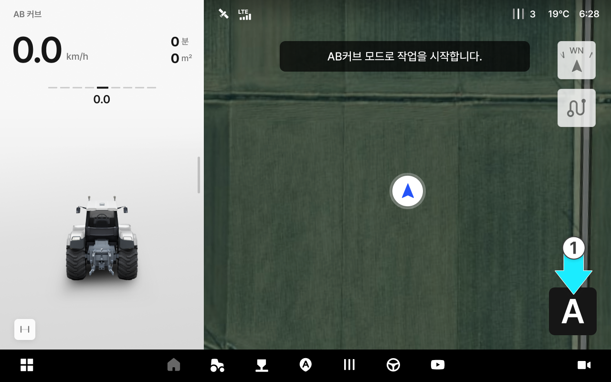
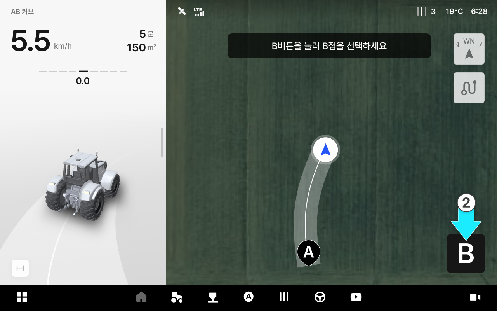
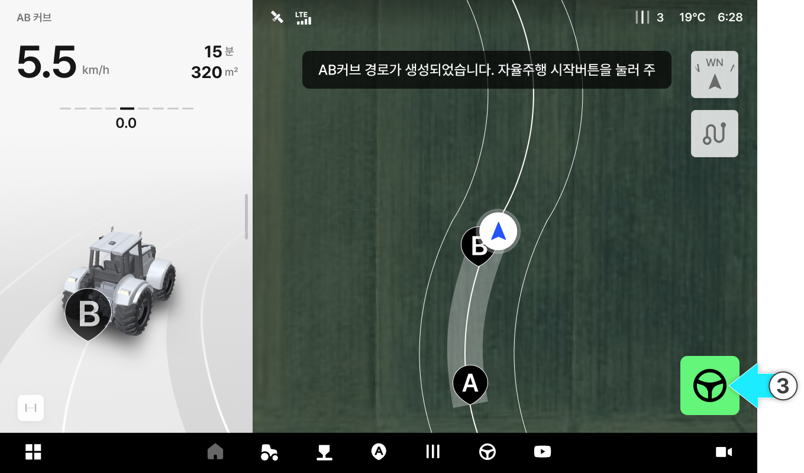

# AB 커브

곡선 형태의 작업 경로를 만들 때 사용합니다. 곧은 직선이 아닌 휘어진 이랑이나 경계에 맞춰 작업할 때 유용합니다.

AB 커브

* A점에서 시작해 원하는 곡선을 그리며 B점까지 주행하면, 그 곡선을 기준으로 자율주행 경로가 생성됩니다.&#x20;

<figure><figcaption></figcaption></figure>



 버튼을 눌러 A 지점을 생성합니다.

<figure><figcaption></figcaption></figure>



원하는 곡선을 그리며 주행한 뒤 \[B] 버튼을 눌러 B점을 생성합니다.

<figure><figcaption></figcaption></figure>



\[자율주행 시작] 버튼을 눌러 주행을 시작합니다.

<figure><figcaption></figcaption></figure>




**주의**: 권장 속도를 초과하거나 경로를 벗어나면 아래와 같이 동작합니다.

**경고 표시**

* 권장 속도를 초과하면 현재 속도가 **빨간색**으로 표시됩니다.
* 설정 경로를 **30cm 이상** 벗어나면 화면에 경고가 표시됩니다.

**자율주행 해제**

* 설정 경로를 **80cm 이상** 벗어나면 **"속도가 빨라 자율주행이 해제되었습니다"** 안내와 함께 자율주행이 해제됩니다.

**대응 방법**

* 이 안내를 닫으려면 다시 주행을 시작하거나 다른 모드로 변경해 주세요.



참고: 이앙기는 AB 커브 모드에서 후진할 수 없습니다.

