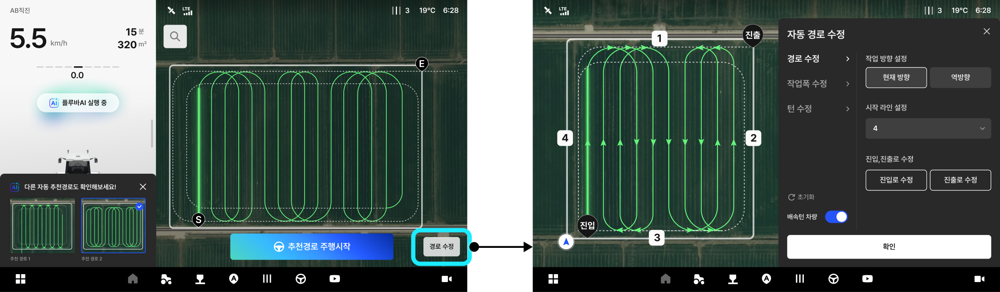

---
layout:
  width: default
  title:
    visible: true
  description:
    visible: false
  tableOfContents:
    visible: true
  outline:
    visible: true
  pagination:
    visible: true
  metadata:
    visible: true
  tags:
    visible: true
metaLinks:
  alternates:
    - >-
      https://app.gitbook.com/s/cB5Egkzinglp2WYUeNhf/ion/driving/auto-route-generation
---

# 자동 경로 (플루바 AI)

자동 경로(플루바 AI)

* 사용자의 필드/차량 조건을 바탕으로 최적의 작업 경로를 자동 생성하는 기능입니다.

<figure><figcaption></figcaption></figure>



\[자동 경로 추천] 버튼을 누른다.

<figure><figcaption></figcaption></figure>



pluva AI가 경로를 생성합니다.

<figure><figcaption></figcaption></figure>



경로가 생성 완료되면 \[추천된 경로로 주행시작]을 누릅니다.

<figure><figcaption></figcaption></figure>



시작점으로 이동한 뒤\[자율주행 시작] 버튼을 누르면 주행이 시작됩니다.

<figure><figcaption></figcaption></figure>




\[경로 수정] 버튼을 눌러 추천 경로를 변경할 수 있습니다.


<figure><figcaption></figcaption></figure>
