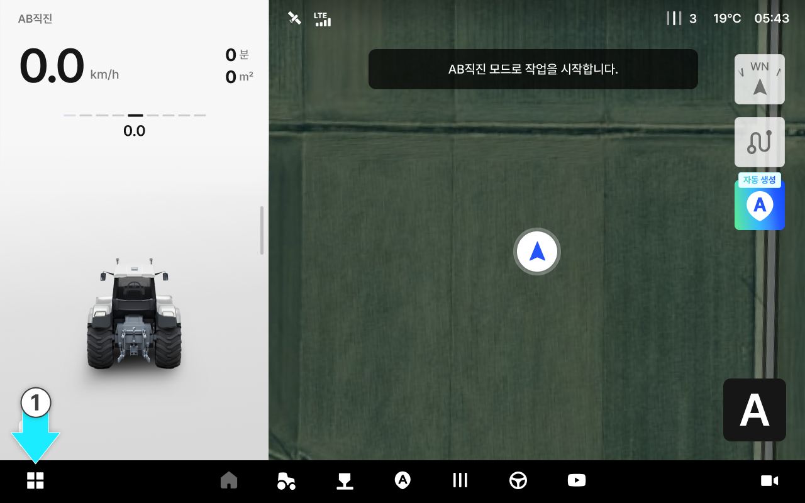
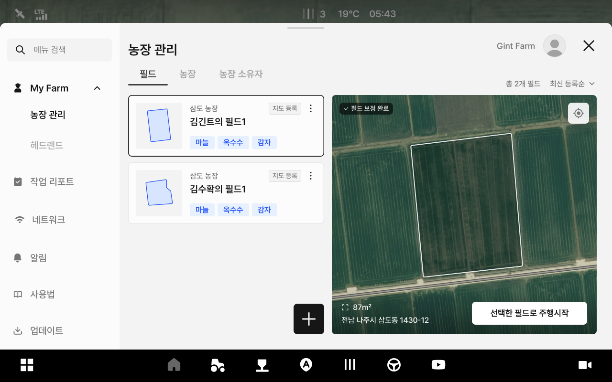
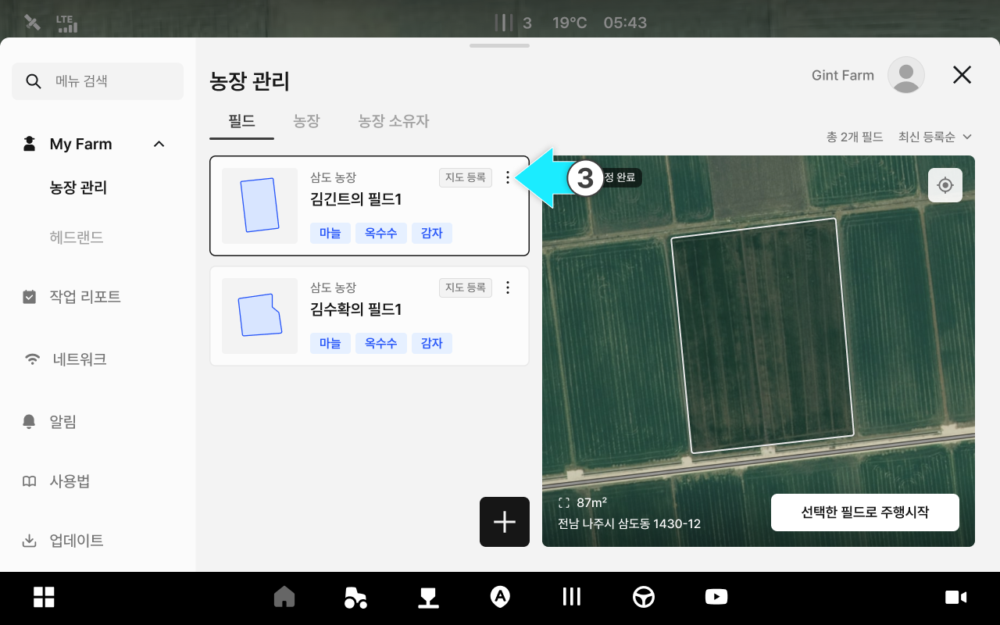
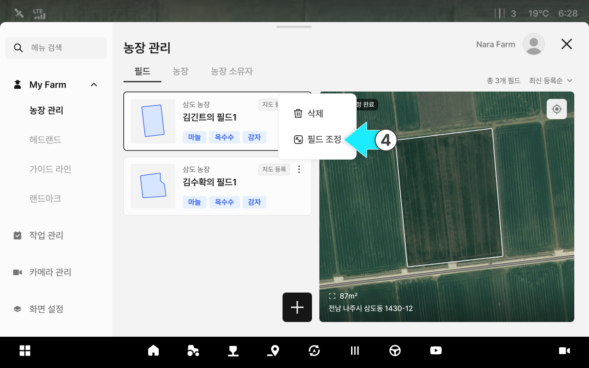
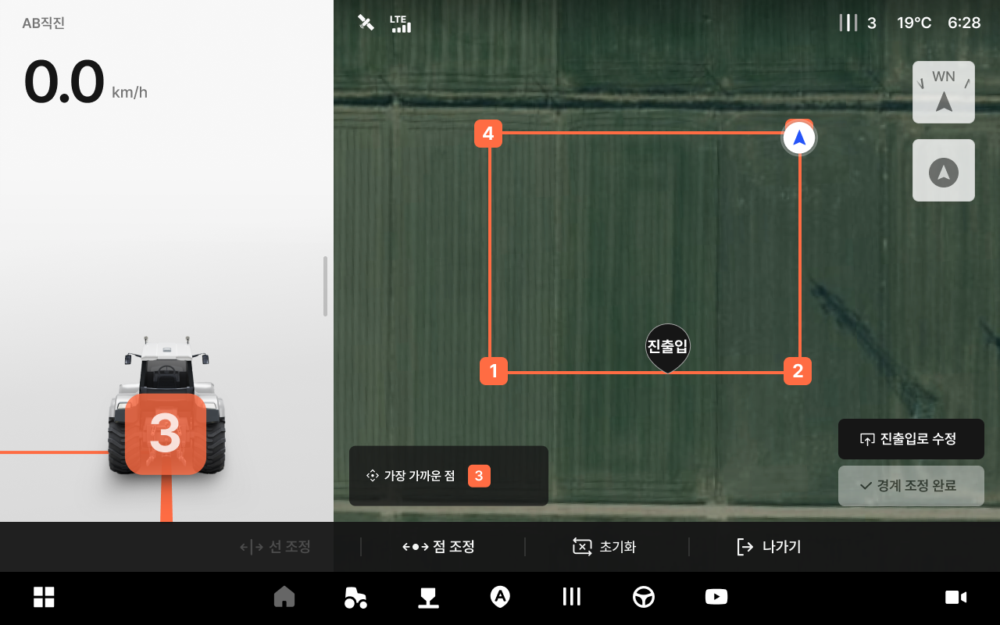
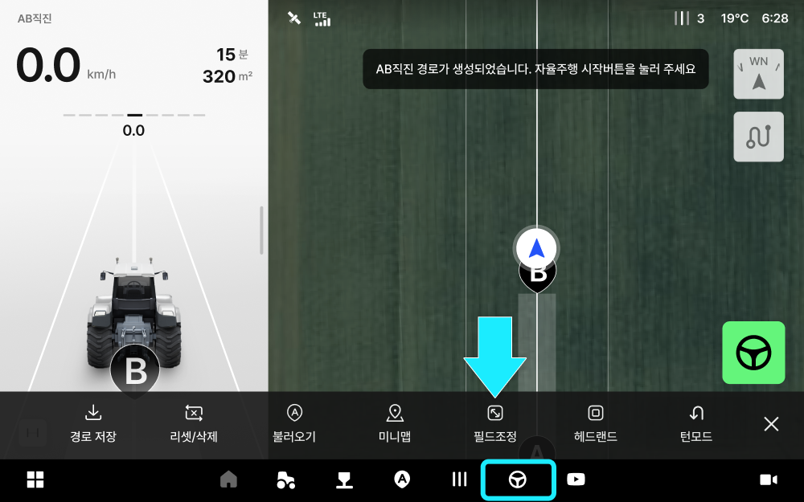
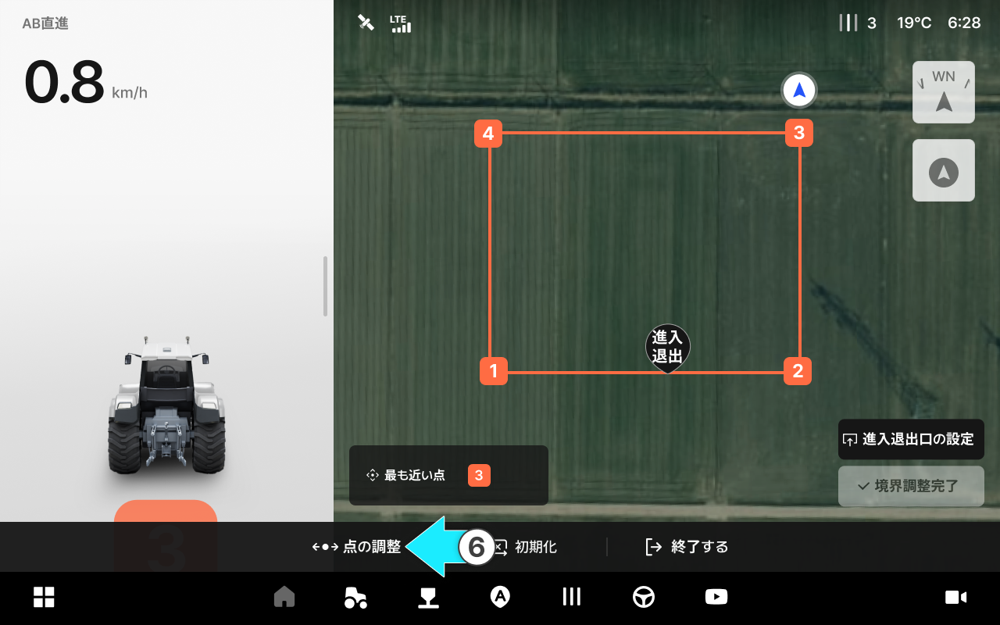
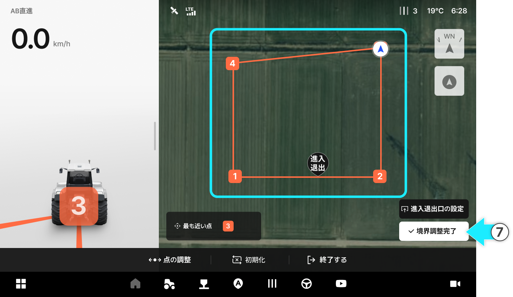
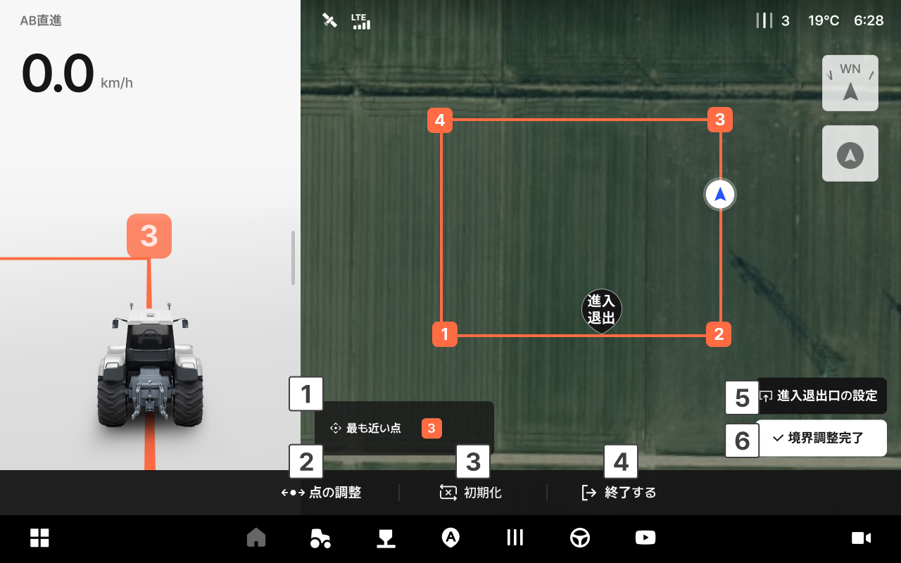

---
layout:
  width: default
  title:
    visible: true
  description:
    visible: false
  tableOfContents:
    visible: true
  outline:
    visible: true
  pagination:
    visible: true
  metadata:
    visible: true
  tags:
    visible: true
metaLinks:
  alternates:
    - >-
      https://app.gitbook.com/s/cB5Egkzinglp2WYUeNhf/ion/my-farm/field-adjustment
---

# 필드 조정

등록한 필드의 형태를 조정할 수 있는 기능입니다. 차량을 직접 이동하여 필드를 조정합니다.

***

#### 필드 조정 과정



 전체 메뉴 아이콘을 누릅니다.

<figure><figcaption></figcaption></figure>



My Farm의 농장관리의 \[필드 탭] 진입이 완료됩니다.

<figure><figcaption></figcaption></figure>



원하는 필드 항목의  아이콘을 누릅니다.

<figure><figcaption></figcaption></figure>



\[필드 조정]을 선택합니다.

<figure><figcaption></figcaption></figure>



필드 조정 화면으로 진입합니다.

<figure><figcaption></figcaption></figure>


기본 필드 등록은 **\[지도에서 선택]** 으로 설정되어 있습니다. 경계를 직접 만들려면 **\[직접 그리기]** 를 선택합니다.



**\[작업 옵션]**&#xC758; **\[필드 조정]** 버튼을 통해서도 진입할 수 있으며, 이 경우 현재 선택한 필드의 조정 화면으로 이동합니다.





조정을 원하는 위치로 차량을 이동한 후 **\[점 조정]** 을 선택합니다.

<figure><figcaption></figcaption></figure>


현재 차량 위치와 가장 가까운 점이 조정됩니다.



원활한 필드 조정을 위해 저속 주행 또는 정차 상태에서 점 조정을 진행합니다.




필드 조정이 완료되면 **\[경계 조정 완료]** 를 선택하여 필드 조정을 종료합니다.

<figure><figcaption></figcaption></figure>



***

#### 필드 조정 화면 설명

<figure><figcaption></figcaption></figure>

 **가장 가까운 점**

* 현재 차량 위치에서 가장 가까운 점을 표시합니다.

 **점 조정**

* 차량 위치를 기준으로 가장 가까운 점의 위치를 조정합니다.

 **초기화**

* 필드 조정 전 초기 상태로 되돌립니다.

 **나가기**

* 필드 조정 화면에서 나갑니다.

 **진(출)입로 수정**

* 진출입로 위치를 수정합니다. 해당 버튼을 선택하거나 진출입로 아이콘을 선택하면 이동 가능한 상태로 전환됩니다.
* 진출입로 수정 모드에서 아이콘을 드래그하여 위치를 변경합니다.
* 진입로와 출입로가 각각 설정된 경우 별도의 버튼으로 표시됩니다.

 **경계 조정 완료**

* 경계 조정을 완료합니다.
