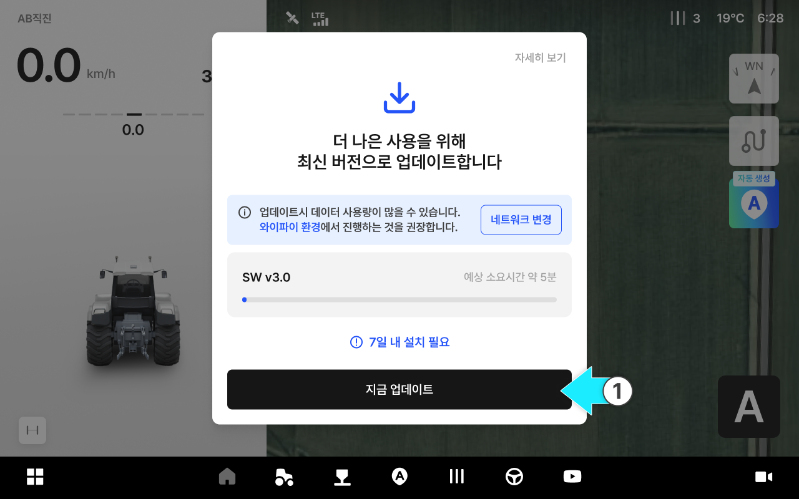
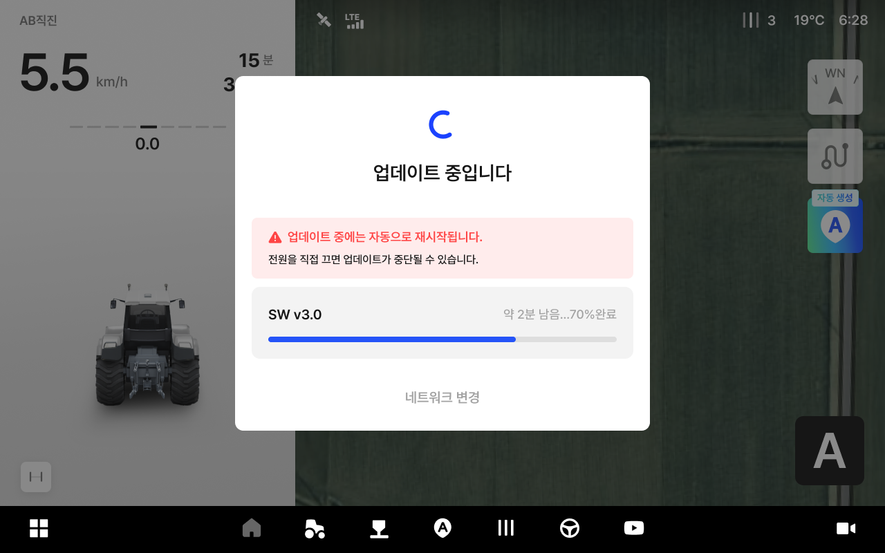
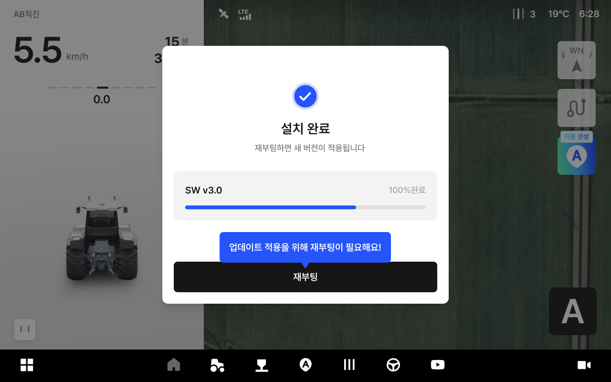
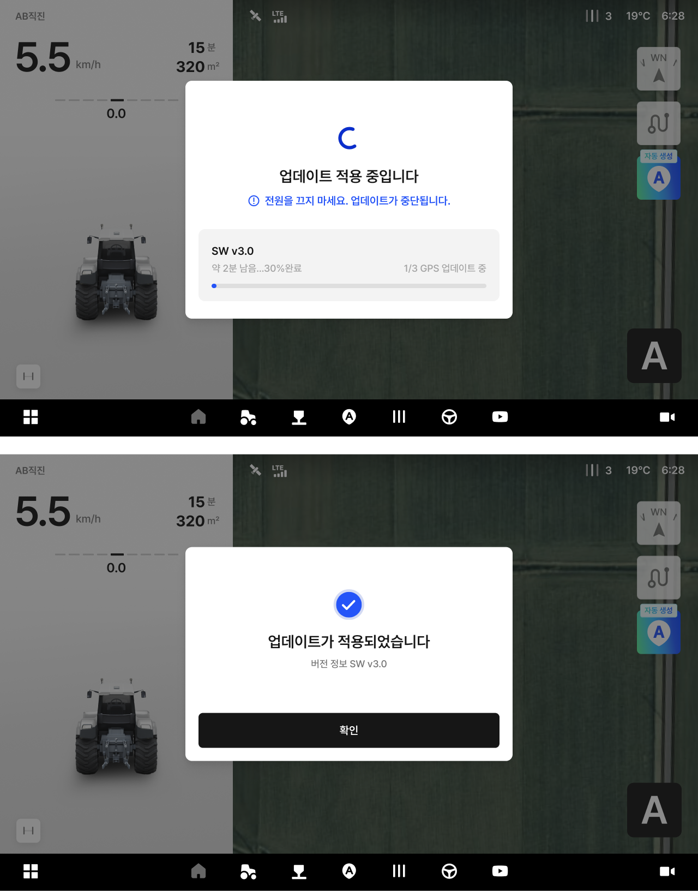
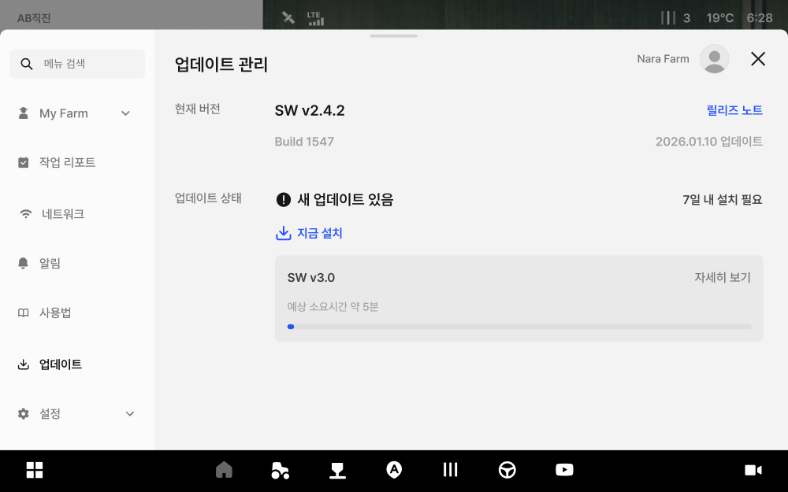
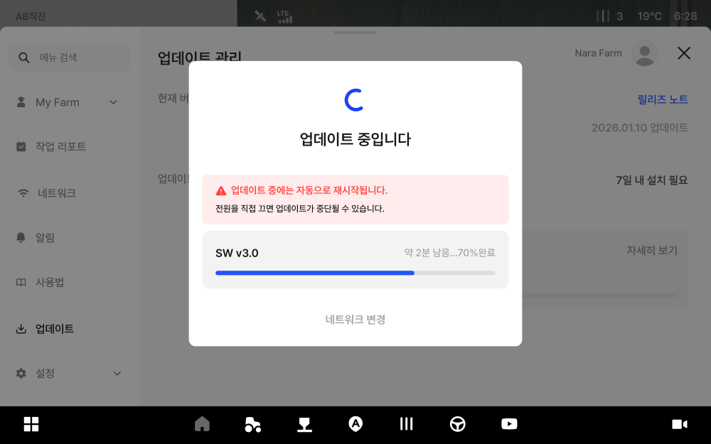
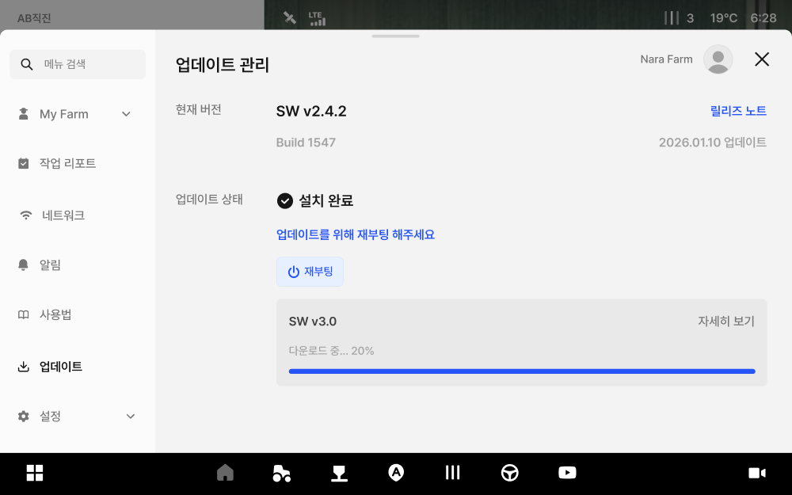

---
layout:
  width: default
  title:
    visible: true
  description:
    visible: false
  tableOfContents:
    visible: true
  outline:
    visible: true
  pagination:
    visible: true
  metadata:
    visible: true
  tags:
    visible: true
  actions:
    visible: true
metaLinks:
  alternates:
    - /broken/spaces/cB5Egkzinglp2WYUeNhf/pages/ts8JHILNFE1wyzk0Wc2I
---

# 소프트웨어 업데이트(OTA)

기기가 자동으로 업데이트 필요 여부를 확인하며, 필요시 알림이 표시됩니다.


반드시 LTE 수신 상태가 원활한 지역 개활지(하늘이 트인 곳)에서 업데이트를 진행해주세요.



업데이트에는 신규 기능 추가, 안정성 개선, 오류 수정 등이 포함됩니다.



일부 업데이트는 즉시 설치가 필요할 수 있습니다.



업데이트 완료 후 재부팅이 필요할 수 있습니다.


***

#### 업데이트 유형 안내

플루바 아이온의 업데이트는 내용과 중요도에 따라 다음과 같이 안내됩니다.

 **필수 업데이트**

* 안전/안정성에 영향을 줄 수 있어 반드시 설치해야 하는 업데이트입니다.

 **선택 업데이트**

* 편의 기능 개선이나 경미한 변경사항으로, 원하는 시점에 설치할 수 있는 업데이트입니다.
  * 설치하지 않아도 현재 버전으로 계속 사용 가능합니다.

 **긴급 업데이트**

* 중요한 문제를 빠르게 해결해야 하는 경우로, 즉시 업데이트가 필요합니다.

***

#### 업데이트 방법 안내

태블릿 전원을 켜면 업데이트 안내가 표시되며, 안내에 따라 업데이트를 진행합니다.



**업데이트 안내 확인**

* \[지금 업데이트] 버튼을 누르면 업데이트가 진행됩니다.

<figure><figcaption></figcaption></figure>



**업데이트 진행 중**

* 업데이트는 상황에 따라 작업 가능,작업 제한으로 나뉩니다.
  * 일반 업데이트(작업 가능)
\
    다운로드,설치가 진행되어도 기존 버전으로 작업을 계속할 수 있습니다.
  * 강제 업데이트(작업 불가)\
    업데이트 완료 전까지 제품 사용이 제한됩니다.

<figure><figcaption></figcaption></figure>



**설치 완료 및 재부팅 안내**

* 설치가 끝나면 새 버전을 적용하기 위해 재부팅 안내가 표시됩니다.
* 경우에 따라 재부팅이 2회 필요할 수 있으며, 화면 안내에 따라 진행해 주세요.

<figure><figcaption></figcaption></figure>



**재부팅 후 업데이트 적용 후 업데이트 완료**

<figure><figcaption></figcaption></figure>




#### 자동 안내 외에, 설정 메뉴에서 지금 버전을 확인하고 직접 업데이트할 수도 있습니다.

1. **\[설정]** 메뉴로 들어갑니다.

2. **\[업데이트(소프트웨어)]** 항목을 누릅니다.

3. 현재 설치된 소프트웨어 버전을 확인합니다.

4. 새 버전이 있으면 업데이트를 진행합니다. 진행 중과 완료 상태가 화면에 표시되고, 완료되면 재시작 안내가 나타납니다.\\


