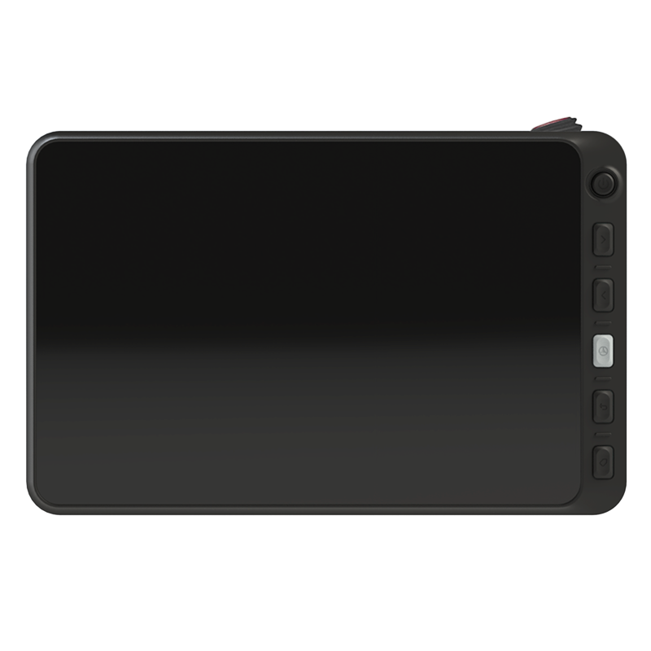
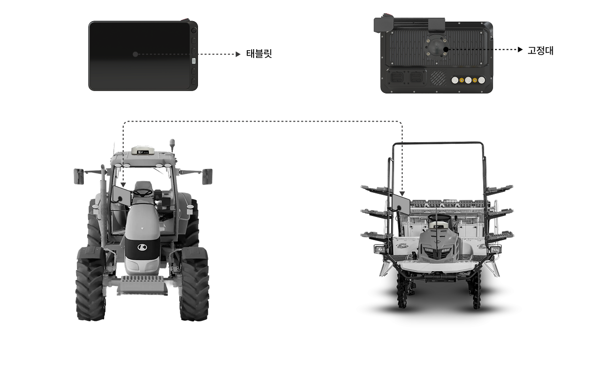

---
layout:
  width: default
  title:
    visible: false
  description:
    visible: false
  tableOfContents:
    visible: true
  outline:
    visible: true
  pagination:
    visible: true
  metadata:
    visible: true
  tags:
    visible: true
---

# Pluva iON 소개

### Pluva iON 소개

플루바 아이온은 트랙터·이앙기용 오토가이던스(Autoguidance) 시스템으로, GNSS(항법 위성 장치) 와 전동 스티어링을 이용해 정밀한 직진 주행과 자동 유턴 등을 지원하는 장비입니다. 운전자의 조작 부담을 줄이고, 작업 품질과 효율을 향상시키는 작업 보조 시스템입니다.

자율주행 기능은 여러 구성품의 연동으로 동작합니다. 아래에서 구성품과 각 장치의 역할을 확인하세요.

***

### 제품의 구성

제품을 구입하시면 다음과 같은 구성물을 제공하고 있으니 반드시 확인하세요.\
제품의 구성물 중 일부는 모델 타입에 따라 외관 및 색상이 그림과 다를 수 있습니다.

#### 플루바 아이온

> 플루바 아이온의 전체 구성품입니다. GNSS 수신기, 전동 스티어링 휠, 태블릿, 카메라를 포함합니다.

<figure><figcaption></figcaption></figure>

#### Expansion Kit

> 태블릿을 제외한 구성품입니다. GNSS 수신기, 전동 스티어링 휠, 카메라를 포함합니다.
반세트 주문 전, 플루바 아이온의 태블릿을 보유하고 있는지 확인이 필요합니다.

<figure><figcaption></figcaption></figure>

***

### 주요 구성품 소개



#### 전동 스티어링 휠

<figure><figcaption></figcaption></figure>

농기계의 기존 핸들을 탈착한 뒤 스티어링 위치에 장착하는 전동 모터 방식 조향 장치입니다.\
자세한 내용은 [전동 스티어링 휠](electric-steering-wheel.md)을 참조해주세요.



#### GNSS 수신기

<figure><figcaption></figcaption></figure>

고정밀 위치정보(RTK) 기술을 활용하여 농기계의 실시간 위치를 정밀하게 측정합니다.\

자세한 사양 및 기능 설명은 [GNSS 수신기](/broken/pages/lWdZgI2P4YIODQ7uazsl) 항목을 참조하십시오.





#### 태블릿

<figure><figcaption></figcaption></figure>

자율주행 시스템의 디스플레이 장치로,
작업 경로 설정, 주행 상태 모니터링, 시스템 제어 및 각종 설정 기능을 제공합니다.\

자세한 사용 방법은 [태블릿](tablet.md) 항목을 참조해주세요.



#### 스위치 (옵션품)

<figure><figcaption></figcaption></figure>

작업자가 조작하기 편리한 위치에 설치하여, 자율주행 시스템의 시작/정지 등 주요 기능을 간편하게 제어할 수 있습니다.

옵션품은 별도 구매가 필요합니다.\
자세한 내용은 [스위치](switch.md)를 참조해주세요.




{% column width="50%" %}
#### 카메라

<figure><figcaption></figcaption></figure>

주변 환경을 모니터링하기 위해 트랙터 뒤쪽 상부에 카메라를 설치하며, 후방 작업 상황을 확인할 수 있습니다.

자세한 내용은 [카메라](camera.md)를 참조해주세요.


{% column width="50%" %}
####



***

### 제품 설치 위치

각 구성품은 농기계에 지정된 위치에 설치됩니다.\
단, 실제 장착 위치는 차량 모델 및 장착 키트 구성에 따라 달라질 수 있습니다.

<figure><figcaption></figcaption></figure>

***

### 농기계 듀얼 사용법(Expansion Kit)

트랙터 및 이앙기에 모두 장착 가능하며, 필요에 따라 농기계 간 탈착 및 이동이 가능합니다.

<figure><figcaption></figcaption></figure>
