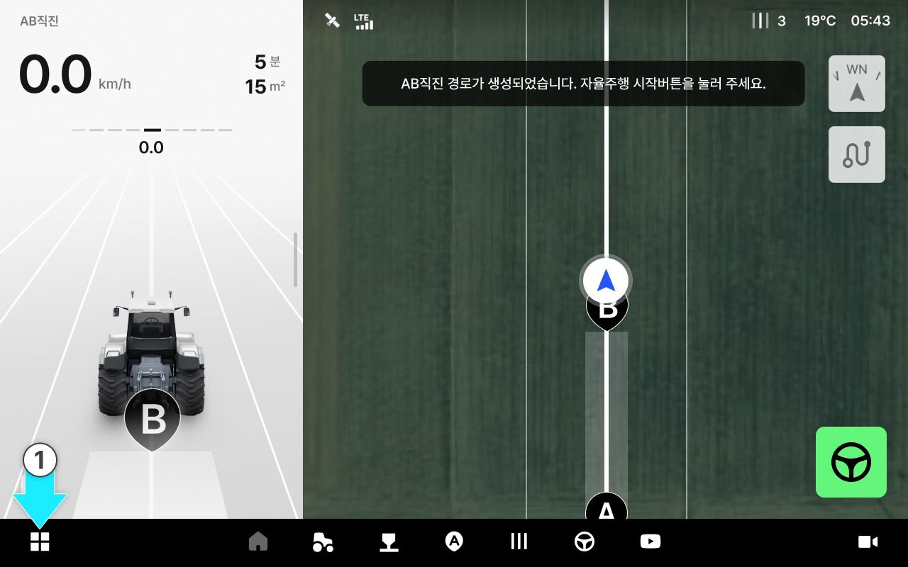
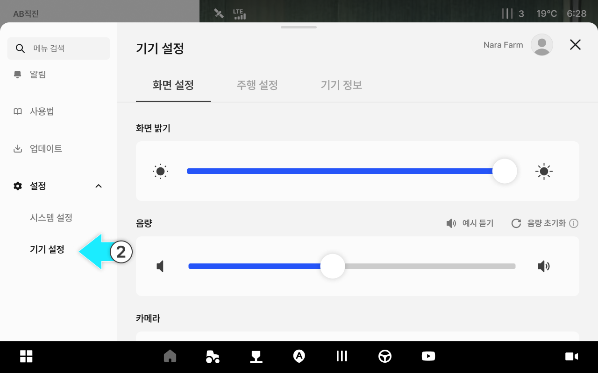
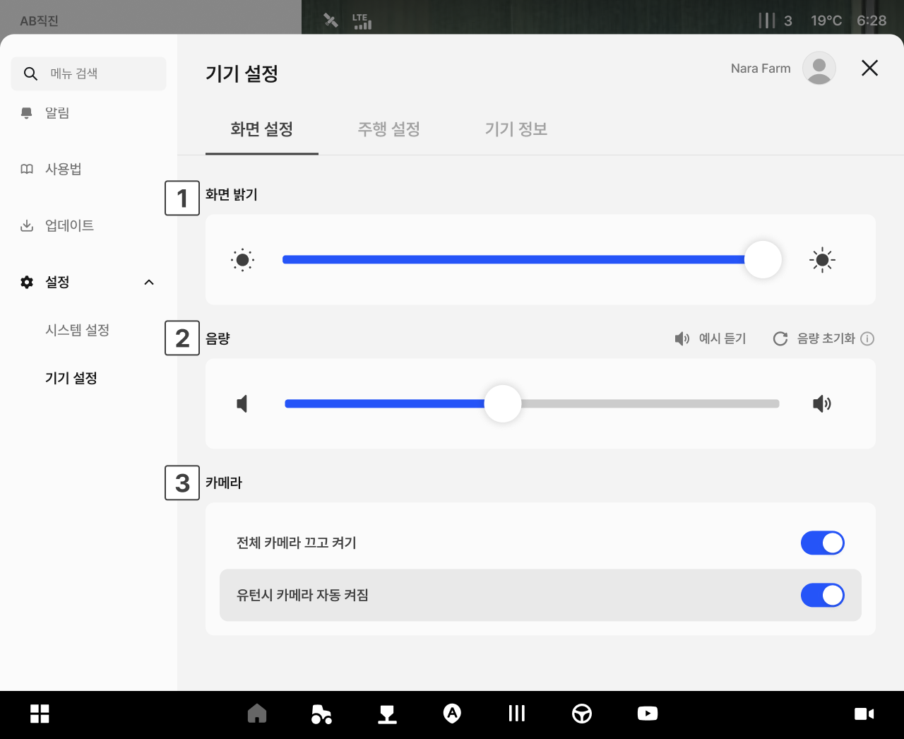
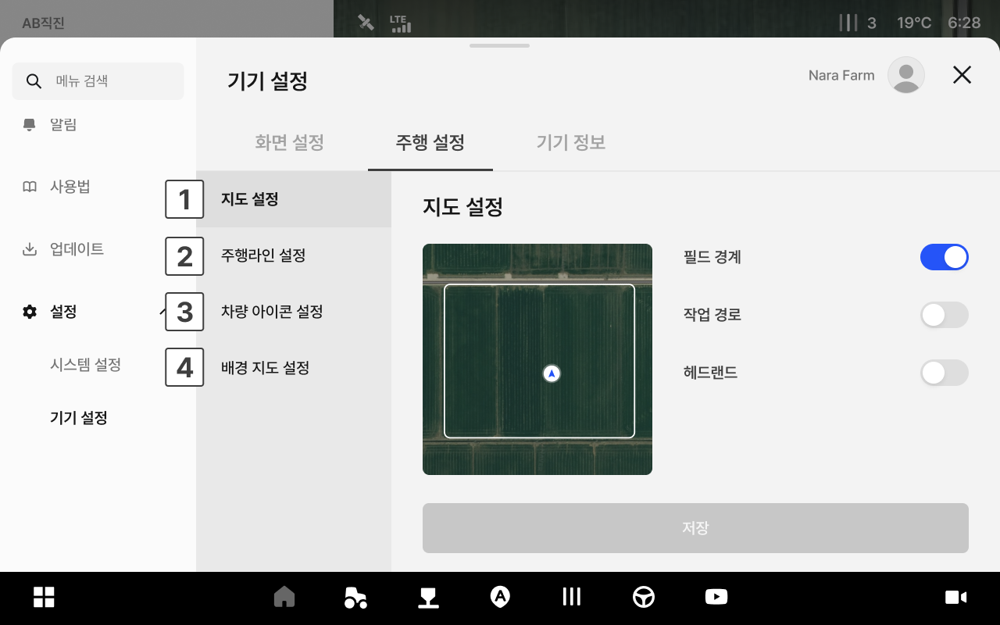
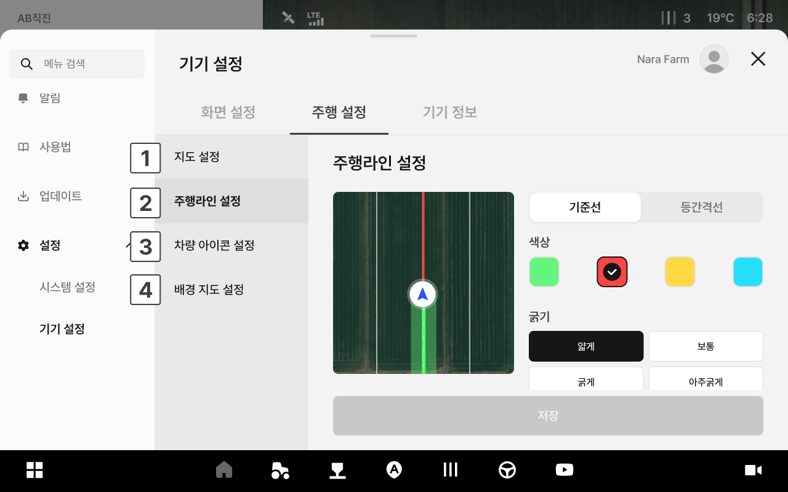
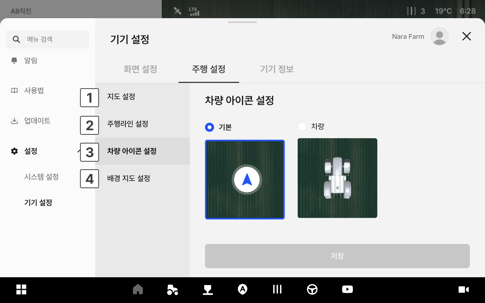
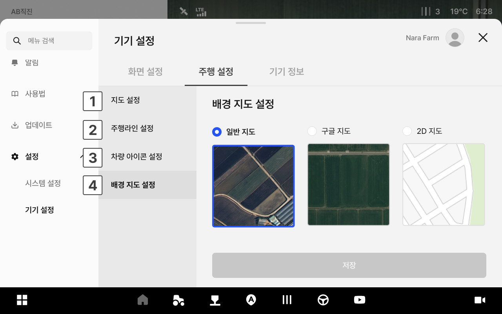
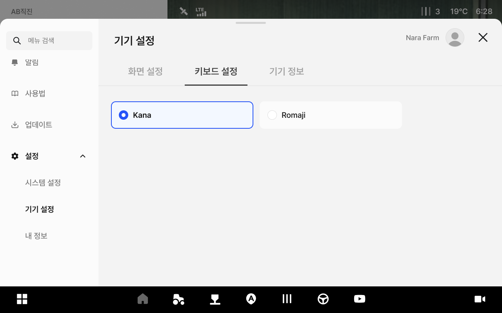

# 기기 설정

주행 화면의 밝기와 음량, 카메라 표시를 설정합니다.

***

### 진입 방법



앱 하단 내비게이션에서 설정 아이콘을 누릅니다.

<figure><figcaption></figcaption></figure>



좌측 메뉴에서 기기 설정을 누릅니다.

<figure><figcaption></figcaption></figure>



***

### 화면 설정 화면

화면 밝기와 음량, 카메라 표시를 설정합니다.

<figure><figcaption></figcaption></figure>

 **화면 밝기**

* 슬라이더를 드래그하여 화면 밝기를 조절합니다.

 **음량**

* 슬라이더를 드래그하여 음량을 조절합니다.
  * **예시 듣기**: 설정한 음량을 미리 들어봅니다.
  * **음량 초기화**: 음량을 기본값으로 되돌립니다.

 **카메라**

* 주행 화면에 카메라 영상 표시 여부를 설정합니다.
  * **전체 카메라**: 카메라를 한 번에 켜거나 끕니다.
  * **유턴 시 자동 켜짐**: 유턴할 때 카메라가 자동으로 켜집니다.

***

### 주행 설정 화면

주행 화면에 표시되는 지도와 주행 정보를 설정합니다.

<figure><figcaption></figcaption></figure>

 **지도 설정**

* 주행 화면에 표시할 지도 요소를 설정합니다.
  * 필드 경계: 작업 필드의 경계선 표시 여부
  * 작업 경로: 이미 주행한 경로 표시 여부
  * 헤드랜드: 헤드랜드 영역 표시 여부

<figure><figcaption></figcaption></figure>

 **주행라인 설정**

* 주행 기준선의 표시 방식을 설정합니다. 원하는 옵션을 선택합니다.

<figure><figcaption></figcaption></figure>

 **차량 아이콘 설정**

* 주행 화면에 표시되는 차량 아이콘 모양을 선택합니다.

<figure><figcaption></figcaption></figure>

 **배경 지도 설정**

* 주행 화면의 배경 지도 종류를 선택합니다.

<figure><figcaption></figcaption></figure>

***

### 키보드 설정 (일본 전용)

키보드 입력 방식을 선택합니다.


키보드 설정은 언어 설정이 일본어인 경우에만 표시됩니다.


<figure><figcaption></figcaption></figure>


유튜브 검색 시에는 가나 입력이 되지 않으며, 로마자(로마지)만 입력할 수 있습니다.



#### 키보드 업데이트가 필요한 경우

키보드 업데이트가 필요하면 화면에 “키보드 업데이트가 필요합니다” 안내와 \[지금 설치] 버튼이 표시됩니다.

\[지금 설치]를 누르면 업데이트가 진행됩니다.


***

### 기기 정보

기기의 기본 정보를 확인하고 저장된 작업 데이터를 초기화할 수 있습니다.

<figure><figcaption></figcaption></figure>

 기기 일련번호

* 기기의 일련번호가 표시됩니다.

 데이터 초기화

* 등록된 연결정보를 모두 해제하고 초기 설정 상태로 되돌립니다.
* 데이터 초기화 시 초기 화면으로 이동하여 퀵셋업을 처음부터 다시합니다.


주의: 데이터 초기화 시 모든 데이터가 영구 삭제되며 복구할 수 없습니다.

