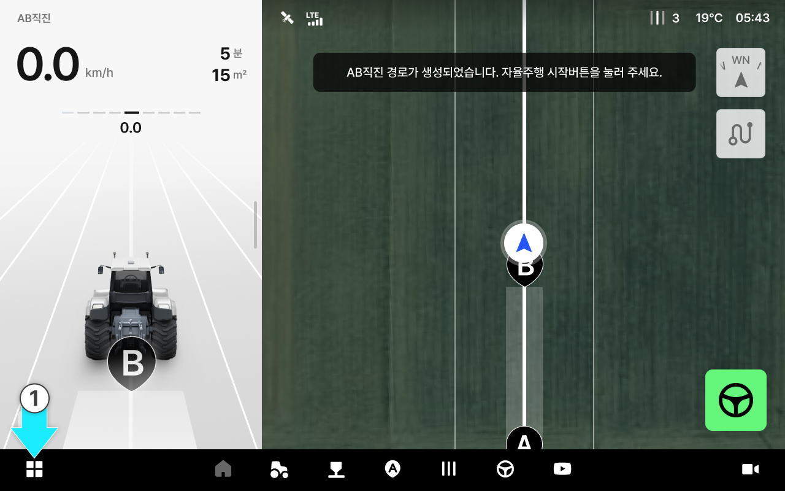
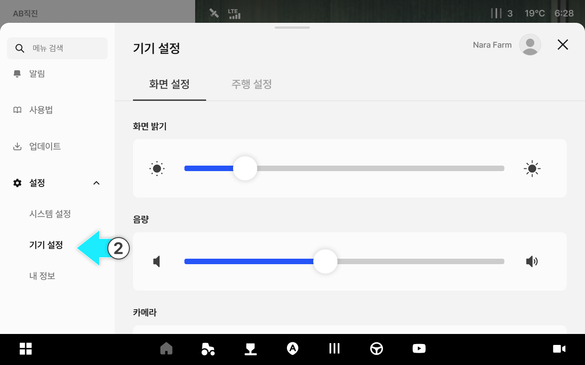
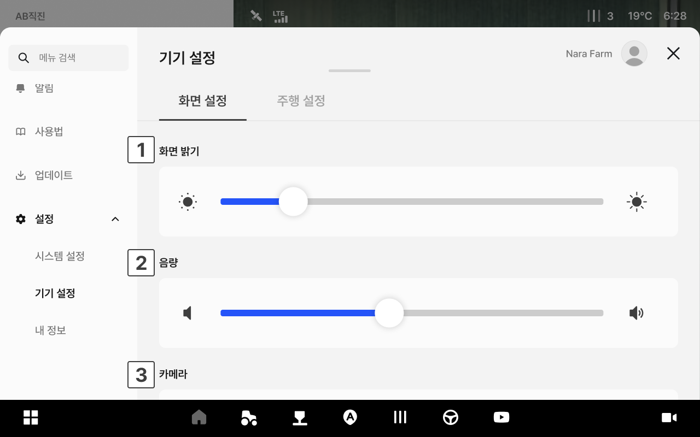
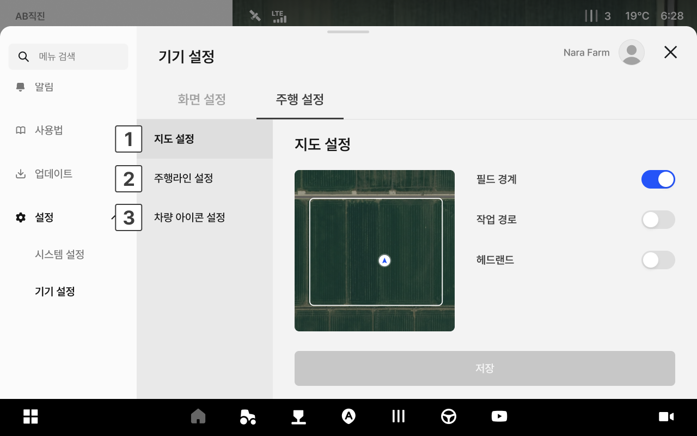
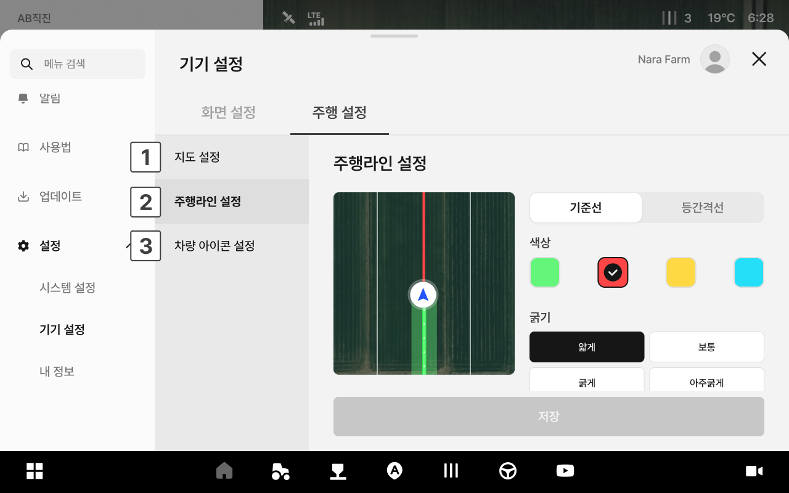
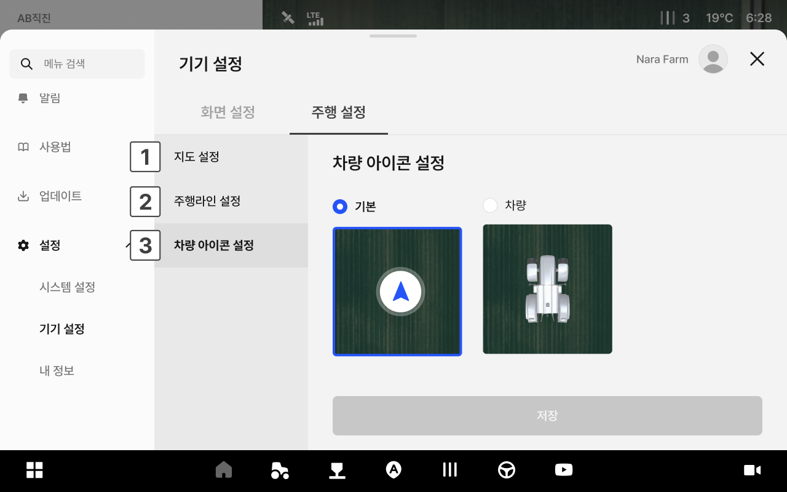

# 화면 설정

주행 화면의 밝기와 음량, 카메라 표시를 설정합니다.

### 진입 방법



앱 하단 내비게이션에서 설정 아이콘을 누릅니다.

<figure><figcaption></figcaption></figure>



좌측 메뉴에서 화면 설정을 누릅니다.

<figure><figcaption></figcaption></figure>



***

### 화면 설정 화면

<figure><figcaption></figcaption></figure>

 **화면 밝기**

* 슬라이더를 드래그하여 화면 밝기를 조절합니다.

 **음량**

* 슬라이더를 드래그하여 음량을 조절합니다.

 **카메라**

* 주행 화면에 카메라 영상 표시 여부를 설정합니다.

***

### 주행 설정 화면

<figure><figcaption></figcaption></figure>

 **지도 설정**

* 주행 화면에 표시할 지도 요소를 설정합니다.
  * 필드 경계: 작업 필드의 경계선 표시 여부
  * 작업 경로: 이미 주행한 경로 표시 여부
  * 헤드랜드: 헤드랜드 영역 표시 여부

<figure><figcaption></figcaption></figure>

 **주행라인 설정**

* 주행 기준선의 표시 방식을 설정합니다. 원하는 옵션을 선택합니다.

<figure><figcaption></figcaption></figure>

 **차량 아이콘 설정**

* 주행 화면에 표시되는 차량 아이콘 모양을 선택합니다.
