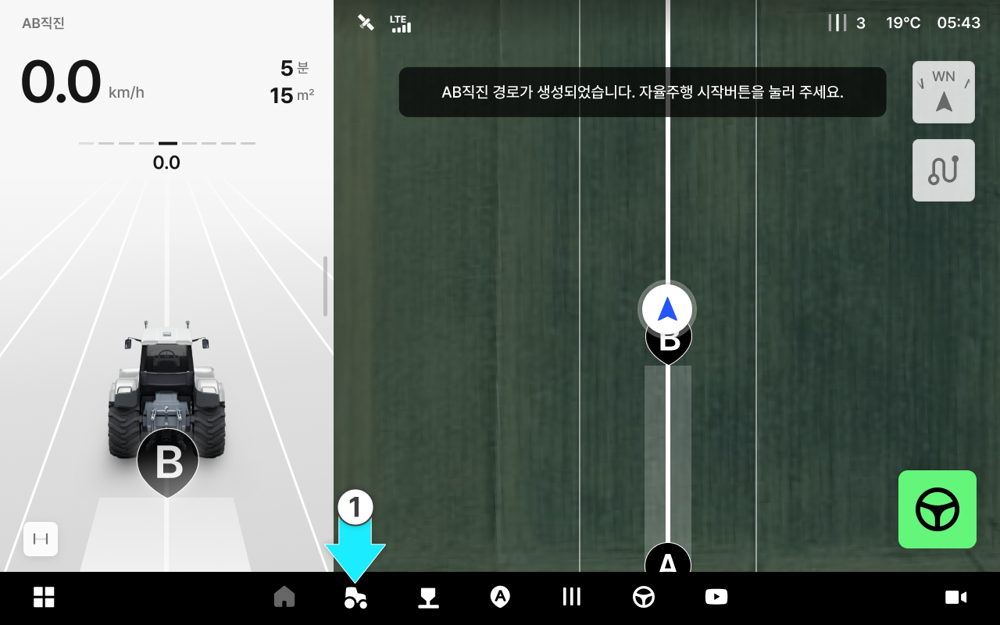
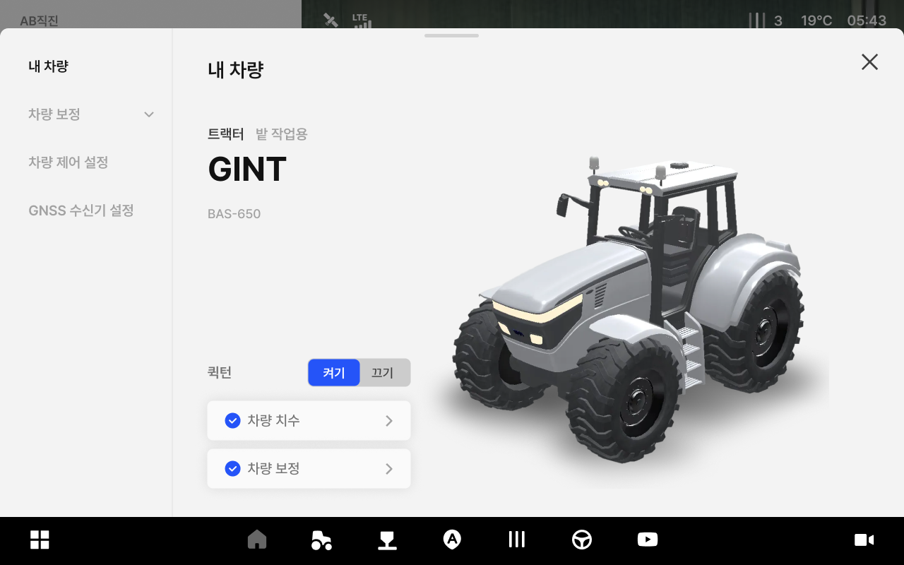
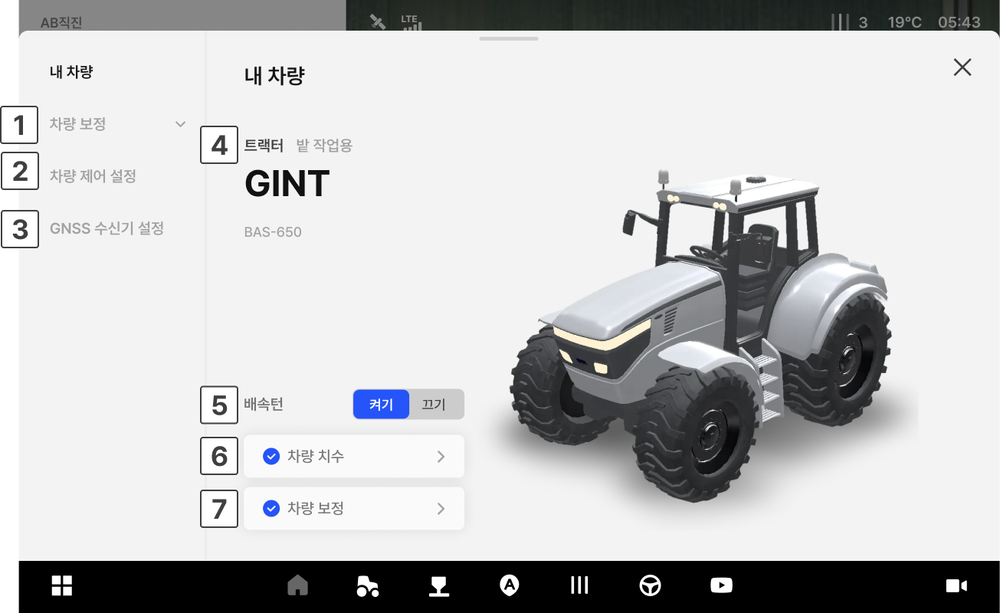

---
layout:
  width: default
  title:
    visible: true
  description:
    visible: false
  tableOfContents:
    visible: true
  outline:
    visible: true
  pagination:
    visible: true
  metadata:
    visible: true
  tags:
    visible: true
metaLinks:
  alternates:
    - /broken/spaces/cB5Egkzinglp2WYUeNhf/pages/gIXThOhTkSi8WiJjDxF2
---

# 내 차량 진입 및 화면 설명

작업에 사용하는 차량을 추가, 보정 등을 할 수 있는 관리 기능입니다.\
현재 태블릿이 장착된 차량 정보가 표시되며, 차량 변경/수정은 구매처(대리점)에 문의해야 합니다.

***

#### 내 차량 진입 방법



 \[차량] 버튼을 누릅니다.

<figure><figcaption></figcaption></figure>



내 차량에 진입이 완료됩니다.

<figure><figcaption></figcaption></figure>



***

#### 내 차량 화면 설명

<figure><figcaption></figcaption></figure>

 **차량 보정**

* 차량이 흔들리거나 휘어지지 않고 정확하게 직진하도록 오토스티어, 롤/피치/요,\
  관성센서 등을 보정합니다.

 **차량 제어 설정**

* 작업 환경에 맞게 주행 특성을 조정합니다.\
  설정 변경은 자율주행 성능에 영향을 줄 수 있습니다.

 **GNSS 수신기 설정**

* 차량에 설치된 GNSS 수신기의 위치를 입력하여 위치 정확도를 최적화합니다.

 **차량 정보**

* 현재 장착된 차량의 타입, 별칭, 브랜드, 모델을 보여줍니다.

 **배속턴 ON/OFF**

* 배속턴 차량의 배속턴 설정 ON/OFF 상태를 표시합니다. 배속턴 차량이 아닌 경우에는 표시되지 않습니다.

 **차량 치수**

* 차량 치수 입력 완료 여부를 표시합니다. 선택 시 차량 치수를 수정할 수 있습니다.

 **차량 보정 유무**

* 차량 보정 작업 완료 여부를 표시합니다. 선택 시 차량 보정 화면으로 이동합니다.
