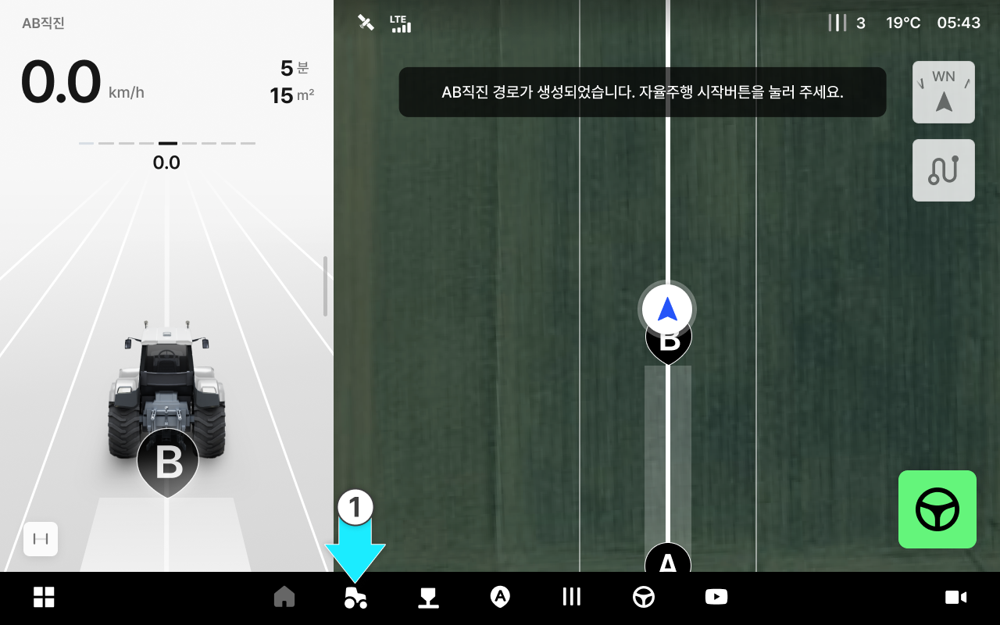
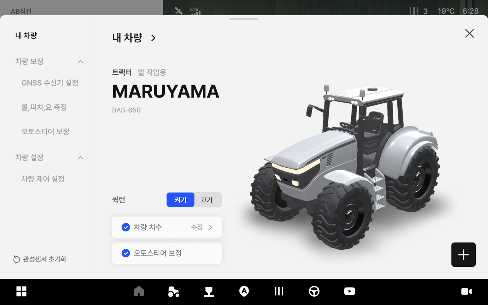
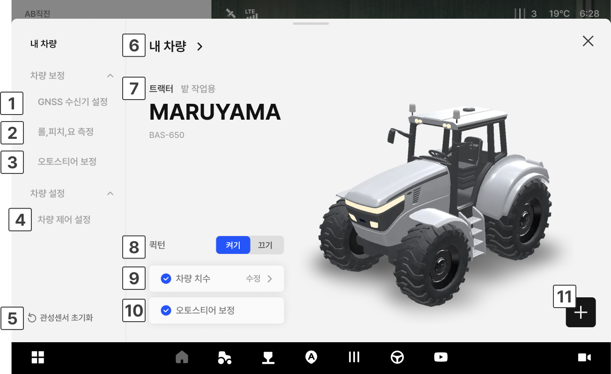
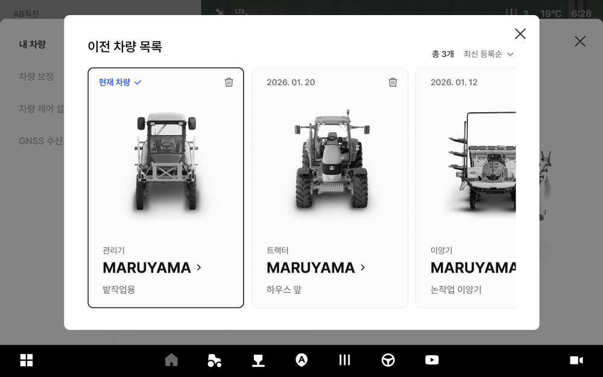

---
layout:
  width: default
  title:
    visible: true
  description:
    visible: false
  tableOfContents:
    visible: true
  outline:
    visible: true
  pagination:
    visible: true
  metadata:
    visible: true
  tags:
    visible: true
  actions:
    visible: true
metaLinks:
  alternates:
    - /broken/spaces/cB5Egkzinglp2WYUeNhf/pages/gIXThOhTkSi8WiJjDxF2
---

# 내 차량 진입 및 화면 설명

내 차량에서는 작업에 사용하는 차량 정보를 확인하고, 보정·치수 등 차량 관련 설정을 할 수 있습니다.&#x20;

***

#### 내 차량 진입 방법



 \[차량] 버튼을 누릅니다.

<figure><figcaption></figcaption></figure>



내 차량에 진입이 완료됩니다.

<figure><figcaption></figcaption></figure>



***

#### 내 차량 화면 설명

<figure><figcaption></figcaption></figure>

 **GNSS 수신기 설정**

* 차량에 설치된 GNSS 수신기의 위치를 입력하여 위치 정확도를 최적화합니다.

 **롤·피치·요 측정**

* 차량의 기울기(롤/피치/요)를 측정·보정합니다.

 **오토스티어 보정**

* 차량이 흔들리지 않고 정확하게 직진하도록 조향을 보정합니다.

 **차량 제어 설정**

* 작업 환경에 맞게 주행 특성을 조정합니다.\
  설정 변경은 자율주행 성능에 영향을 줄 수 있습니다.

 **관성센서 초기화**

* 관성센서(IMU) 값을 초기 상태로 되돌립니다.

 **내 차량**

* 배속턴 차량의 배속턴 설정 ON/OFF 상태를 표시합니다. 배속턴 차량이 아닌 경우에는 표시되지 않습니다.


\[내 차량 ›]을 누르면 이전에 등록한 차량 목록이 표시됩니다.



 **차량 정보**

* 현재 장착된 차량의 타입, 별칭, 브랜드, 모델을 보여 줍니다.

 **퀵턴 켜기/끄기**

* 퀵턴 사용 여부를 설정합니다.

 **차량 치수**

*   차량 치수 입력 완료 여부를 표시합니다. 선택 시 차량 치수를 수정할 수 있습니다. 

    <figure><figcaption></figcaption></figure>

.svg>) **오토스티어 보정 (상태)**

* 보정 완료 여부가 표시되며, 선택하면 보정 화면으로 이동합니다.

 **차량 추가 (+)**

* 화면 우측 하단의 + 버튼으로 새 차량을 추가합니다.
