---
layout:
  width: default
  title:
    visible: true
  description:
    visible: false
  tableOfContents:
    visible: true
  outline:
    visible: true
  pagination:
    visible: true
  metadata:
    visible: true
  tags:
    visible: true
---

# 내 차량 정보 수정

작업에 사용하는 차량의 정보와 수치를 수정할 수 있습니다.

***

#### 내 차량 정보 수정 진입 방법



 \[차량] 버튼을 누릅니다.

<figure>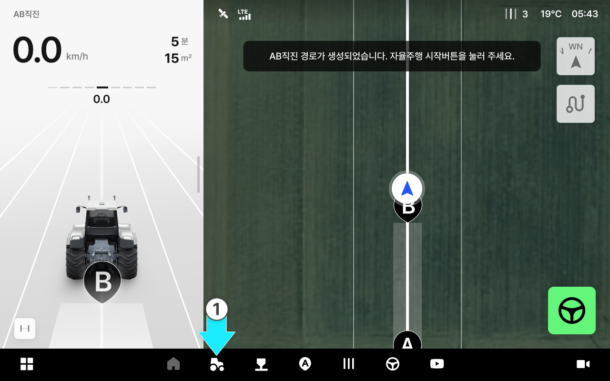<figcaption></figcaption></figure>



내 차량에 진입이 완료됩니다. 차량 치수를 누릅니다.

<figure>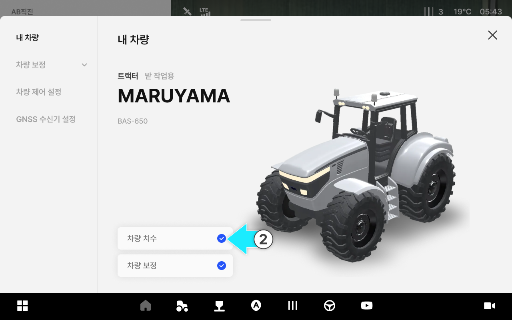<figcaption></figcaption></figure>



내 차량 정보 수정 진입이 완료됩니다.

<figure>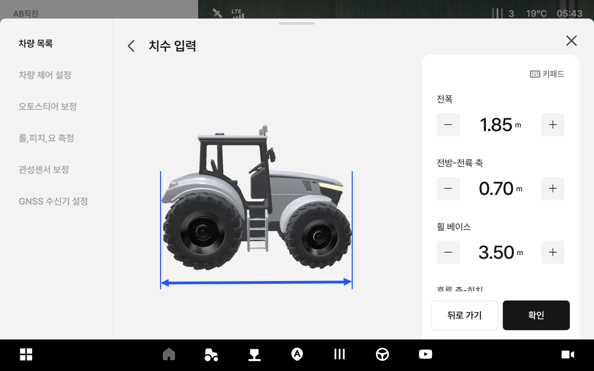<figcaption></figcaption></figure>



***

#### 내 차량 정보 수정 항목 설명

<figure>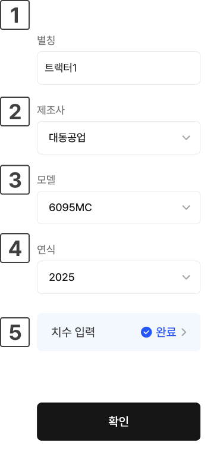<figcaption></figcaption></figure>

&#x20; **별칭**

* 차량을 별칭을 표시합니다.

&#x20; **제조사**

* 차량의 제조사를 선택합니다.

&#x20; **모델**

* 차량의 모델을 선택합니다.

&#x20; **연식**

* 차량의 연식을 선택합니다.

&#x20; **치수 입력**

* 차량의 치수를 입력합니다. 차량 타입에 따라 입력 항목이 달라집니다.
*   트랙터

    
<figure><figcaption></figcaption></figure>

*   &#x20; 휠 베이스

    * 트랙터의 앞바퀴 중심과 뒷바퀴 중심 간의 거리입니다.
    * 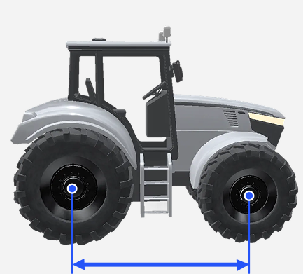

*   &#x20; 후륜 축-히치

    * 트랙터의 후륜 축 중심에서 히치까지의 수평 거리입니다.
    * 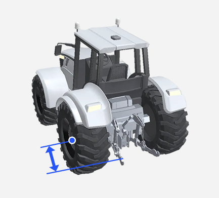

*   &#x20; 지면-상부링크

    * 지면에서부터 트랙터의 상부 링크까지의 수직 거리입니다.
    * 

    이앙기

    
<figure>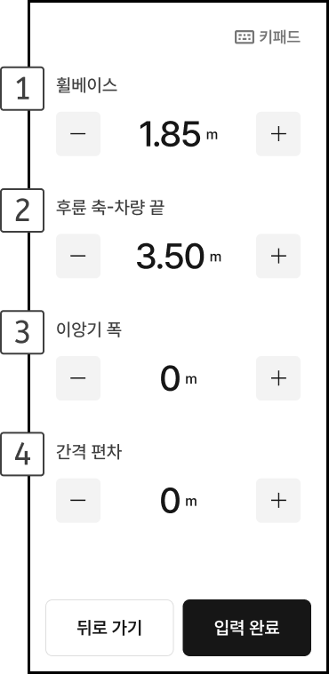<figcaption></figcaption></figure>

*   &#x20; 휠베이스

    * 이앙기의 앞바퀴 중심과 뒷바퀴 중심 간의 거리입니다.
    * 

*   &#x20; 후륜 축-차량 끝

    * 이앙기의 후륜 축 중심에서 차량 끝까지의 수평 거리입니다.
    * 

*   &#x20; 이앙기 폭

    * 이앙기의 폭을 의미하며 타이어 너비를 포함합니다.
    * 

    &#x20; 간격 편차

    * 양방향 작업 주행 시 간격이 일정하지 않을 때 보정하기 위한 수치값입니다. (간격 편차의 절대값을 4로 나눈 수치를 입력)

    관리기

    
<figure>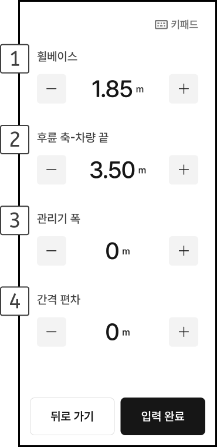<figcaption></figcaption></figure>

*   &#x20; 휠베이스

    * 이앙기의 앞바퀴 중심과 뒷바퀴 중심 간의 거리입니다.
    * 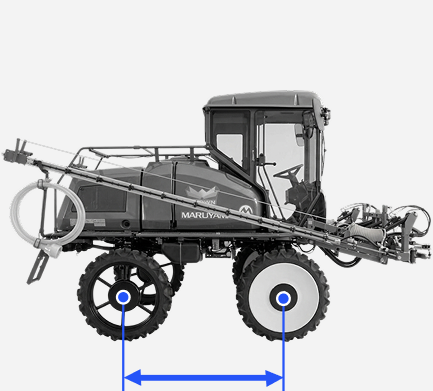

*   &#x20; 후륜 축-차량 끝

    * 이앙기의 후륜 축 중심에서 차량 끝까지의 수평 거리입니다.
    * 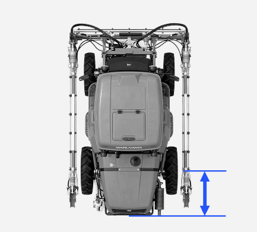

*   &#x20; 이앙기 폭

    * 이앙기의 폭을 의미하며 타이어 너비를 포함합니다.
    * 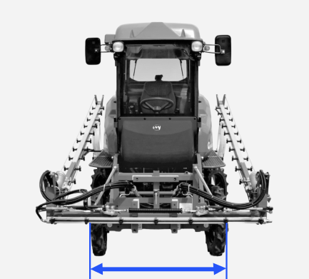

* &#x20; 간격 편차
  * 양방향 작업 주행 시 간격이 일정하지 않을 때 보정하기 위한 수치값입니다. (간격 편차의 절대값을 4로 나눈 수치를 입력)
