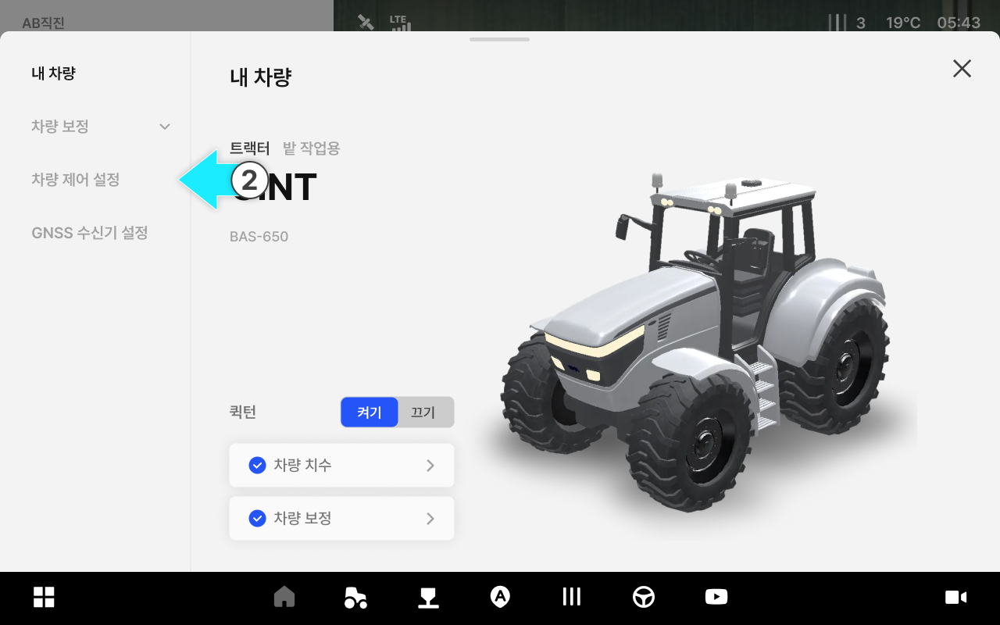

# 차량 제어 설정

### 차량제어설정

차량 제어 설정은 작업 환경에 맞게 자율주행 반응(해제 민감도, 경로 진입 특성 등)을 조정하는 기능입니다. 설정 변경은 주행 성능에 영향을 줄 수 있으므로, 대리점 안내에 따라 조정하는 것을 권장합니다.



 \[차량] 버튼을 누릅니다.

<figure><figcaption></figcaption></figure>



차량제어 설정을 누릅니다.

<figure><figcaption></figcaption></figure>



차량제어 설정 진입이 완료됩니다.

<figure><figcaption></figcaption></figure>



***

#### 차량제어 설정 설명

> #### **일반 설정 방법**

<figure><figcaption></figcaption></figure>

&#x20;

 **자율주행 해제 허용**

* 운전자가 핸들을 직접 조작했을 때 자율주행을 자동으로 해제할지 설정합니다.


수동 해제 강도 허용 토글을 켜야 강도를 설정할 수 있습니다.




설정을 약하게 할수록 스티어링휠에 적은 힘을 가해도 자율주행이 해제됩니다.



아이콘을 누르면 해당 기능에 대한 설명을 볼 수 있습니다.


&#x20;

 **경로 진입 거리 설정**

* 차량이 경로 상 얼마나 먼 지점을 목표로 진입할지 설정합니다.


전진, 후진을 선택해 설정할 수 있습니다.



먼 지점을 목표로 하면 천천히 부드럽게 진입하고 가까운 지점을 목표로 하면 빠르게 직접적으로 진입합니다.



경로 진입 거리는 고급 설정에서 수치로 상세히 설정할 수 있으며, 일반 설정과 변경 값이 연동됩니다.



아이콘을 누르면 해당 기능에 대한 설명을 볼 수 있습니다.


> **고급 설정 방법**



고급 설정  을 눌러 고급 설정 기능을 사용할 수 있습니다.

<figure><figcaption></figcaption></figure>




> #### **고급 설정 항목 설명**

#### **a. 자율주행 해제 허용 (전진)**

&#x20;  **전진 시작 조건**

1. 전진 시작 조건: 전진으로 자율주행을 시작하기 위한 안전 조건 사용 여부를 설정합니다.


토클을 통해 기능을 켜고/끌 수 있습니다.




사용함: 안전 조건을 만족해야만 자율주행을 시작 /사용 안함: 언제든지 자율주행을 시작합니다.



안전 조건을 사용하지 않으면 위험한 상황에서도 자율주행이 시작될 수 있습니다.특별한 경우가 아니라면 안전 조건을 켜둔 상태로 사용합니다.


2. 전진 거리 조건
: 전진으로 자율주행을 시작할 수 있는 최대 거리를 설정합니다.


차량이 경로로부터 이 값보다 먼 거리에 위치하면 자율주행을 시작할 수 없습니다.


3. 전진 각도 조건
: 전진으로 자율주행을 시작할 수 있는 최대 각도 차이를 설정합니다.


차량과 경로의 각도 차이가 이 값보다 크면 자율주행을 시작할 수 없습니다.


4. 전진 속도 조건
: 전진으로 자율주행을 시작할 수 있는 최대 속도를 설정합니다.


차이 속도보다 빠르게 주행 중일 때는 자율주행을 시작할 수 없습니다.


&#x20;

 **전진 해제 조건**

1. 전진 해제 조건 사용
: 전진으로 조건을 벗어날 때 자율주행을 자동으로 해제할지 설정합니다.


사용함: 조건을 벗어나면 자동으로 자율주행이 해제 /사용 안함: 운전자 조작으로만 자율주행이 해제합니다.



안전 조건을 사용하지 않으면 위험한 상황에서도 자율주행이 시작될 수 있습니다. 특별한 경우가 아니라면 안전 조건을 켜둔 상태로 사용합니다.


2. 랜딩 전 전진 거리
: 전진으로 경로에 완전히 진입하기 전 자율주행이 해제되는 최대 거리를 설정합니다.


차량이 경로로부터 이 값보다 먼 거리에 위치하면 자율주행이 해제됩니다.


3. 랜딩 전 전진 각도
: 전진으로 경로에 완전히 진입하기 전 자율주행이 해제되는 최대 각도 차이를 설정합니다.


차량과 경로의 각도 차이가 이 값보다 크면 자율주행이 해제됩니다.


4. 랜딩 후 전진 거리
:전진으로 경로에 완전히 진입한 후 자율주행이 해제되는 최대 거리를 설정합니다.


차량이 경로로부터 이 값보다 먼 거리에 위치하면 자율주행이 해제됩니다.


5. 랜딩 후 전진 각도
:전진으로 경로에 완전히 진입한 후 자율주행이 해제되는 최대 각도 차이를 설정합니다.


차량과 경로의 각도 차이가 이 값보다 크면 자율주행이 해제됩니다.


6. 전진 속도 조건
:전진으로 자율주행이 자동으로 해제되는 최대 속도를 설정합니다.


이 속도보다 빠르게 주행하면 자율주행이 자동으로 해제됩니다.


&#x20;

 **전진 최저 속도 조건**

* 전진으로 자율주행 동작에 필요한 최저 속도를 설정합니다.


이 속도보다 느리면 자율주행이 시작되지 않거나 해제됩니다.



시작 조건과 해제 조건의 사용 여부에 따라 해당 시점에만 적용됩니다.


#### **b. 자율주행 해제 허용 (후진)**

&#x20;  **후진 시작 조건**

1. 후진 시작 조건
: 후진으로 자율주행을 시작하기 위한 안전 조건 사용 여부를 설정합니다.


사용함: 안전 조건을 만족해야만 자율주행을 시작 /사용 안함: 언제든지 자율주행을 시작합니다



안전 조건을 사용하지 않으면 위험한 상황에서도 자율주행이 시작될 수 있습니다. 특별한 경우가 아니라면 안전 조건을 켜둔 상태로 사용합니다.


2. 후진 거리 조건
: 후진으로 자율주행을 시작할 수 있는 최대 거리를 설정합니다.


차량이 경로로부터 이 값보다 먼 거리에 위치하면 자율주행을 시작할 수 없습니다.


3. 후진 각도 조건
: 후진으로 자율주행을 시작할 수 있는 최대 각도 차이를 설정합니다.


차량과 경로의 각도 차이가 이 값보다 크면 자율주행을 시작할 수 없습니다.


4. 후진 속도 조건
: 후진으로 자율주행을 시작할 수 있는 최대 속도를 설정합니다.


이 속도보다 빠르게 주행 중일 때는 자율주행을 시작할 수 없습니다.


&#x20;  **후진 해제 조건**

1. 후진 해제 조건 사용
: 후진으로 조건을 벗어날 때 자율주행을 자동으로 해제할지 설정합니다.


사용함: 조건을 벗어나면 자동으로 자율주행이 해제 /사용 안함: 운전자 조작으로만 자율주행이 해제합니다.



안전 조건을 사용하지 않으면 위험한 상황에서도 자율주행이 시작될 수 있습니다. 특별한 경우가 아니라면 안전 조건을 켜둔 상태로 사용합니다.


2. 랜딩 전 후진 거리
: 후진으로 경로에 완전히 진입하기 전 자율주행이 해제되는 최대 거리를 설정합니다.


차량이 경로로부터 이 값보다 먼 거리에 위치하면 자율주행이 해제됩니다.


3. 랜딩 전 후진 각도
: 후진으로 경로에 완전히 진입하기 전 자율주행이 해제되는 최대 각도 차이를 설정합니다.


차량과 경로의 각도 차이가 이 값보다 크면 자율주행이 해제됩니다.


4. 랜딩 후 후진 거리
:후진으로 경로에 완전히 진입한 후 자율주행이 해제되는 최대 거리를 설정합니다.


차량이 경로로부터 이 값보다 먼 거리에 위치하면 자율주행이 해제됩니다.


5. 랜딩 후 후진 각도
:후진으로 경로에 완전히 진입한 후 자율주행이 해제되는 최대 각도 차이를 설정합니다.


차량과 경로의 각도 차이가 이 값보다 크면 자율주행이 해제됩니다.


6. 후진 속도 조건
:후진으로 자율주행이 자동으로 해제되는 최대 속도를 설정합니다.


이 속도보다 빠르게 주행하면 자율주행이 자동으로 해제됩니다.


&#x20;  **후진 최저 속도 조건**

* 후진으로 자율주행 동작에 필요한 최저 속도를 설정합니다.


이 속도보다 느리면 자율주행이 시작되지 않거나 해제됩니다.



시작 조건과 해제 조건의 사용 여부에 따라 해당 시점에만 적용됩니다.


#### **c. 경로 진입 거리 고급 설정**

&#x20;  **진입 성향**

1. 전진 경로 진입 거리:
전진으로 차량이 경로 상 얼마나 먼 지점을 목표로 진입할지 설정합니다.


경로 진입 거리는 고급 설정에서 수치로 상세히 설정할 수 있으며, 일반 설정과 변경 값이 연동됩니다.


2. 후진 경로 진입 거리:
후진으로 차량이 경로 상 얼마나 먼 지점을 목표로 진입할지 설정합니다.


경로 진입 거리는 고급 설정에서 수치로 상세히 설정할 수 있으며, 일반 설정과 변경 값이 연동됩니다.


3. 경로 진입 각도:
차량이 경로에 진입할 때 얼마나 적극적으로 들어갈지 설정합니다.


값이 클수록 경로에 급격하게 진입하고 값이 작을수록 완만하게 진입합니다.



너무 작게 설정하면 진입이 지나치게 늦어질 수 있습니다.


4. 경로 진입 시간:
경로 진입을 위해 미리 계획할 시간을 설정합니다.


값이 클수록 시간을 두고 계획해서 부드럽게 진입하고 값이 작을수록 직전에 계획해서 빠르게 진입합니다.



차량의 경로 진입 정도를 조정하려면 진입 거리 → 진입 각도 → 진입 시간 순으로 설정하는 것을 권장합니다.


&#x20;

  **추종 민감도**

1. 전진 경로 추종 민감도: 전진으로 진입 후 경로를 얼마나 정밀하게 따라갈지 설정합니다.


값이 클수록 여유롭게 추종하고 값이 작을수록 민첩하게 추종합니다.



이 설정은 주행 성능에 큰 영향을 미치므로 신중하게 조정합니다.


2. 후진 경로 추종 민감도:
후진으로 진입 후 경로를 얼마나 정밀하게 따라갈지 설정합니다.


값이 클수록 여유롭게 추종하고 값이 작을수록 민첩하게 추종합니다.



이 설정은 주행 성능에 큰 영향을 미치므로 신중하게 조정합니다.


  **조향 민감도**

1. 랜딩 전 전진 조향 민감도:
전진으로 경로에 완전히 진입하기 전 조향 민감도를 설정합니다.


값이 클수록 핸들 조작이 부드러워지고 값이 작을수록 핸들 조작이 민감해집니다.


2. 랜딩 전 후진 조향 민감도:
후진으로 경로에 완전히 진입하기 전 조향 민감도를 설정합니다.


값이 클수록 핸들 조작이 부드러워지고 값이 작을수록 핸들 조작이 민감해집니다.


3. 랜딩 후 전진 조향 민감도:
전진으로 경로에 완전히 진입한 후 조향 민감도를 설정합니다.


값이 클수록 핸들 조작이 부드러워지고 값이 작을수록 핸들 조작이 민감해집니다.


4. 랜딩 후 후진 조향 민감도:
후진으로 경로에 완전히 진입한 후 조향 민감도를 설정합니다.


값이 클수록 핸들 조작이 부드러워지고 값이 작을수록 핸들 조작이 민감해집니다.


5. 데드존 보정:
핸들을 돌려도 바퀴가 움직이지 않는 구간을 보정한다.


설정값과 실제 데드존의 오차가 클수록, 데드존의 범위가 클수록 투박하게 제어될 수 있습니다.



부정확한 값은 자율주행 성능에 큰 영향을 미치므로 데드존은 반드시 실측하여 정확하게 설정합니다.


6. 유턴 조향 보정:
유턴 시 설정된 경로를 기준으로 조향을 보정합니다.


값이 클수록 경로 안쪽으로 들어가며 적극적으로 유턴합니다.


  **곡률 반경 제한**

* 커브 경로 생성 시 최대 곡률을 제한하여 경로를 보정합니다.


AB 커브 모드에서만 설정할 수 있습니다.

