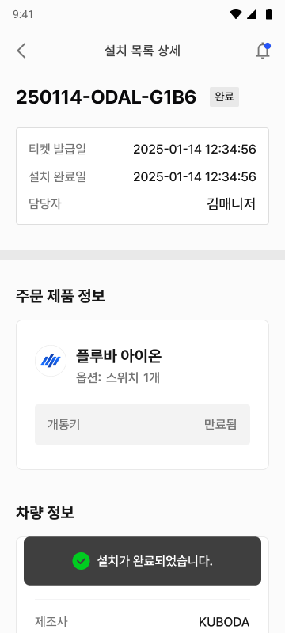

---
layout:
  width: default
  title:
    visible: false
  description:
    visible: false
  tableOfContents:
    visible: true
  outline:
    visible: true
  pagination:
    visible: true
  metadata:
    visible: true
  tags:
    visible: true
---

# 설치 완료 확인

### 설치 완료 확인&#x20;

설치 및 퀵셋업 작업의 완료 항목을 점검하고, 설치 티켓 상태를 설치 완료로 변경하는 작업입니다.


모든 설치 작업을 완료한 후 \[확인 완료]를 누릅니다.

* 제품이 정상적으로 장착되었습니다.
* 필요한 소프트웨어 설정이 모두 완료되었습니다.
* 고객이 즉시 서비스를 사용할 수 있는 상태입니다.




설치 티켓 목록에서 설치 완료한 설치 티켓을 누릅니다.

<figure><figcaption></figcaption></figure>



\[설치 완료 확인]을 누릅니다.

<figure><figcaption></figcaption></figure>



설치 완료 확인 사항을 확인하고 \[확인 완료]를 누릅니다.

<figure><figcaption></figcaption></figure>



설치가 완료됩니다.

<figure><figcaption></figcaption></figure>


