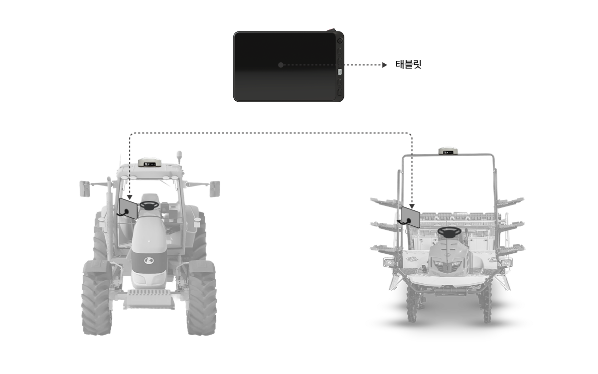

---
layout:
  width: default
  title:
    visible: false
  description:
    visible: false
  tableOfContents:
    visible: true
  outline:
    visible: true
  pagination:
    visible: true
  metadata:
    visible: true
  tags:
    visible: true
---

# 제품 설치 위치

### 제품 설치

각 구성품은 농기계에 지정된 위치에 설치됩니다.\
단, 실제 장착 위치는 차량 모델 및 장착 키트 구성에 따라 달라질 수 있습니다.

<figure><figcaption></figcaption></figure>

***

### 확장 키트(Expansion Kit) 사용법

확장 키트를 통해 ‘태블릿’하나로 여러대의 농기계에서 자율주행을 사용할 수 있습니다.

<figure><figcaption></figcaption></figure>


\[Expansion Kit]
\
태블릿을 제외한 경제적인 확장형 제품입니다.\
GNSS 수신기, 전동 스티어링 휠, 카메라를 포함합니다. 주문 전, 플루바 아이온 태블릿을 보유하고 있는지 확인이 필요합니다.

