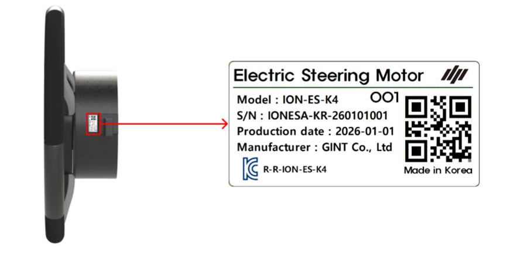

---
layout:
  width: default
  title:
    visible: false
  description:
    visible: false
  tableOfContents:
    visible: true
  outline:
    visible: true
  pagination:
    visible: true
  metadata:
    visible: true
  tags:
    visible: true
---

# 설치티켓으로 제품 등록

### **설치티켓으로** 제품 등록

설치티켓에 제품을 등록하여 개통키를 발급합니다. 원활한 설치를 위해 설치 전 등록을 권장합니다.


설치티켓이 무엇인가요?

주문한 상품별로 **설치 상태를 체크할 수 있는 관리 티켓**입니다.


***

#### 주문 제품별 등록 구성품

각 주문 제품에 따라 아래 구성품을 준비합니다.

1. **플루바 아이온**

* 모든 주요 구성품을 등록합니다.
  * 태블릿
  * GNSS 수신기
  * 전동 스티어링 휠

2. **Expansion Kit (확장키트)**

* 태블릿을 제외한 구성품들을 등록합니다.
  * GNSS 수신기
  * 전동 스티어링 휠

3. **추가 옵션**

* 스위치

***

#### 시리얼 넘버 등록 (패키징 넘버)

제품 등록은 제품에 부착된 QR 코드(시리얼 넘버)를 스캔해 진행합니다.

* 패키징 넘버(패키지 박스 QR)를 등록하면, 구성품을 **한 번에 등록**할 수 있습니다.

#### QR 코드 위치 안내



#### 태블릿

후면의 QR코드를 확인합니다.

<figure><figcaption></figcaption></figure>



#### GNSS 수신기

우측면 또는 하단의 QR 코드를 확인합니다.

<figure><figcaption></figcaption></figure>





#### 전동 스티어링 휠

모터 측면에 QR 코드를 확인합니다.

<figure><figcaption></figcaption></figure>



#### 스위치

후면의 QR코드를 확인합니다.

<figure><figcaption></figcaption></figure>



***

#### 설치 티켓 진입 방법



어드민 페이지에 로그인합니다.

<figure><figcaption></figcaption></figure>



설치 티켓 목록에 진입하고 원하는 티켓을 선택합니다.

<figure><figcaption></figcaption></figure>


왼쪽 상단 더보기 버튼을 누르고 주문/설치 관리 > 설치 티켓 목록에 접속할 수 있습니다.





***

#### 제품 등록 방법



설치 티켓에서 \[제품 등록 시작]을 누릅니다.

<figure><figcaption></figcaption></figure>



\[한번에 등록 진행]을 누릅니다.

<figure><figcaption></figcaption></figure>


제품 항목을 선택하면 개별 등록도 가능합니다.




패키징 넘버 QR 코드를 스캔합니다.

<figure><figcaption></figcaption></figure>


카메라 스캔으로 올바른 코드가 입력되지 않을 경우 입력칸을 눌러 직접 입력합니다.





패키징 넘버를 확인한 뒤 \[확인 완료]를 누릅니다.

<figure><figcaption></figcaption></figure>



등록이 완료되면 제품 등록 팝업에서 \[제품 등록 완료]를 누릅니다.

<figure><figcaption></figcaption></figure>


패키징 넘버(시리얼 넘버)가 유효하지 않으면 QR 스캔 화면으로 돌아갑니다.





제품 등록이 완료됩니다.

<figure><figcaption></figcaption></figure>


