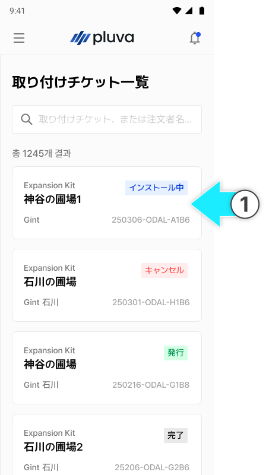
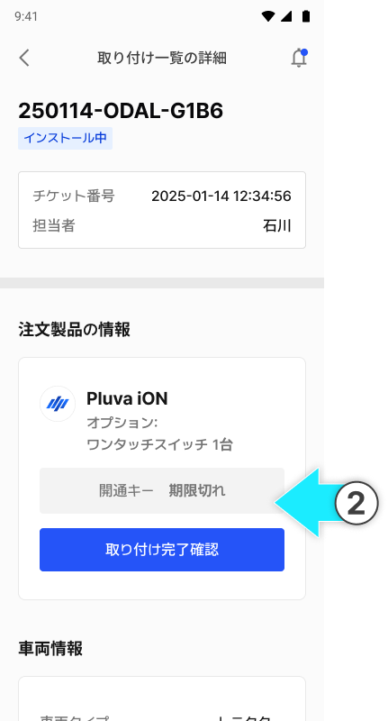

---
layout:
  width: default
  title:
    visible: false
  description:
    visible: false
  tableOfContents:
    visible: true
  outline:
    visible: true
  pagination:
    visible: true
  metadata:
    visible: true
  tags:
    visible: true
metaLinks:
  alternates:
    - >-
      https://app.gitbook.com/s/256Umh24fJVf6zNkZpSa/order-installation/installation-completed
---

# 取付完了の確認 (설치 완료 확인)

### 取付完了の確認&#x20;



GNSSのLEDランプを確認し、取り付け状況を確認してください。

<figure><figcaption></figcaption></figure>



\[설치 완료 확인]을 누릅니다.

<figure><figcaption></figcaption></figure>


