---
layout:
  width: default
  title:
    visible: true
  description:
    visible: false
  tableOfContents:
    visible: true
  outline:
    visible: true
  pagination:
    visible: true
  metadata:
    visible: true
  tags:
    visible: true
metaLinks:
  alternates:
    - /broken/spaces/YgZGmmCCfllSmVLHO3Uz/pages/b7TQmxzUUyJEC0Nu6dCG
---

# 注文登録

注文の基本情報を作成・登録します。注文いただいた製品や取り付ける車両、訪問情報を入力すると、取り付けチケットが自動的に発行されます。これにより、取り付けに必要な事項を事前に確認および準備できます。

注文リストは、[pluva ionのアドミンページ](https://gint-admin.pluva.jp/)にログインするとアクセスできます。



注文リストから\[注文作成]をクリックします。

<figure>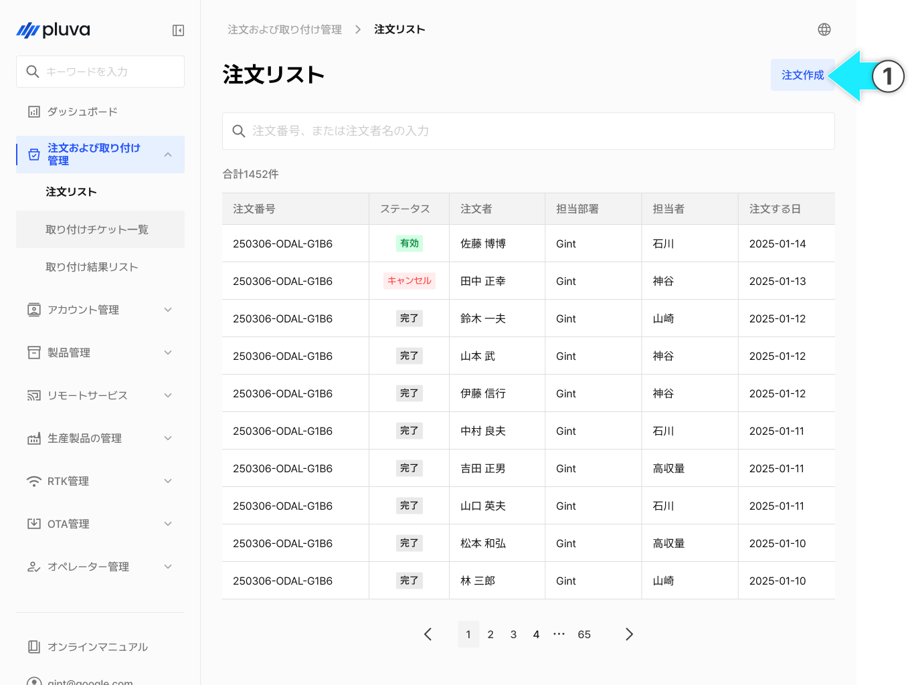<figcaption></figcaption></figure>



担当部署を選択します。

<figure>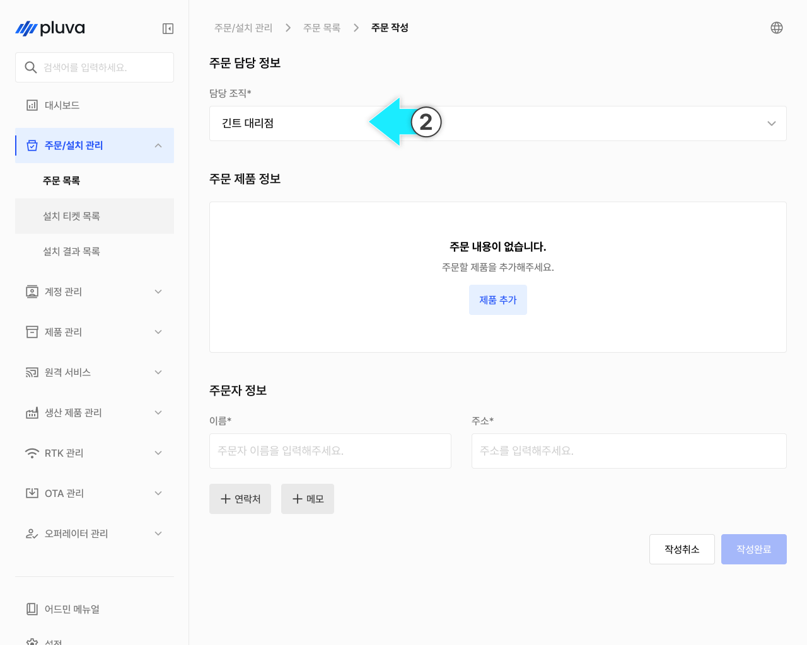<figcaption></figcaption></figure>


担当部署は、ご自身の所属部署が初期値として選択されます。




\[製品の追加]をクリックします。

<figure>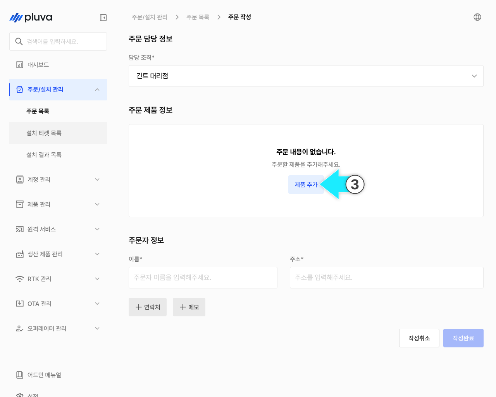<figcaption></figcaption></figure>



注文する製品を選択し、\[追加]をクリックします。

<figure>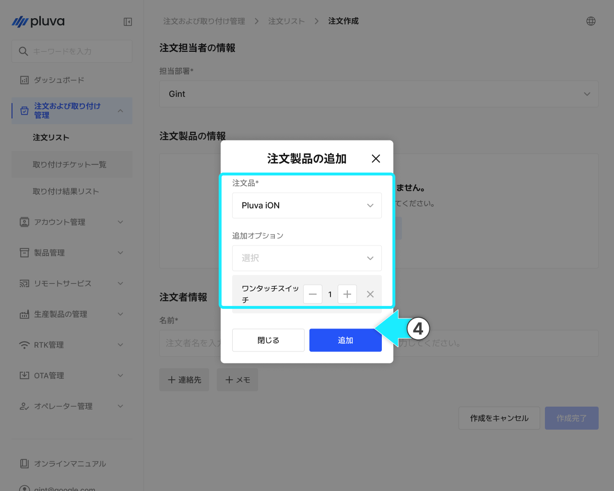<figcaption></figcaption></figure>


**pluva ionとエクスパンションキット（拡張キット）**

*   **pluva ion**

    * GNSS受信機、電動ステアリングホイール、タブレットから構成される、基本構成です。
    * 新規のお客様や、複数の農業機械を同時に稼働され、各機体ごとにタブレットが必要なお客様に最適なセットです。

    <figure><figcaption></figcaption></figure>
*   **pluva ion エクスパンションキット（拡張キット）**

    * GNSS受信機、電動ステアリングホイールから構成されます。タブレットは含まれていません。
    * 一台のタブレットで、複数の農業機械を運用されたいお客様に最適なセットです。
    * エクスパンションキットは、タブレットなしで単体での使用はできません。注文時、お客様がすでにタブレットを保有しているか、またはタブレット付きセットとの同時購入であるかを必ず確認してください。

    <figure>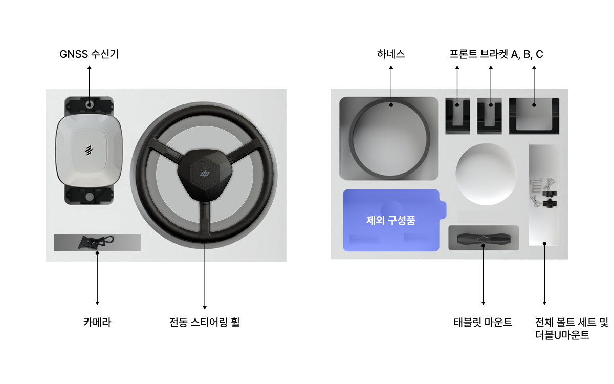<figcaption></figcaption></figure>



追加オプション

* 追加オプションは、セットと一緒に購入できる項目です。必要な数だけ注文製品の追加ができます。
* ワンタッチスイッチはセットに含まれないので、追加オプションとして注文する必要があります。




注文製品に関する情報を入力します。

<figure>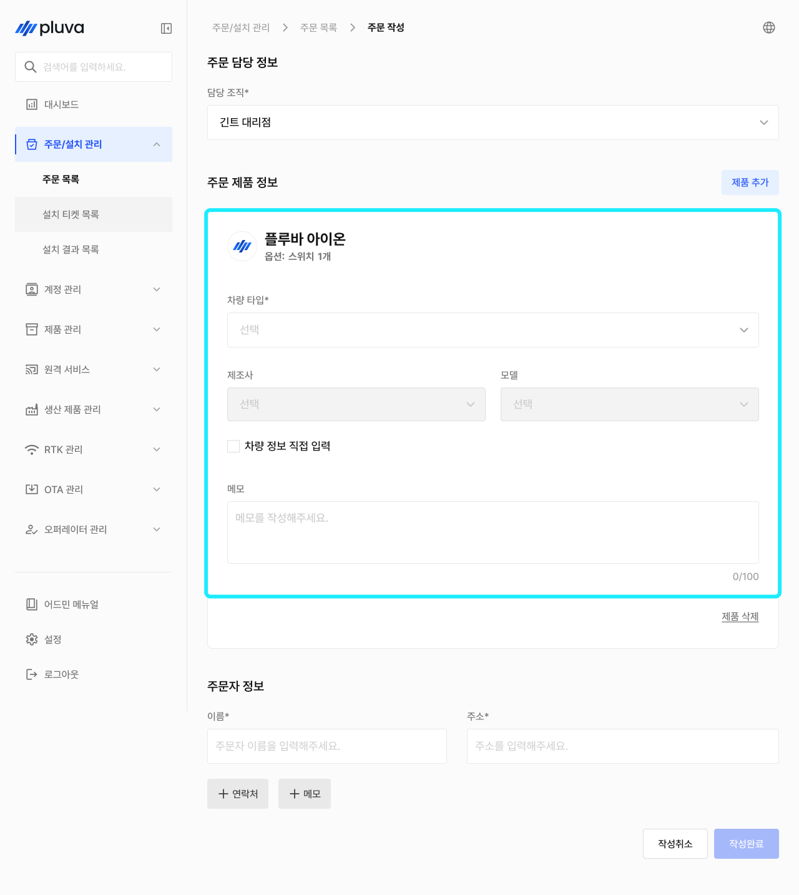<figcaption></figcaption></figure>


複数のセットをご注文の場合は、\[製品の追加]をクリックし、項目を追加してください。

* 例1. トラクター2台、田植え機1台に全てpluva ionを取り付けたいとお考えの新規のお客様
  * \[製品の追加]をクリックし、計2台のpluva ionを注文登録してください。
* 例2. 去年、トラクターにpluva ionを取り付けたお客様が、今年新たに田植え機を購入され、タブレットを付け替えて使用したいとお考えのお客様
  * \[製品の追加]をクリックし、計1台のエクスパンションキットを注文登録してください。



メーカー・型番一覧にご希望の項目がない場合は、チェックを入れて直接入力してください。\
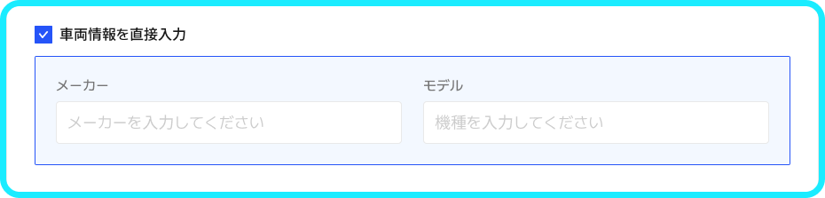




注文者の情報を入力後、\[作成完了]をクリックします。

<figure>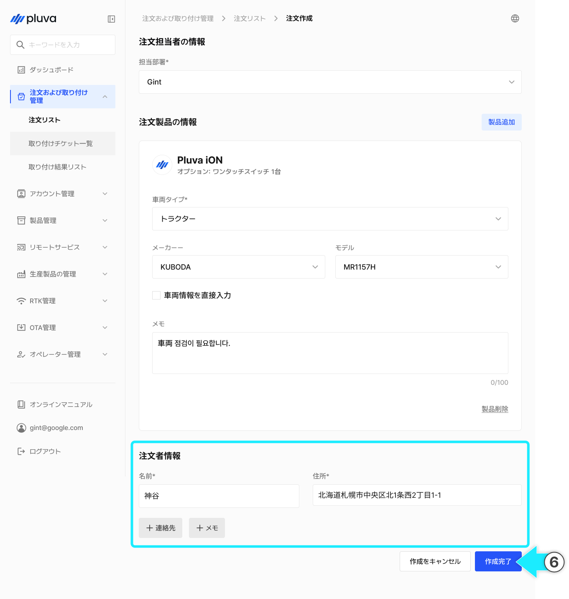<figcaption></figcaption></figure>


連絡先、メモなどを追加で入力できます。

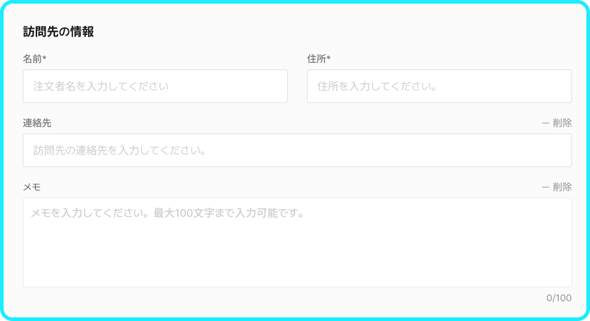




注文確認モーダルから入力内容を確認の上、\[注文]をクリックします。

<figure>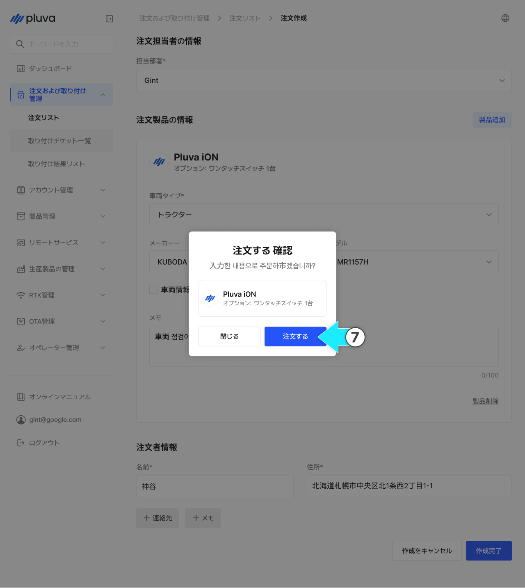<figcaption></figcaption></figure>



注文登録が完了されます。

<figure>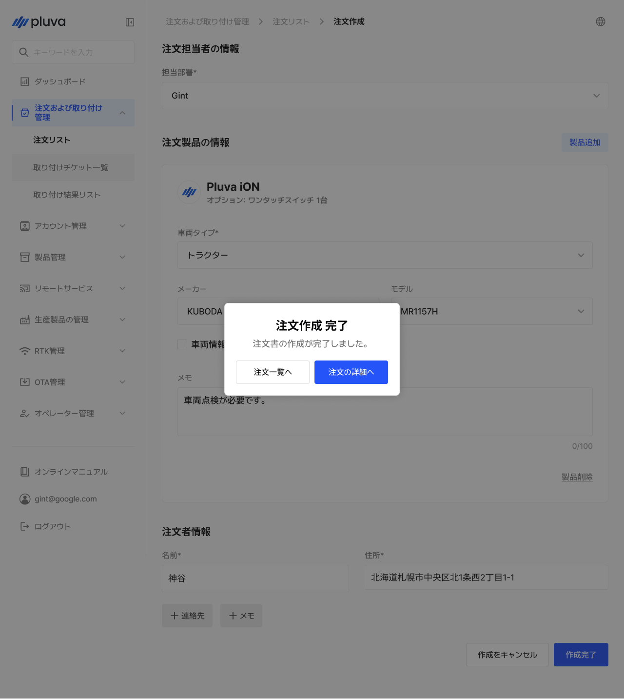<figcaption></figcaption></figure>


注文書の登録が完了すると、自動で取り付けチケットが発行されます。



