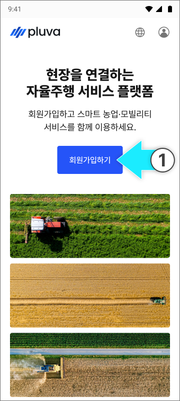
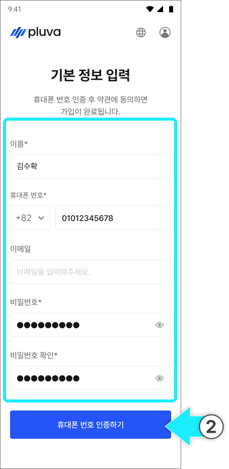
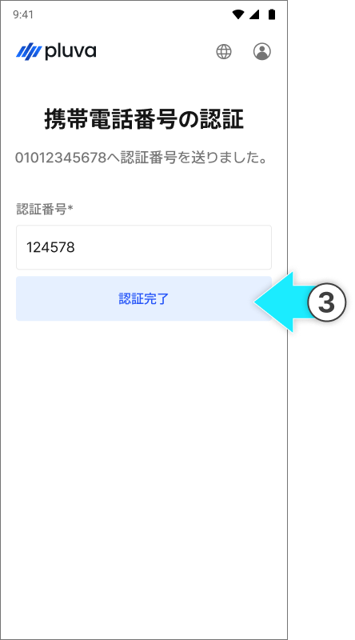
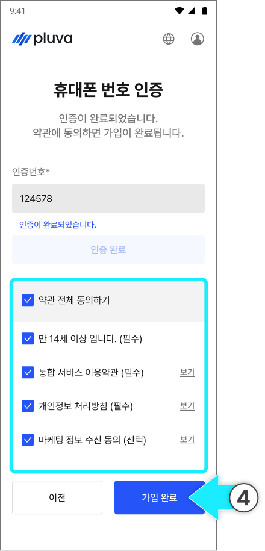
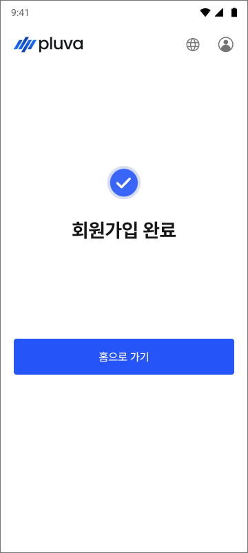

---
layout:
  width: default
  title:
    visible: true
  description:
    visible: false
  tableOfContents:
    visible: true
  outline:
    visible: true
  pagination:
    visible: true
  metadata:
    visible: true
  tags:
    visible: true
metaLinks:
  alternates:
    - >-
      https://app.gitbook.com/s/256Umh24fJVf6zNkZpSa/order-installation/preparing-accounts
---

# お客様アカウントのご用意

お客様がpluva ionを使用するためには、予めアカウントを作成する必要があります。\
お客様がアカウントをお持ちか確認し、まだお持ちでない場合は、下記の内容を参考にし、お客様にご案内してください。


[pluva ion公式サイトへ](https://gint.pluva.jp/)




[pluva ionの会員登録サイト](https://gint.pluva.jp/)にアクセスし、\[会員登録]を選択します。

<figure><figcaption></figcaption></figure>



名前、携帯電話番号、パスワードを入力後、\[携帯電話番号の認証]を選択します。

<figure><figcaption></figcaption></figure>


メールアドレスの入力は任意です。入力しなくても会員登録できます。




携帯電話に送信された6桁の認証番号を入力し、\[認証完了]を選択します。

<figure><figcaption></figcaption></figure>



携帯電話の認証が完了したら、利用規約に同意のチェックを入れ\[登録完了]を選択します。

<figure><figcaption></figcaption></figure>



会員登録が完了されます。

<figure><figcaption></figcaption></figure>


