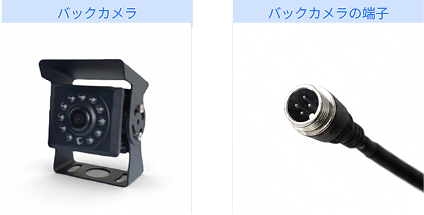
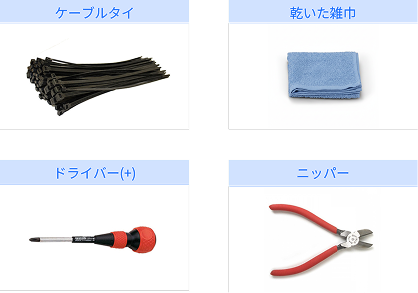

---
layout:
  width: default
  title:
    visible: true
  description:
    visible: false
  tableOfContents:
    visible: true
  outline:
    visible: true
  pagination:
    visible: true
  metadata:
    visible: true
  tags:
    visible: true
metaLinks:
  alternates:
    - >-
      https://app.gitbook.com/s/256Umh24fJVf6zNkZpSa/order-installation/product-installation/camera
---

# カメラ

pluva ionと連動し、後方視野を確保するためのカメラを取り付けます。

***

### 必要な工具及び用意する物

#### 🔩 用意する物

<figure><figcaption></figcaption></figure>

<table><thead><tr><th width="130.5">名称</th><th>規格</th><th>数量</th></tr></thead><tbody><tr><td>バックカメラ</td><td>-</td><td>1</td></tr></tbody></table>

#### 🛠️ 必要な工具

<figure><figcaption></figcaption></figure>

<table><thead><tr><th width="139.3887939453125">名称</th><th>規格</th><th>数量</th></tr></thead><tbody><tr><td>乾いた布</td><td>-</td><td>1</td></tr><tr><td>インシュロック</td><td>6 X 150</td><td>10</td></tr><tr><td>ドライバー(+)</td><td>4mm, 5mm</td><td>1</td></tr><tr><td>ニッパー</td><td>200mm 8"</td><td>1</td></tr></tbody></table>

***

### 取り付け方法


{% column width="83.33333333333334%" %}
**1. 後方が最もよく見える位置を確認し、カメラを取り付けます。**

<figure><figcaption></figcaption></figure>


{% column width="16.666666666666657%" %}





{% column width="83.33333333333334%" %}
**2. カメラとハーネスのコネクターを接続します。**

<figure><figcaption></figcaption></figure>


{% column width="16.666666666666657%" %}



