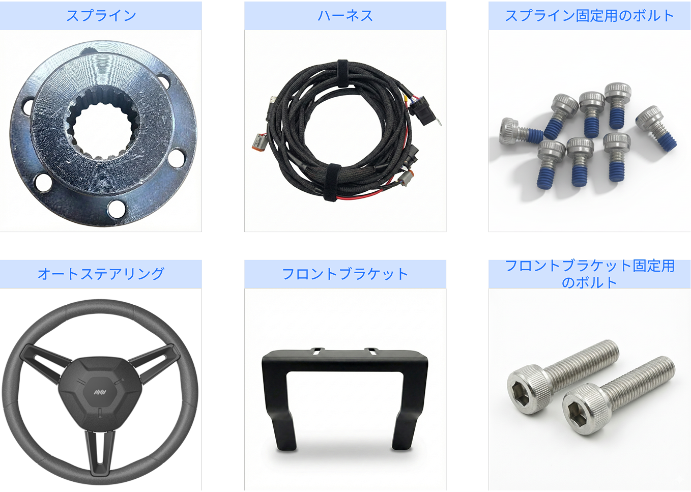
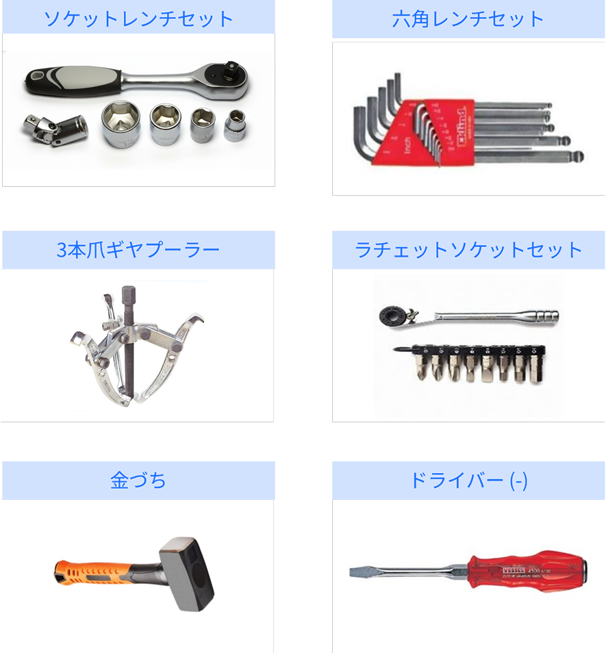
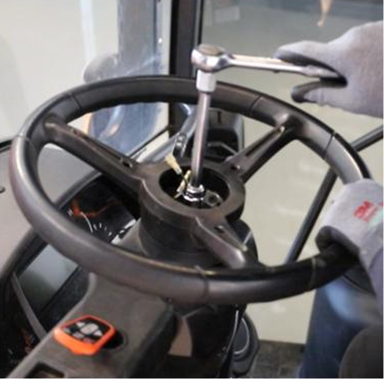
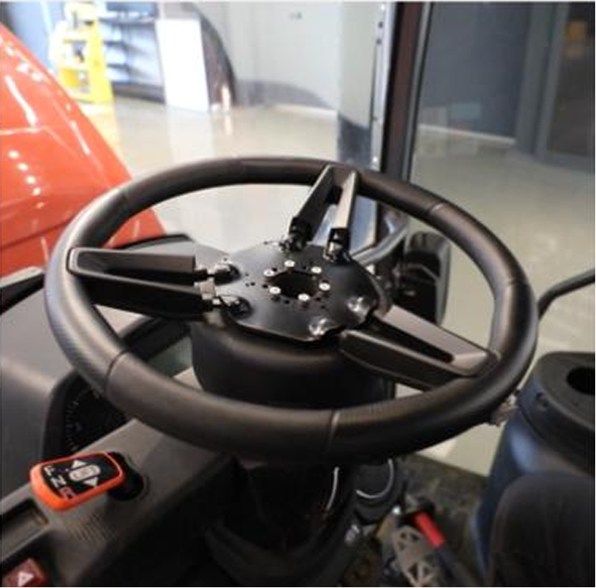
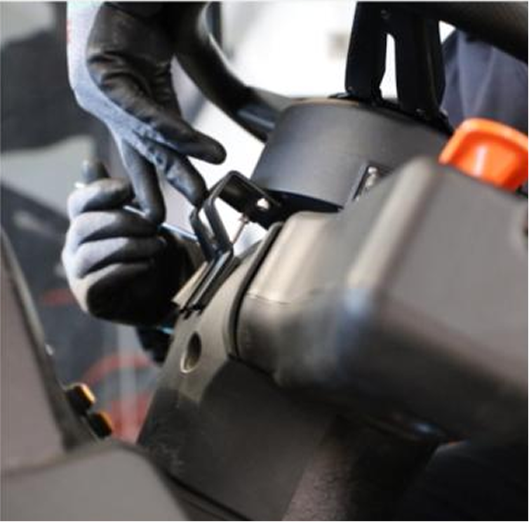

---
metaLinks:
  alternates:
    - >-
      https://app.gitbook.com/s/256Umh24fJVf6zNkZpSa/order-installation/product-installation/electric-steering-wheel
---

# 전동 스티어링 휠

## 전동 스티어링

플루바 아이온 자율주행에 필요한 핸들, 오토 스티어링을 설치합니다.

***

### 필요 공구 및 준비물

#### 🔩 준비물

<figure><figcaption></figcaption></figure>

<table><thead><tr><th width="161.1815185546875">이름</th><th>규격</th><th>수량</th></tr></thead><tbody><tr><td>스플라인</td><td>-</td><td>1</td></tr><tr><td>프론트 브라켓</td><td>-</td><td>1</td></tr><tr><td>세레이션 고정 볼트</td><td>M4 X 8</td><td>7</td></tr><tr><td>
프론트 브라켓 

고정 볼트
</td><td>M5 X 10</td><td>3</td></tr></tbody></table>

#### 🛠️ 필요 공구

<figure><figcaption></figcaption></figure>

<table><thead><tr><th width="130.5">이름</th><th>규격</th></tr></thead><tbody><tr><td>소켓 렌치</td><td>14mm, 17mm, 19mm, 22mm, 24mm, 27mm</td></tr><tr><td>육각 렌치</td><td>4mm, 5mm</td></tr><tr><td>라칫 렌치</td><td>4mm, 5mm</td></tr><tr><td>기어 풀러</td><td>200mm 8”</td></tr><tr><td>드라이버 (-)</td><td>6 X 150</td></tr><tr><td>망치</td><td>두경 34mm</td></tr></tbody></table>

***

### 설치 방법


{% column width="58.333333333333336%" %}
#### 1. 프론트 브라켓 고정 위치를 확인합니다.

<figure><figcaption></figcaption></figure>



{% column width="41.666666666666664%" %}





{% column width="58.333333333333336%" %}
#### **2.** 스티어링 휠 커버 탈거합니다.

<figure><figcaption></figcaption></figure>



{% column width="41.666666666666664%" %}





{% column width="58.333333333333336%" %}
#### **3.** 고정된 록 너트를 알맞은 소켓을 이용하여 탈거합니다.

<figure><figcaption></figcaption></figure>



{% column width="41.666666666666664%" %}





{% column width="58.333333333333336%" %}
#### **4. 전동** 스티어링 휠을 탈거합니다.

<figure><figcaption></figcaption></figure>


{% column width="41.666666666666664%" %}





{% column width="58.333333333333336%" %}
#### 5. 탈거한 조향 축에 스플라인결합 후 유격 확인합니다.

<figure><figcaption></figcaption></figure>



{% column width="41.666666666666664%" %}





{% column width="58.333333333333336%" %}
#### **6.** 스플라인을 동봉된 볼트(M4x8볼트 / 6EA)로 오토 스티어링에 결합합니다.

<figure><figcaption></figcaption></figure>



{% column width="41.666666666666664%" %}





{% column width="58.333333333333336%" %}
#### **7.** 오토 스티어링을 조향 축에 결합합니다.

<figure><figcaption></figcaption></figure>



{% column width="41.666666666666664%" %}





{% column width="58.333333333333336%" %}
#### **8.** 동봉된 볼트(M5x10 / 2EA)를 사용하여 프론트 브라켓 고정합니다.

<figure><figcaption></figcaption></figure>



{% column width="41.666666666666664%" %}





{% column width="58.333333333333336%" %}
#### **9.** 오토 스티어링과 락 너트 결합합니다.

<figure><figcaption></figcaption></figure>



{% column width="41.666666666666664%" %}





{% column width="58.333333333333336%" %}
#### 10. 오토 스티어링 커버 결합합니다.

<figure><figcaption></figcaption></figure>



{% column width="41.666666666666664%" %}




