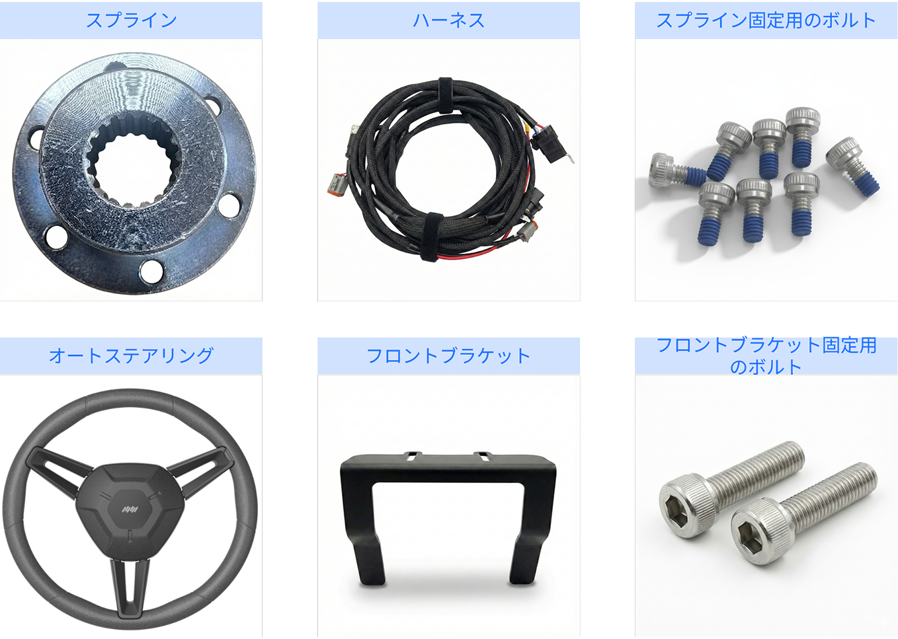
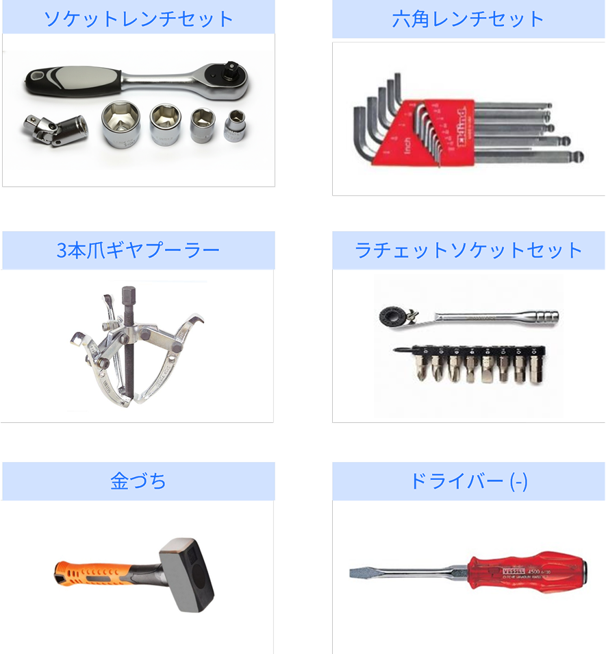
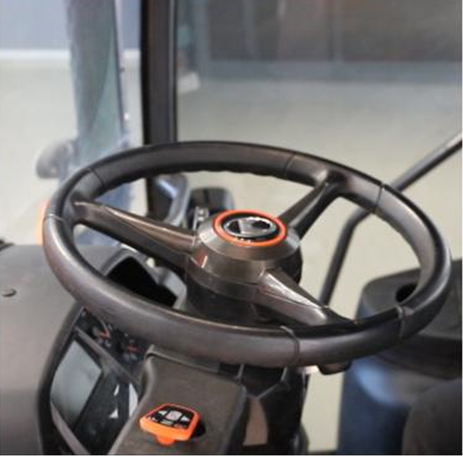
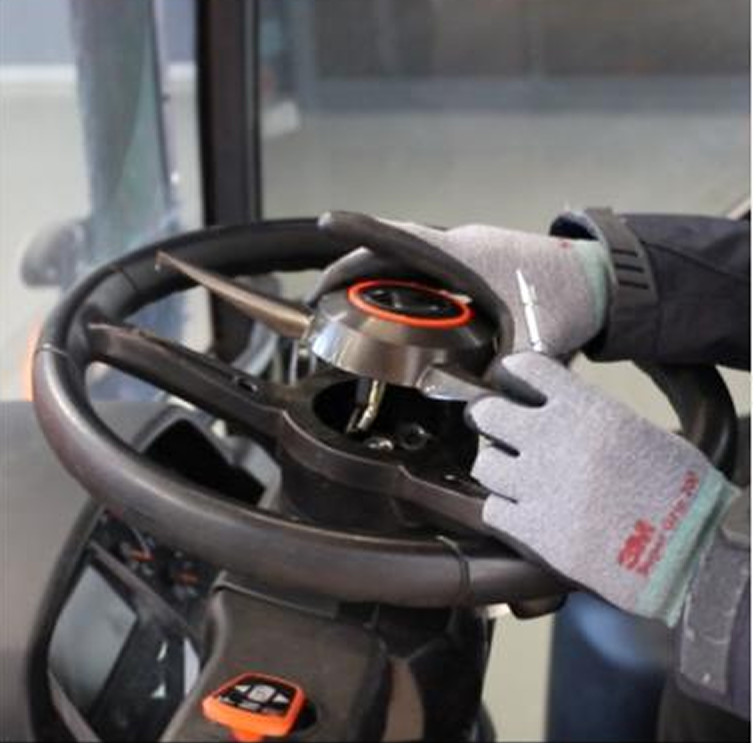
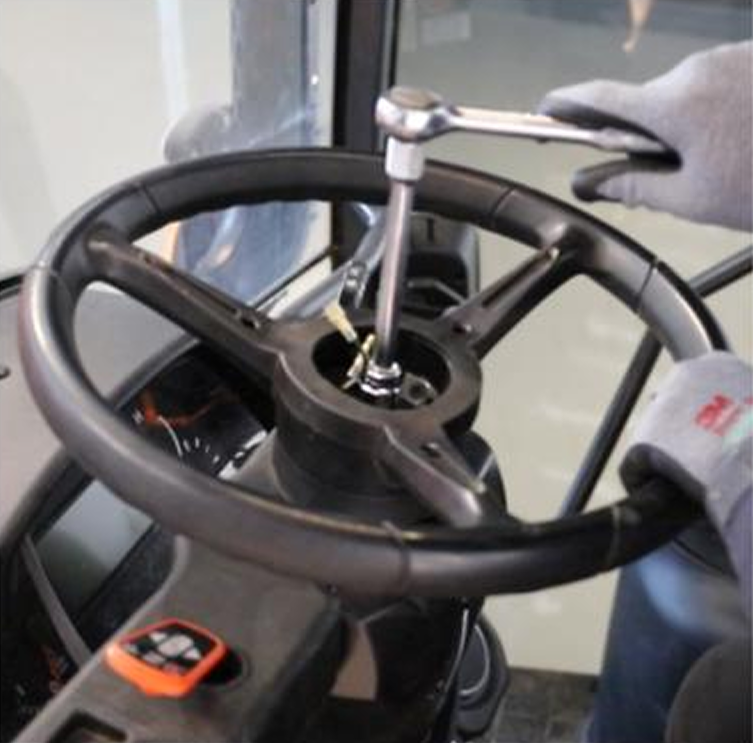
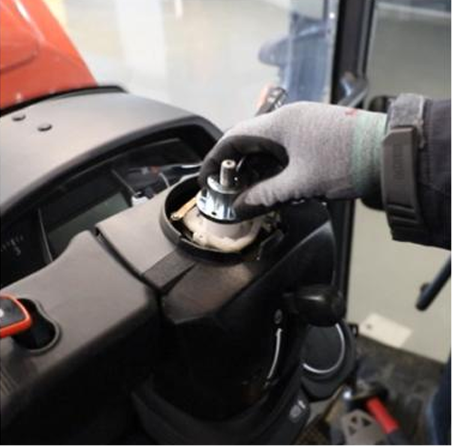
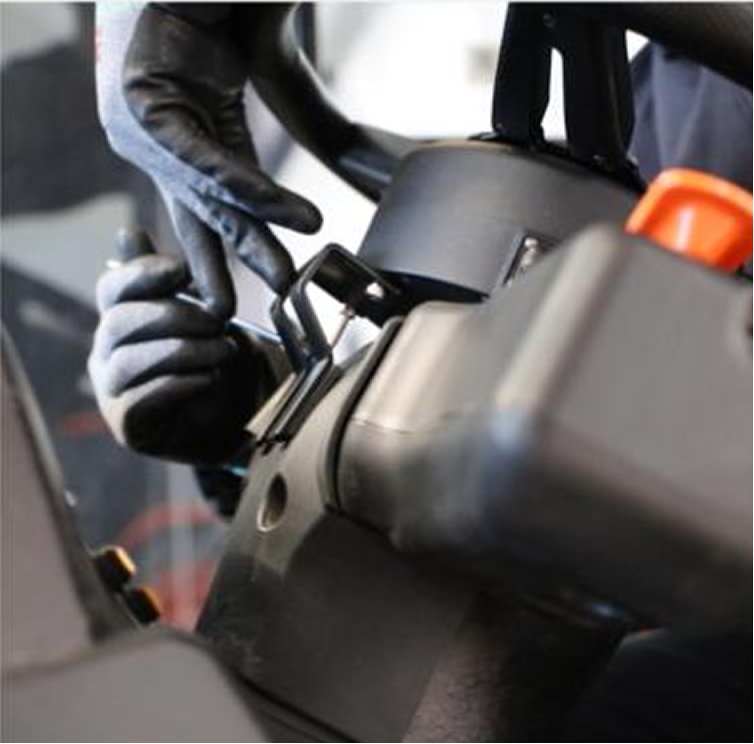

---
layout:
  width: default
  title:
    visible: true
  description:
    visible: false
  tableOfContents:
    visible: true
  outline:
    visible: true
  pagination:
    visible: true
  metadata:
    visible: true
  tags:
    visible: true
metaLinks:
  alternates:
    - >-
      https://app.gitbook.com/s/YgZGmmCCfllSmVLHO3Uz/order-installation/product-installation/electric-steering-wheel
---

# 電動ステアリングホイール

pluva ionの自動操舵に必要なハンドルである、オートステアリングを取り付けます。

***

### 必要な工具及び用意する物

#### 🔩 用意する物

<figure><figcaption></figcaption></figure>

<table><thead><tr><th width="188.9593505859375">名称</th><th>規格</th><th>数量</th></tr></thead><tbody><tr><td>スプライン</td><td>-</td><td>1</td></tr><tr><td>フロントブラケット</td><td>-</td><td>1</td></tr><tr><td>
スプライン用

固定ボルト
</td><td>M4 X 8</td><td>7</td></tr><tr><td>
フロントブラケット用

固定ボルト
</td><td>M5 X 10</td><td>3</td></tr></tbody></table>


スプラインの形状は、農業機械の型番によって異なる場合があります。


#### 🛠️ 必要な工具

<figure><figcaption></figcaption></figure>

<table><thead><tr><th width="143.8333740234375">名称</th><th>規格</th></tr></thead><tbody><tr><td>ソケットレンチ</td><td>14mm, 17mm, 19mm, 22mm, 24mm, 27mm</td></tr><tr><td>六角レンチ</td><td>4mm, 5mm</td></tr><tr><td>ラチェット</td><td>4mm, 5mm</td></tr><tr><td>ギアプーラー</td><td>200mm 8”</td></tr><tr><td>ドライバー (-)</td><td>6 X 150</td></tr><tr><td>ハンマー</td><td>頭径 34mm</td></tr></tbody></table>

***

### 取り付け方法


{% column width="83.33333333333334%" %}
**1. フロントブラケットの固定位置を確認します。**

<figure><figcaption></figcaption></figure>


{% column width="16.666666666666657%" %}





{% column width="83.33333333333334%" %}
**2. ステアリングホイールのカバーを取り外します。**

<figure><figcaption></figcaption></figure>


{% column width="16.666666666666657%" %}





{% column width="83.33333333333334%" %}
**3. 適合するサイズのソケットを用い、締結されたロックナットを緩めて取り外します。**

<figure><figcaption></figcaption></figure>


{% column width="16.666666666666657%" %}





{% column width="83.33333333333334%" %}
**4. 電動ステアリングホイールを取り外します。**

<figure><figcaption></figcaption></figure>


{% column width="16.666666666666657%" %}





{% column width="83.33333333333334%" %}
**5. ステアリング軸にスプラインを結合し、ガタつきがないか確認します。**

<figure><figcaption></figcaption></figure>


{% column width="16.666666666666657%" %}





{% column width="83.33333333333334%" %}
**6. 同梱のボルト（M4x8ボルト / 6EA）を使用し、スプラインをオートステアリング本体に取り付けます。**

<figure><figcaption></figcaption></figure>


{% column width="16.666666666666657%" %}





{% column width="83.33333333333334%" %}
**7. オートステアリングをステアリング軸に装着します。**

<figure><figcaption></figcaption></figure>


{% column width="16.666666666666657%" %}





{% column width="83.33333333333334%" %}
**8. 同梱のボルト（M5x10 / 2EA）でフロントブラケットを固定します。**

<figure><figcaption></figcaption></figure>


{% column width="16.666666666666657%" %}





{% column width="83.33333333333334%" %}
**9. オートステアリングとロックナットを締結します。**

<figure><figcaption></figcaption></figure>


{% column width="16.666666666666657%" %}





{% column width="83.33333333333334%" %}
**10. オートステアリングのカバーを取り付けます。**

<figure><figcaption></figcaption></figure>


{% column width="16.666666666666657%" %}



