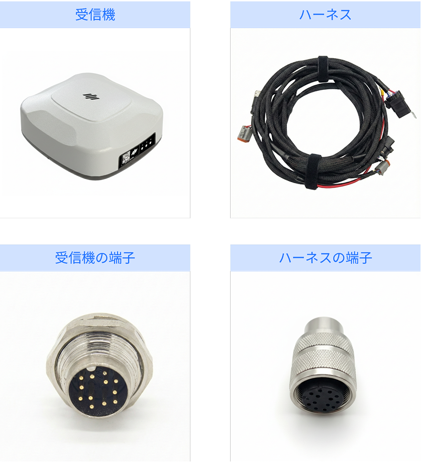
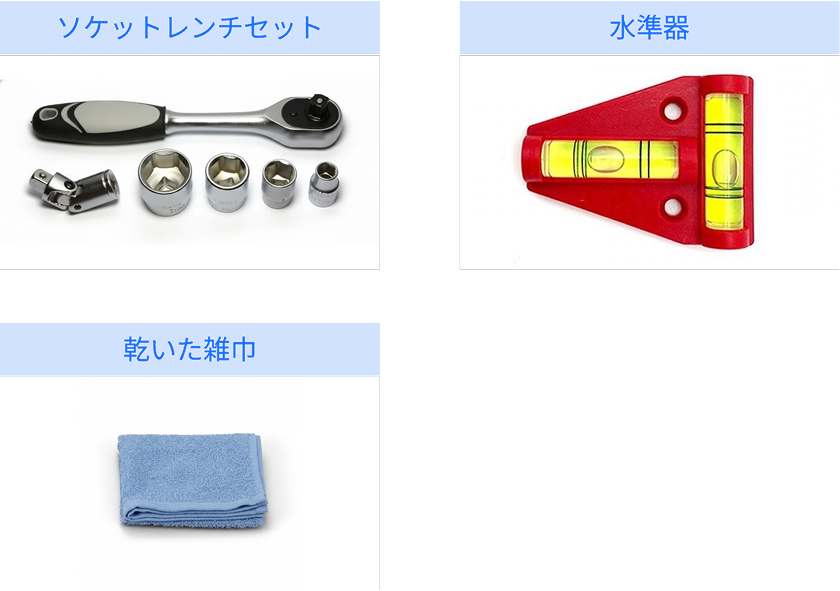

---
layout:
  width: default
  title:
    visible: true
  description:
    visible: false
  tableOfContents:
    visible: true
  outline:
    visible: true
  pagination:
    visible: true
  metadata:
    visible: true
  tags:
    visible: true
metaLinks:
  alternates:
    - >-
      https://app.gitbook.com/s/YgZGmmCCfllSmVLHO3Uz/order-installation/product-installation/gnss-receiver
---

# GNSS受信機

pluva ionの自動操舵に必要なGNSS受信機を取り付けます。

***

### 必要な工具及び用意する物

#### 🔩 用意する物

<figure><figcaption></figcaption></figure>

<table><thead><tr><th width="161.1815185546875">名称</th><th>規格</th><th>数量</th></tr></thead><tbody><tr><td>GNSS受信機</td><td>-</td><td>1</td></tr><tr><td>ハーネス</td><td>-</td><td>1</td></tr></tbody></table>

#### 🛠️ 必要な工具

<figure><figcaption></figcaption></figure>

<table><thead><tr><th width="139.388916015625">名称</th><th>規格</th><th>数量</th></tr></thead><tbody><tr><td>ソケットレンチ</td><td>13mm</td><td>1</td></tr><tr><td>水準器</td><td>-</td><td>1</td></tr><tr><td>乾いた布</td><td>-</td><td>1</td></tr></tbody></table>

***

### 取り付け方法


{% column width="83.33333333333334%" %}
**1. 受信機の取り付け位置を確認し、乾いた布で農業機械の表面を拭き取ります。**

<figure><figcaption></figcaption></figure>


{% column width="16.666666666666657%" %}





{% column width="83.33333333333334%" %}
**2. ブラケットに付着してあるシールをはがします。**

<figure><figcaption></figcaption></figure>


{% column width="16.666666666666657%" %}





{% column width="83.33333333333334%" %}
**3. トラクターの中央、または後方にGNSS受信機を取り付けます。**

<figure><figcaption></figcaption></figure>


{% column width="16.666666666666657%" %}





{% column width="83.33333333333334%" %}
**4. 六角頭付きボルト（M8x25）で調整し、水平を確認後、ボルトを締め付けます。**

<figure><figcaption></figcaption></figure>


{% column width="16.666666666666657%" %}



