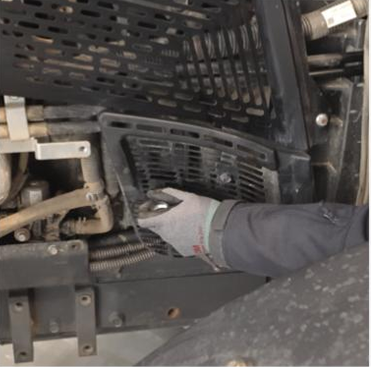
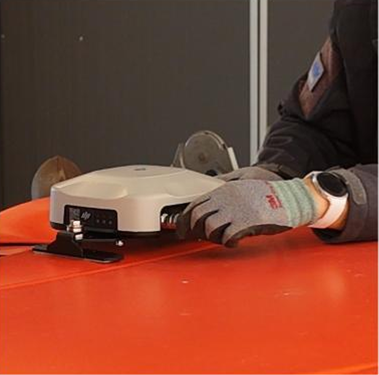
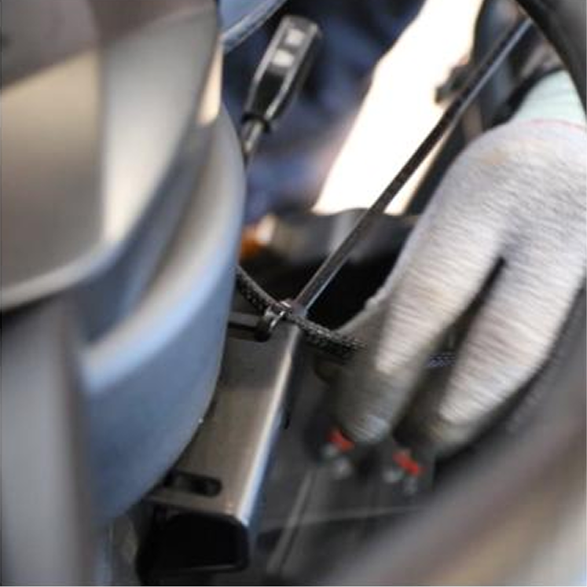

---
layout:
  width: default
  title:
    visible: false
  description:
    visible: false
  tableOfContents:
    visible: true
  outline:
    visible: true
  pagination:
    visible: true
  metadata:
    visible: true
  tags:
    visible: true
metaLinks:
  alternates:
    - >-
      https://app.gitbook.com/s/256Umh24fJVf6zNkZpSa/order-installation/product-installation/harness
---

# ハーネスの取り付け&#x20;

## ハーネスの取り付け

플루바 아이온 자율주행에 필요한 하네스를 설치합니다.

***

### 必要工具および準備物

#### 🔩 用意する物

<figure><figcaption></figcaption></figure>

#### 🛠️ 必要な工具

<figure><figcaption></figcaption></figure>

<table><thead><tr><th width="130.5">項目</th><th>規格</th><th>数量</th></tr></thead><tbody><tr><td>
ソケット

レンチ
</td><td>8~13mm</td><td>1</td></tr><tr><td>スパナ―</td><td>8~13mm</td><td>1</td></tr><tr><td>ドライバー(+)</td><td>-</td><td>1</td></tr><tr><td>ニッパー</td><td>200mm 8"</td><td>1</td></tr><tr><td>ケーブルタイ</td><td>6 X 150</td><td>15</td></tr></tbody></table>

***

### ハーネスの取り付け


{% column width="66.66666666666666%" %}
#### 1. ハーネス配線の振り分け位置を確認する

<figure><figcaption></figcaption></figure>



{% column width="33.33333333333334%" %}





{% column width="66.66666666666666%" %}
#### **2.** バッテリーが入っているボンネットを開ける

<figure><figcaption></figcaption></figure>



{% column width="33.33333333333334%" %}





{% column width="66.66666666666666%" %}
#### **3.** エンジン保護カバーを取り外す

<figure><figcaption></figcaption></figure>



{% column width="33.33333333333334%" %}





{% column width="66.66666666666666%" %}
#### **4.** 電源端子をバッテリーのところへ伸ばして持ってくる

<figure><figcaption></figcaption></figure>



{% column width="33.33333333333334%" %}





{% column width="66.66666666666666%" %}
#### **5.** バッテリーに電源端子を結合させる

<figure><figcaption></figcaption></figure>



{% column width="33.33333333333334%" %}





{% column width="66.66666666666666%" %}
#### **6.** 取り外したエンジン保護カバーを再度取り付ける

<figure><figcaption></figcaption></figure>



{% column width="33.33333333333334%" %}





{% column width="66.66666666666666%" %}
#### **7.** ハーネスに当たらないよう注意してボンネットを閉める

<figure><figcaption></figcaption></figure>



{% column width="33.33333333333334%" %}





{% column width="66.66666666666666%" %}
#### **8.** 受信機の端子をトラクターの屋根に伸ばして持ってくる

<figure><figcaption></figcaption></figure>



{% column width="33.33333333333334%" %}





{% column width="66.66666666666666%" %}
#### **9.** ハーネスの先にある受信機の端子を受信機に差し込む

<figure><figcaption></figcaption></figure>



{% column width="33.33333333333334%" %}





{% column width="66.66666666666666%" %}
#### **10.** 走行の邪魔にならないようハーネスを整理する

<figure><figcaption></figcaption></figure>



{% column width="33.33333333333334%" %}





{% column width="66.66666666666666%" %}
#### **11.** 電源ハーネスと受信機のハーネスを走行の邪魔にならないよう整理する

<figure><figcaption></figcaption></figure>



{% column width="33.33333333333334%" %}





{% column width="66.66666666666666%" %}
#### **12.** ステアリングモーターの端子をステアリングモーターと結合させる

<figure><figcaption></figcaption></figure>



{% column width="33.33333333333334%" %}





{% column width="66.66666666666666%" %}
#### **13.** ステアリングモーターのハーネスを操舵の邪魔にならないよう整理する

<figure><figcaption></figcaption></figure>



{% column width="33.33333333333334%" %}





{% column width="66.66666666666666%" %}
#### **14.** ブレーキペダル操作の邪魔にならないようハーネスを整理する

<figure><figcaption></figcaption></figure>



{% column width="33.33333333333334%" %}





{% column width="66.66666666666666%" %}
#### **15.** タブレットの端子をタブレットの場所まで伸ばして持ってくる

<figure><figcaption></figcaption></figure>



{% column width="33.33333333333334%" %}





{% column width="66.66666666666666%" %}
#### **16.** タブレットの端子をタブレットと結合させる

<figure><figcaption></figcaption></figure>



{% column width="33.33333333333334%" %}





{% column width="66.66666666666666%" %}
#### **17.** リレー部分の配線を整理する

<figure><figcaption></figcaption></figure>



{% column width="33.33333333333334%" %}





{% column width="66.66666666666666%" %}
#### **18.** 操作の邪魔にならないよう整理する

<figure><figcaption></figcaption></figure>



{% column width="33.33333333333334%" %}




